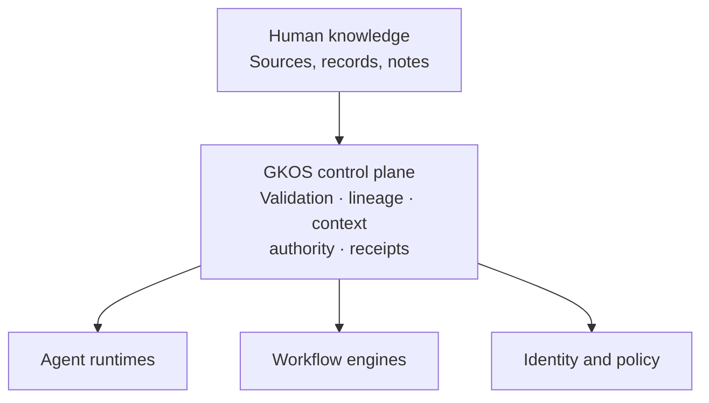

# Governed Knowledge Operations Standard (GKOS)

<!-- markdownlint-disable MD013 -->

> A public pre-standard for governing how evidence becomes knowledge, how
> authority is applied, and how consequential actions remain accountable.

**Evidence is not truth. Confidence is not authority.**

GKOS is a control-plane architecture for knowledge used by people and AI
agents. It keeps evidence, claims, decisions, context, authority, and actions
distinguishable and auditable—without replacing the tools that store data,
run agents, manage workflows, or enforce identity.

- **Current release:** GKOS-2026-08-16 v0.79
- **Maturity:** public pre-standard; developmental and open for testing
- **Machine exchange contract:** GKX 2.0
- **Canonical repository:** `Odenknight/gkos-standard`

[Read the technical orientation](TECHNICAL_README.md) ·
[Read the master standard](standard/00_GKOS_Master_Standard.md) ·
[Review conformance](conformance/README.md) ·
[See the roadmap](ROADMAP.md)

> **GKOS defines the rules and responsibilities. GKX is the machine-readable
> way systems carry the governed records between them.**

## Where GKOS helps

The same governance problem appears wherever people or AI turn information
into decisions and actions:

| Domain | Why GKOS is useful |
| --- | --- |
| **Individuals** | Keeps original sources, personal notes, interpretations, and AI suggestions separate, so a helpful assistant does not silently rewrite what you know or decide for you. |
| **Engineers** | Preserves which requirement, design, dependency, configuration, test, and incident evidence led to a technical decision or operational change. |
| **Small businesses** | Makes policies, responsibilities, approvals, and AI-assisted work traceable without requiring the business to replace its existing tools. |
| **Enterprises and corporations** | Connects evidence, roles, restrictions, review, context, and consequential actions across teams and systems while keeping authority explicit. |
| **Scientific organizations** | Keeps datasets, methods, executions, artifacts, interpretations, reviews, and reruns linked without treating a reproducible record as proof that a conclusion is scientifically valid. |
| **Legal organizations** | Separates source material, an actor's interpretation, matter-specific context, authorized review, and resulting action while preserving privilege and access boundaries supplied by the deployment. |
| **Government and public institutions** | Helps preserve the record behind policy, administrative decisions, delegated authority, public accountability, and later review without itself granting legal or regulatory standing. |
| **AI and agentic systems** | Prevents retrieval rank, model confidence, tool access, or technical capability from being mistaken for permission, approval, or authority. |

These are architectural benefits, not certifications or guarantees of legal,
regulatory, scientific, security, or domain compliance. Each deployment still
needs its own qualified authorities, controls, validation, and applicable
domain profile.

## Why GKOS exists

AI systems can retrieve documents, combine evidence, propose conclusions, call
tools, and act faster than a person can inspect every intermediate step. Most
systems can answer *what is similar to this query?* Far fewer can reliably
answer:

- What was the original evidence?
- What did a person or agent claim that evidence meant?
- Is this the current version, and what does it supersede?
- Which deterministic controls actually ran?
- Who accepted responsibility for the decision?
- What exact context was shown, to whom, and for what purpose?
- What action occurred, under which authority, and with what result?

GKOS defines the responsibilities and records needed to preserve those
answers. It does not declare absolute truth. It makes the path from evidence to
action explicit enough to inspect, reproduce, challenge, correct, and govern.

## The model in one minute

1. **Preserve evidence.** Keep what was received or observed separate from
   later interpretation.
2. **Structure knowledge.** Give governed objects stable identity, versions,
   relationships, and lineage.
3. **Apply controls.** Record deterministic validation, restrictions, and
   failures. Mandatory failures block promotion.
4. **Record decisions.** Acceptance, rejection, limitation, deferral, or
   withdrawal comes from an authorized actor—not model confidence.
5. **Compile context.** Present purpose-bound context with relevant evidence,
   contradictions, restrictions, omissions, versions, and expiry.
6. **Authorize use.** Link a consequential action to its context, authority,
   dependencies, outcome, and recovery route.
7. **Preserve the result.** If an outcome later becomes evidence, it re-enters
   as a new source instead of rewriting the history that produced it.

The practical promise is simple:

> Preserve what happened. Record what was claimed. Show how it was checked.
> Identify who accepted responsibility. Compile the context actually used.
> Retain a receipt for the action that followed.

## Seven cumulative responsibilities

The seven layers are cumulative responsibilities—not seven products, not a
required synchronous pipeline, and not a claim that every implementation must
operate at every layer.

| Layer | Responsibility | Core record or result |
| --- | --- | --- |
| **1. Original Sources** | Preserve what was received or observed | Source Record |
| **2. Structure and Identity** | Give objects stable identity and version history | Structured Knowledge Object |
| **3. Relationships and Lineage** | Record support, contradiction, dependency, and supersession | Assertion and lineage records |
| **4. Validation and Control** | Apply deterministic rules and restrictions | Diagnostics and control receipts |
| **5. Review and Workflow** | Record an authorized disposition | Decision Record |
| **6. Context Presentation** | Compile reproducible, purpose-bound context | Context Manifest |
| **7. Authorized Use** | Bind action to context and authority | Authorized Use Record |

An implementation claims only the exact responsibilities it demonstrates. A
higher layer does not erase or silently rewrite the records below it.

## A control plane—not another runtime

GKOS complements an existing stack. It does not replace:

- agent runtimes or model routers;
- workflow and orchestration engines;
- identity, access-management, or policy systems;
- databases, vector stores, or knowledge graphs;
- provenance, signing, or supply-chain standards; or
- the professional judgment of an authorized person.

Those systems provide capabilities. GKOS defines how governed knowledge,
context, authority, and receipts move between them without turning retrieval
rank, model confidence, or tool access into approval.

## One architecture, different depths of use

GKOS can be adopted incrementally. The examples below are **illustrative usage
depths**, not products, certifications, or current conformance profiles.

| Experience | Typical depth | What it adds |
| --- | --- | --- |
| **Personal** | Layers 1–3 | Notes with preserved sources, identity, lineage, and freshness |
| **Engineering** | Layers 1–4, with selected 6–7 controls | Deterministic validation, dependency traceability, incidents, and action evidence |
| **Business and agents** | Layers 1–6 | Institutional memory, governed retrieval, roles, decisions, and purpose-bound context |
| **Governed operations** | Layers 1–7 | Separation of duties, controlled context, authorized use, and full action traceability |
| **Domain-assured use** | Layers 1–7 plus a defined domain profile | Additional requirements for a particular scientific, legal, safety, or regulatory setting |

These labels explain adoption paths only. Formal GKOS claims must use the
profiles and evidence rules defined by the standard.

## Four names are enough to get started

| Name | Meaning |
| --- | --- |
| **GKOS** | The governance standard: responsibilities, authority, lifecycle, controls, and conformance |
| **GKX** | The machine exchange contract governed by GKOS |
| **GKOS Engine** | A reference implementation of deterministic GKOS/GKX machinery; it is not the standard |
| **Conformance profile** | The exact subset of responsibilities an implementation claims and demonstrates |

Other names belong to implementations, distributions, experimental profiles,
or ordinary technical artifacts. They are introduced only where needed.
Product names do not create additional GKOS layers or competing standards.

## Implementations in the GKOS ecosystem

GKOS is implementation-neutral. These public projects illustrate different
ways its responsibilities can be implemented. Their inclusion does not establish
endorsement, certification, or a GKOS conformance result.

| Implementation | Demonstrates | Claim boundary |
| --- | --- | --- |
| [GKOS Engine](https://github.com/Odenknight/GKOS-Engine) | Deterministic parsing, validation, assessment, graphing, projection, and read-only navigation for GKX records | Reference implementation; not the standard and not an independent implementation |
| [Kosmos-Oden v0.8.0](https://github.com/Odenknight/Kosmos-Oden) | Read-only visualization and lineage traversal over governed knowledge records, using exact-pinned GKOS Engine 2.1.1 | Product example; not the standard, an endorsement, or a conformance result |

Formal conformance claims must identify the exact GKOS release, GKX version,
profile, implementation version, test suite, limitations, and immutable evidence.

## GKOS and ordinary RAG

Retrieval-augmented generation finds potentially relevant material. GKOS adds
governed selection and purpose-bound context around that retrieval.

GKOS does not make a model correct. It makes critical distinctions reviewable:
source versus assertion, current versus superseded, permission versus
similarity, confidence versus authority, and answer versus authorized action.

## Five rules to remember

1. **Evidence is not automatically truth.** Preserve what was received and
   separately record what an actor claims it means.
2. **Capability is not authority.** An agent may be able to analyze or act
   without being authorized to approve or execute.
3. **Confidence is not authority.** Model confidence, similarity, retrieval
   rank, graph centrality, and claimed expertise never authorize promotion.
4. **Restrictions only tighten without authority.** Lower-precedence inputs
   cannot widen a higher-precedence boundary.
5. **Consequential use leaves a receipt.** The action remains linked to the
   exact context and authority under which it occurred.

## Current maturity and claim boundary

GKOS v0.79 is suitable for public review, research, prototypes, controlled
pilots, fixture development, and independent implementation work.

It is **not**:

- an accredited national or international standard;
- a certification or accreditation program;
- proof that a product is truthful, safe, secure, or legally compliant;
- a legal opinion or regulatory authorization;
- a replacement for professional judgment; or
- evidence that the future GKOS v1.0 gates have been met.

The v0.x series is governed by Shaun “Oden” Marshall as Founder and Initial
Editor. Adopted changes are disclosed development decisions, not independent
approval or consensus ratification. Multi-stakeholder authority, complete
conformance infrastructure, independently demonstrated implementation,
appeals, succession, and signed archival publication remain v1.0 work.

## Start here

| If you are… | Read this next |
| --- | --- |
| Evaluating the idea | This README, then the [illustrated edition](archive/illustrated/GKOS-v0.76-Illustrated-Edition.md) |
| Implementing GKOS or GKX | [Technical orientation](TECHNICAL_README.md), [master standard](standard/00_GKOS_Master_Standard.md), and [layer contracts](standard/annexes/Layer_Interface_Contracts.md) |
| Testing an implementation | [Conformance](conformance/README.md), [requirements registry](requirements/REGISTRY.md), and [fixtures](fixtures/README.md) |
| Comparing standards | [Provenance landscape crosswalk](docs/GKOS_PROVENANCE_LANDSCAPE_CROSSWALK.md) |
| Proposing a change | [Contributing](CONTRIBUTING.md) and [governance](GOVERNANCE.md) |
| Reviewing current limitations | [Known limitations](standard/annexes/Known_Limitations_and_Open_Issues.md) and [roadmap](ROADMAP.md) |

## Repository map

- [Master standard](standard/00_GKOS_Master_Standard.md)
- [Normative and informative annexes](standard/annexes/)
- [Development decisions](decisions/GKOS_Decision_Register.md)
- [Schemas](schemas/README.md)
- [Conformance](conformance/README.md)
- [Fixtures](fixtures/README.md)
- [Examples](examples/README.md)
- [Implementation references](docs/implementation/README.md)
- [Governance](GOVERNANCE.md)
- [Roadmap](ROADMAP.md)
- [Licensing](LICENSE.md)

The provisional Scientific Research Trace Profile is an informative draft for
testing research traceability. It is non-normative, establishes no qualifying
GKOS profile, and grants no certification, scientific-validity judgment, or
execution authority. See the [SRTP proposal](docs/proposals/SRTP_DRAFT_PROFILE.md).

## Publication, citation, and licensing

Tagged releases may be archived by Zenodo for version-specific and concept
DOIs. See [ZENODO.md](ZENODO.md) for the release gate and binding requirements.

Documentation and original graphics are licensed under CC BY 4.0. Schemas,
fixtures, workflows, scripts, and reference code are licensed under Apache-2.0.
Trademark, certification, endorsement, and accreditation rights are separate.
See [LICENSE.md](LICENSE.md), [NOTICE.md](NOTICE.md), and
[TRADEMARKS.md](TRADEMARKS.md).

Suggested citation:

> Shaun “Oden” Marshall. *Governed Knowledge Operations Standard (GKOS),
> GKOS-2026-08-16 v0.79.* CC BY 4.0. Changes, if any, should be identified by
> the modifier.
