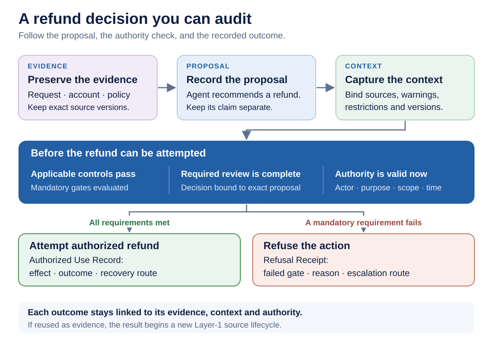
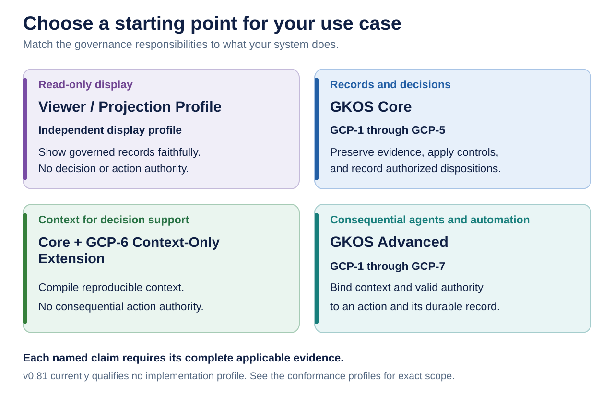

# Governed Knowledge Operations Standard (GKOS)

Drafted by Shaun "Oden" Marshall. Refined and published by AI Assistant.

<!-- markdownlint-disable MD013 -->

> A developmental public pre-standard for making the path from evidence to consequential action inspectable, testable, and governable.

**Evidence is not truth. Confidence is not authority. Capability is not authority.**

GKOS is designed for environments where people, software, models, and AI agents turn information into decisions or actions. It defines governed contracts between existing systems so that retrieval, technical access, model confidence, workflow state, or automation are not silently mistaken for review, approval, or authority.

When a person or AI system recommends, approves, or takes an action, GKOS is designed to make six questions answerable:

1. What evidence actually entered the system?
2. What did a person, model, tool, or agent claim that evidence meant?
3. Which deterministic controls ran, and what failed or was refused?
4. Who or what had authority to decide, and within what limits?
5. What exact context was presented for that decision or action?
6. What happened next, and how can the result be corrected, challenged, or replayed?

GKOS does not replace databases, records systems, agent runtimes, workflow engines, identity providers, policy engines, professional judgment, or applicable law. It defines the responsibilities and records that allow those components to participate in a governed evidence-to-action chain.

## Current standing

- **Release coordinate:** GKOS-2026-09-03 v0.81
- **Publication status:** live since September 3, 2026, following R20 owner approval, the verified signed `v0.81` tag, passing post-tag checks, and GitHub publication
- **Release record:** [v0.81 release](https://github.com/Odenknight/gkos-standard/releases/tag/v0.81) · [publication and archive receipt](docs/releases/GKOS_2026-09-03_v0.81_PUBLICATION_RECORD.md)
- **Version DOI:** [10.5281/zenodo.22269294](https://doi.org/10.5281/zenodo.22269294)
- **Concept DOI (all versions):** [10.5281/zenodo.22269293](https://doi.org/10.5281/zenodo.22269293)
- **Publication controls:** [exact commit and approval binding](docs/implementation/V081_PUBLICATION_BINDING.md)
- **Maturity:** developmental public pre-standard
- **Governance:** owner-authorized v0.x development; not consensus ratification
- **Machine exchange contract:** GKX 2.0
- **Canonical artifact profile:** GKX-CBOR-1 where required by the applicable artifact contract
- **Profile qualification:** none currently qualified
- **Public second implementation:** awaiting a public second implementation
- **Current ecosystem program:** R21 informative interoperability work for MCP, A2A, ACS, agent governance, evidence packaging, public pilots, and deployment guidance

GKOS v0.81 is a developmental pre-standard designed to support AI governance, accountability, and auditability by binding evidence, claims, deterministic controls, review, authority, context, and outcomes. The exact R20 release gates and separate owner decision were completed, and the edition was published on September 3, 2026. Zenodo preserves the verified source archive. Publication and archival identity establish no profile qualification, certification, or independently demonstrated effectiveness.

[Technical orientation](TECHNICAL_README.md) ·
[Master standard](standard/00_GKOS_Master_Standard.md) ·
[Requirements registry](requirements/REGISTRY.md) ·
[Conformance](conformance/README.md) ·
[Reference infrastructure](docs/implementation/GKOS_REFERENCE_INFRASTRUCTURE.md) ·
[Practitioner blueprint](docs/implementation/GKOS_INFRASTRUCTURE_PRACTITIONER_BLUEPRINT.md) ·
[Ecosystem interoperability](docs/ecosystem/README.md) ·
[Roadmap](ROADMAP.md)

## Why GKOS exists

Modern AI systems can retrieve records, combine evidence, create assertions, call tools, delegate work, and change external systems faster than a person can inspect every intermediate step. Conventional logs often show that a call occurred, but not whether the source was current, which contradictions were known, which policy version controlled the operation, which authority was valid at action time, or what corrective route existed afterward.

GKOS keeps several things distinct that are frequently collapsed together:

- preserved evidence;
- human, model, tool, and agent assertions;
- deterministic validation and control results;
- authorized dispositions and decisions;
- purpose-bound context;
- grants, delegation, expiry, suspension, and revocation;
- consequential actions, refusals, outcomes, and recovery routes.

It does not declare absolute truth. It makes the path from evidence to action explicit enough to inspect, reproduce, challenge, correct, and test.

## The seven cumulative responsibilities

| Layer | Responsibility | Required result |
| --- | --- | --- |
| **1. Original Sources** | Preserve what was received or observed with revision, provenance, custody, sensitivity, retention, and acquisition evidence | Source Record |
| **2. Structure and Identity** | Assign stable governed identity, type, schema, version, and representation without treating filename or path as identity | Structured Knowledge Object |
| **3. Relationships and Lineage** | Record typed, sourced, temporal, scoped, and attributable assertions, contradictions, dependencies, corrections, and supersession | Assertion and lineage records |
| **4. Validation and Control** | Apply deterministic requirements and restrictions; applicable mandatory failures block, refuse, roll back, or freeze as specified | Diagnostics and Control Receipts |
| **5. Review and Workflow** | Bind an authorized, append-only disposition to the exact proposal and evidence reviewed | Decision Record |
| **6. Context Presentation** | Capture non-deterministic selection, then assemble reproducible, purpose-bound, restriction-aware context | Selection Envelope and Context Manifest |
| **7. Authorized Use** | Bind consequential use to exact context, valid authority, actor roles, delegation, effect scope, outcome, and recovery | Authorized Use Record or Refusal Receipt |

The layers are cumulative responsibilities, not seven products and not a required synchronous network pipeline. A deployment may place multiple responsibilities in one service or distribute them across several systems.

Higher layers do not silently rewrite lower layers. When an upper-layer outcome later becomes evidence, it re-enters as a new Layer-1 source without inheriting the standing of the action that produced it.

## A simple example

Consider an AI assistant proposing a customer refund:

[Download PNG](graphics/diagrams/gkos-accountable-refund.png)

1. The request, account record, and applicable policy versions are preserved as sources.
2. The agent's interpretation is recorded separately from those sources.
3. Deterministic controls check purpose, sensitivity, delegation, limits, and required evidence.
4. A routine reversible case may proceed under valid standing authority; an exception may require an authorized review and Decision Record.
5. The exact evidence, contradictions, warnings, restrictions, and policy versions presented for the decision are bound in a Context Manifest.
6. Authority is checked again at action time and the attempted effect is recorded with its scope and outcome.
7. The result returns as new evidence rather than rewriting the original request or decision history.

GKOS does not decide whether the refund policy is fair or lawful. It makes the operation and responsibility chain inspectable and testable.

## A governance architecture, not another runtime

[Download PNG](graphics/diagrams/gkos-control-plane.png) · [Editable diagram source](graphics/diagrams/gkos-control-plane.mmd)

GKOS can be realized as an embedded library, sidecar, service, gateway, event-driven control plane, workflow contract, or federation of existing systems. The Standard does not mandate one database, one cloud, one agent framework, one identity system, or one protocol.

The governing distinction is:

- **Capabilities** retrieve, reason, route, store, sign, authorize access, or execute.
- **GKOS contracts** state what evidence, authority, context, disposition, failure, and receipt information must survive when those capabilities are used.

Existing tools remain useful. They simply do not become GKOS-conformant by being installed.

## Important boundaries

- Extraction software is not by itself an immutable source-preservation system.
- A content digest fingerprints bytes or a revision; it is not automatically the stable governed identity of an object across versions.
- A graph edge is not automatically a governed assertion, acceptance, correction, or supersession decision.
- Authentication is not authorization, and authorization is not a Decision Record.
- A signature or transparency-log entry establishes only what its trust model and signed statement support; it does not prove truth, substantive authority, safety, or GKOS conformance.
- A model grader may provide evidence or monitoring, but it cannot silently replace a deterministic mandatory gate.
- Retrieval may be non-deterministic, but the operative selection must be captured before deterministic context assembly when the applicable contract requires it.
- Protocol transport does not itself create GKOS authority.

## Agent and protocol interoperability

GKOS remains protocol-neutral. R21 develops separately versioned, informative implementation bindings so the Standard can remain useful while the agent ecosystem changes.

Current reviewed R21 inputs include:

- Model Context Protocol `2026-07-28`, with an explicit migration lane from `2025-11-25`;
- Agent2Agent Protocol `v1.0.1`; and
- OWASP Agent Control Standard `v0.1.1` public preview.

These external versions must be rechecked before publication or implementation claims. A protocol version, SDK version, service version, gateway version, and product version are separate coordinates.

MCP, A2A, and ACS do not become normative GKOS dependencies merely because GKOS publishes a mapping. A binding identifies what the external protocol can carry or observe and what additional GKOS evidence or control is still needed.

For consequential agent actions, authentication or a successful protocol request is insufficient by itself. The applicable purpose, authority, delegation, context, deterministic controls, effect scope, outcome, refusal, and re-entry requirements still apply.

## Why standards communities may care

NIST and other public standards and governance efforts increasingly focus on agent identity, authorization, delegation, interoperability, logging, provenance, security evaluation, and human accountability. GKOS is intended to provide candidate operationalization artifacts for those kinds of implementation questions: durable records, exact context, deterministic gate evidence, role separation, bounded delegation, and action receipts.

This is an informative relationship, not an endorsement claim. GKOS is not a NIST publication and does not claim NIST, NCCoE, ISO, OWASP, IMDA, or another body's approval, alignment, conformity, certification, or regulatory standing.

The R21 external-source and review-disposition registers preserve exact reviewed versions, access dates, limitations, corrections, and superseded claims so changing external frameworks do not silently rewrite the Standard.

## Adoption paths

GKOS can be adopted incrementally, but named claims have exact boundaries.

[Download PNG](graphics/diagrams/gkos-adoption-paths.png)

| Participant or use | Appropriate first target |
| --- | --- |
| Read-only display surface of a viewer, dashboard, audit, or oversight product | Viewer/Projection Profile |
| Organization governing records and decisions | GKOS Core |
| Retrieval or decision support that does not perform consequential action | GKOS Core plus the GCP-6 Context-Only Extension |
| Consequential agents and automation | GKOS Advanced |
| Protocol, infrastructure, or middleware provider | Bounded implementation binding plus the applicable GKOS profile |

A deployment may truthfully report lower-layer capability without calling it GKOS Core or Advanced.

The active fixture catalogs currently create **no qualifying profile**. Passing a subset of mechanisms, registry checks, or mutation tests therefore must not be presented as a complete tier or certification result.

## Exact-bound claims

A serious GKOS claim identifies at least:

- exact GKOS release and GKX version;
- claimed profile and applicable requirement population;
- implementation version and immutable commit or artifact digest;
- schemas, policies, canonicalization profile, and relevant adapters;
- fixture catalog and runner versions;
- operating environment and dependency closure;
- executed, passed, failed, skipped, unsupported, and unevaluated results;
- exceptions and limitations;
- assessment scope and whether the result is self-attested or independently verified.

R21 is also developing the informative GKOS Conformance Evidence Package so evidence can be exchanged without confusing package integrity with conformance assessment.

## What GKOS cannot establish by itself

GKOS cannot, by itself, establish that:

- a source is factually correct;
- a model output is accurate, unbiased, safe, or appropriate;
- a policy is lawful, fair, ethical, or complete;
- an identity provider, credential, ledger, signature system, policy engine, or runtime is uncompromised;
- a reviewer reached the correct substantive conclusion;
- a deployment complies with a law, regulation, NIST framework, ISO standard, or sector rule; or
- an implementation is certified or accredited.

Those determinations require their own evidence, competent authorities, assessment scope, and recognized conformity or regulatory processes where applicable.

## Public implementation and participation

GKOS is implementation-neutral. Public implementations, adapters, viewers, validators, assessment tools, and services are welcome, but public claims must remain evidence-bound.

Current standing: **awaiting a public second implementation**.

A second implementation must be publicly inspectable enough to evaluate its source, interpretation path, dependencies, ownership, operation, fixtures, evidence, limitations, and independence. No private repository or unpublished implementation is counted or implied as public second-implementation evidence.

Commercial implementation support, hosted validation, training, and assessment tooling are compatible with the project. The term **GKOS certified** is reserved until a governed certification scheme and competent independent certification process exist.

## Contributing

High-value contributions include:

- independent implementation reports;
- negative, boundary, mutation, downgrade, bypass, and recovery fixtures;
- protocol and framework mappings with exact version evidence;
- public pilot results, including failures and implementation burden;
- security, privacy, legal, accessibility, records, scientific, and human-factors review;
- clearer public examples and translations;
- multi-stakeholder governance participation for the v1.0 path.

See [CONTRIBUTING.md](CONTRIBUTING.md), [GOVERNANCE.md](GOVERNANCE.md), and the [roadmap](ROADMAP.md).

## Publication, citation, and licensing

Documentation and original graphics are licensed under CC BY 4.0; schemas, fixtures, workflows, scripts, and reference code are licensed under Apache-2.0. See [LICENSE.md](LICENSE.md), [NOTICE.md](NOTICE.md), and [ZENODO.md](ZENODO.md) for licensing, attribution, archival publication, and version-specific citation guidance.

Suggested citation for the current published release: Shaun Allan Marshall. *Governed Knowledge Operations Standard (GKOS), GKOS-2026-09-03 v0.81.* Zenodo. [https://doi.org/10.5281/zenodo.22269294](https://doi.org/10.5281/zenodo.22269294).

## Maturity and governance boundary

GKOS v0.x is a developmental public pre-standard under Founder/Initial Editor governance. It is not an accredited standard, consensus publication, certification program, legal opinion, or regulator approval.

The v1.0 path requires materially stronger governance and external evidence, including multi-stakeholder maintenance, appeals and succession mechanisms, public review, a publicly demonstrated second implementation, interoperable evidence exchange, pilot results, and archival release controls.

Until those gates exist, the repository should prefer precise evidence over maturity language and implementation usefulness over claims of institutional authority.
