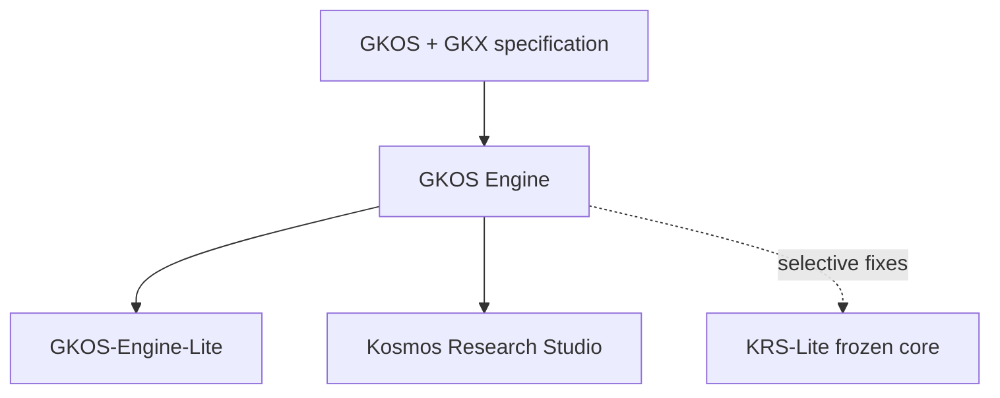
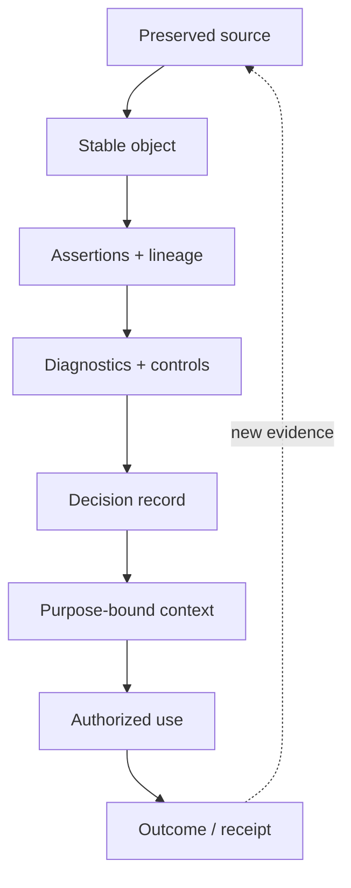

# Governed Knowledge Operations Standard (GKOS)

> **How knowledge becomes trustworthy**

- **Current public standard:** GKOS-2026-07-20 v0.76
- **Maturity:** Public pre-standard; testing and concept refinement
- **Current exchange-model name:** GKX — Governed Knowledge Exchange
- **Canonical repository:** `Odenknight/gkos-standard`
- **Last overview consolidation:** 2026-08-03

GKOS is a domain-neutral governance model for preserving evidence, giving
knowledge stable identity, recording claims and lineage, enforcing controls,
governing review, compiling reproducible context, and authorizing consequential
use by people or computational agents.

GKOS does **not** compute absolute truth. It makes the path from evidence to
action explicit enough to inspect, reproduce, challenge, correct, and govern.

This README is the consolidated, one-document orientation to the project. It
combines the current standard, annexes, ecosystem policy, historical v0.75
documentation, pre-standardization plans, domain-impact studies, healthcare
analysis, and standards/certification path. The linked normative documents
remain authoritative when this overview and a normative source differ.

## Read this first

GKOS rests on five rules:

1. **Evidence is not automatically truth.** Preserve the source and separately
   record what an actor claims it means.
2. **Capability is not authority.** A person or agent may analyze, retrieve,
   draft, or recommend without gaining the right to approve or act.
3. **Confidence is not authority.** Model confidence, similarity, retrieval
   rank, graph position, and claimed expertise never authorize promotion or use.
4. **Trust accumulates upward.** Each layer adds a bounded responsibility and a
   reviewable artifact; later output cannot retroactively rewrite its evidence.
5. **Consequential use requires an explicit record.** The action must be linked
   to the exact context, authority, actor, dependencies, and outcome.

The governing basis is the [master standard](standard/00_GKOS_Master_Standard.md),
especially §§2–9, with supporting detail in the
[layer contracts](standard/annexes/Layer_Interface_Contracts.md),
[conformance profiles](standard/annexes/Conformance_Profiles.md), and
[security/privacy annex](standard/annexes/Security_Privacy_Retention.md).

## Status and claim boundary

GKOS v0.76 is suitable for:

- public review and critique;
- prototypes and implementation experiments;
- schema and fixture development;
- controlled pilots;
- comparison with other governance frameworks; and
- development of independent implementations.

GKOS v0.76 is **not**:

- an accredited national or international standard;
- a certification or accreditation program;
- proof that a product is safe, truthful, secure, or legally compliant;
- a legal opinion or regulatory authorization;
- a replacement for professional judgment; or
- evidence that the future GKOS v1.0 governance gates have been met.

Development decisions in the v0.x series are documented adoptions by the
Founder and Initial Editor after technical review. They are not consensus
ratifications or independent certifications. Formal multi-stakeholder
authority, voting, quorum, appeals, dominance safeguards, and consensus
procedures are v1.0 gates. See
[GOVERNANCE.md](GOVERNANCE.md), the
[decision register](decisions/GKOS_Decision_Register.md), and the
[roadmap](ROADMAP.md).

## The architecture in one view

| Name | Responsibility | What it must not claim |
| --- | --- | --- |
| **GKOS** | Governance responsibilities, authority, lifecycle, conformance, and use controls | An implementation or data format |
| **GKX** | Exchange objects, schemas, identities, relationships, receipts, and protocols | Authority merely because an object is valid |
| **GKOS Engine** | Canonical deterministic implementation of GKX under GKOS | The power to redefine GKOS or GKX |
| **KRS** | Active reference application and Obsidian experience | Full GKOS conformance merely because it uses the Engine |
| **Engine-Lite / KRS-Lite** | Simplified or frozen distributions for bounded audiences | Independent governance semantics or automatic parity |

GKX is the current public name of the exchange model formerly published as
**OKF+**. Existing OKF+ 2.2/2.3 documents, `okf*` commands, schema keys,
protocol identifiers, status values, and migration paths remain compatibility
surfaces until a versioned migration changes them. New prose and product copy
should use **GKX** first. See
[R11](decisions/R11_GKX_Naming_Transition_Development_Decision_Record.md).

Archived v0.75/v0.76 release text may still say OKF+ because historical releases
are preserved. That terminology does not reverse the later R11 naming decision.

### Dependency direction



Specification changes flow downward. Implementations may return evidence,
defect reports, and proposals upward, but cannot silently redefine an upstream
contract. The full decision-rights model is in
[Ecosystem organization](docs/ECOSYSTEM-ORGANIZATION.md).

## The seven-layer reference model

The layers are cumulative responsibilities, not a mandatory synchronous
pipeline and not a claim that every product implements every layer.

| Layer | Core question | Required output | Blocking rule |
| --- | --- | --- | --- |
| **7. Authorized Use** | May this actor take this action for this purpose? | Authorized Use Record | No consequential action without valid context and authority |
| **6. Context Presentation** | What exact, purpose-bound context was presented? | Context Manifest | Warnings, contradictions, restrictions, and omissions remain visible |
| **5. Review and Workflow** | Who accepted, rejected, deferred, or limited the proposal? | Append-only Decision Record | No self-approval under separation-of-duty profiles |
| **4. Validation and Control** | Which deterministic checks and restrictions apply? | Diagnostics and control receipts | Mandatory failures block promotion |
| **3. Relationships and Lineage** | What supports, contradicts, depends on, or supersedes what? | Assertion and lineage records | Relationships remain typed, sourced, temporal, and scoped |
| **2. Structure and Identity** | What object is this, independent of its filename? | Structured Knowledge Object | Stable identity and schema are required |
| **1. Original Sources** | What evidence was actually received or observed? | Source Record and ingestion receipt | Revision, provenance, custody, sensitivity, and retention are preserved |

Trust and assurance move upward through these checks. An upper-layer result
that returns to the corpus re-enters as a **new Layer-1 source**; it does not
rewrite the earlier evidence or inherit authority from its previous position.

### Why the OSI analogy is useful—and where it stops

OSI standardizes responsibilities for moving data reliably; GKOS standardizes
responsibilities for making knowledge use governable. GKX plays a role similar
to a protocol/data-object family, while the Engine and KRS are implementations.

The analogy is intentionally limited:

- network data commonly flows in both directions;
- GKOS assurance is cumulative and upward;
- an upper layer cannot weaken a lower-layer restriction; and
- re-entry starts a new governed lifecycle instead of flowing backward as
  inherited truth.

The detailed comparison is informative, not normative. See the
[illustrated edition](illustrated/GKOS-v0.76-Illustrated-Edition.md) and
[graphics index](graphics/README.md).

## The governed lifecycle



A practical implementation must keep at least five things distinct:

- **Evidence:** what was collected, observed, measured, submitted, or received.
- **Assertion:** what a person, system, tool, or model claims the evidence means.
- **Validation:** which checks ran, using which rules and versions.
- **Decision:** what an authorized reviewer accepted, rejected, deferred,
  withdrew, expired, or limited.
- **Use:** which consequential action was permitted and actually performed.

Conventional systems often collapse these into one status or record. GKOS
requires their provenance, authority, and transitions to remain inspectable.

## Authority model

Authority comes only from authenticated authority receipts and explicit
governance grants. It does not arise from prompts, role names, tool access,
model identity, confidence, similarity, graph centrality, or retrieval rank.

Authority precedence is:

1. Constitution.
2. Safety and applicable law.
3. Security restrictions.
4. Authority receipts.
5. Accepted governance.
6. Deterministic policy.
7. Human assertions.
8. Agent proposals.
9. Similarity and retrieval.

A lower-precedence item cannot widen a higher-precedence restriction.
Deterministic policy may approve an operation only when the authority is
explicit, bounded, reproducible, and recorded.

### Consequential use

The v0.76 minimum definition includes:

- external disclosure outside the governed deployment boundary;
- a sensitivity-level change;
- promotion to the `accepted` epistemic state; and
- deletion, tombstoning, or governed erasure.

Deployments may add stricter categories but may not remove these. See §6.1 of
the [master standard](standard/00_GKOS_Master_Standard.md).

## Four independent state axes

GKOS forbids implementations from collapsing these dimensions into one state
machine:

| Axis | What it answers | Example values |
| --- | --- | --- |
| **Object class** | What kind of thing is this? | source, assertion, proposal, diagnostic, decision, context, use record |
| **Epistemic state** | What is its evidentiary standing? | unknown, reported, hypothesis, supported, contested, accepted, superseded |
| **Review disposition** | What did an authorized workflow decide? | pending, accepted, rejected, deferred, withdrawn, expired |
| **Temporal validity** | When was it applicable? | valid-from, valid-until, superseded-at, processing time |

The normative twelve-state epistemic vocabulary is:

`unknown → observation → reported → inferred → hypothesis → modeled → supported → contested → refuted → retracted → accepted → superseded`

This arrow is an ordered vocabulary, not an automatic promotion conveyor.
Promotion to `accepted` requires a corroborating Decision Record. Contradiction,
correction, rejection, retraction, supersession, deletion, and erasure remain
different operations.

## Humans, agents, and systems

| Actor | Permitted responsibility | Boundary |
| --- | --- | --- |
| **Human** | Create assertions, review evidence, exercise granted authority, accept accountability | Human authorship alone does not grant organization-wide authority |
| **Specialized agent** | Extract, classify, correlate, test, detect conflict, compile, and propose within a contract | Specialization grants capability, not authority |
| **Governance coordinator** | Consolidate proposals, verify receipts, apply deterministic routing, detect conflicts | It is not sovereign authority |
| **Security specialist** | Quarantine, deny export, or temporarily raise restrictions | It may not lower sensitivity or widen access |
| **Operational agent** | Act from an authorized, purpose-bound Context Manifest | Read authority and write/action authority are separate |
| **System** | Preserve originals, enforce controls, record decisions, prevent silent mutation | Automation must remain bounded, attributable, and reproducible |

Agent output re-enters the governed corpus as new evidence or a proposal. It
does not become accepted knowledge because a model was confident or because a
retriever ranked it highly.

## Security, privacy, retention, and failure behavior

The default posture is fail-closed:

- missing or ambiguous sensitivity resolves to a restricted deployment default;
- audit and provenance records inherit or exceed referenced sensitivity;
- read authority does not imply write authority;
- external dispatch requires a permitted route and declared purpose;
- reductions in sensitivity require authenticated authority;
- legal hold overrides routine deletion;
- governed erasure may remove payload bytes while preserving a safe tombstone
  and decision/integrity evidence;
- queue capacity, proposal TTL, backlog aging, reviewer load, sampling, and
  emergency quarantine must be governed; and
- incomplete projections must visibly badge defects or refuse the affected
  rendering instead of silently omitting decision-material information.

The minimum defect badges are `missing-provenance`,
`unresolved-contradiction`, `stale-context`, `unverified-sensitivity`, and
`incomplete-lineage`.

## GKX exchange profiles and compatibility

GKX 2.3 is the renamed continuation of the OKF+ 2.2/2.3 technical exchange
line, not a restart at GKX 1.0. Existing identifiers remain compatibility
aliases; a later breaking exchange revision is expected to use GKX 3.0.

GKX provides the technical exchange structures used across GKOS layers. Current
implementation work distinguishes:

| Surface | Intended use | Write posture |
| --- | --- | --- |
| **GKX Notes 2.2** | Compact, human-editable properties | Human-editable |
| **Agent-Ready GKX 2.3** | Flat scalars and lists for people and agents | Human/agent-editable through governed workflows |
| **GKX 2.3 Machine Dialect** | Nested origin-separated projection and governance structures | Read-only unless a later specification authorizes a writer |
| **Google OKF 0.2 subset** | Version-scoped optional interoperability projection/import | Compatibility only; later Google versions require a new decision and profile |

Stable historical identifiers remain where changing them would break
documents or integrations. Branding changes do not silently rename
`okf_version`, `.okf/` paths, `okf*` commands, diagnostic codes, migration
status values, imported symbol names, or versioned fixtures.

Interoperability claims are limited to the source/target versions and subset
declared by a projection profile. GKX does not automatically track later Google
OKF releases and must not be described as an unqualified superset.

Human authoring surfaces should use progressive disclosure: identifiers,
timestamps, and schema mechanics may sit behind a discoverable reveal, while
warnings, contradictions, restrictions, defects, incompleteness, and
epistemic state remain visible by default.

## Conformance model

GKOS Conformance Profiles are cumulative:

| Profile | Capability |
| --- | --- |
| **GCP-1** | Source preservation |
| **GCP-2** | Structure and stable identity |
| **GCP-3** | Typed assertions and lineage |
| **GCP-4** | Deterministic validation and controls |
| **GCP-5** | Governed review and Decision Records |
| **GCP-6** | Reproducible Context Manifests |
| **GCP-7** | Authorized Use Records |
| **Viewer/Projection** | Read-only display with visible origins, limitations, warnings, and contradictions |

A conformance claim must identify:

- the exact GKOS release;
- profile and assessment type;
- test-suite/fixture version;
- evidence and result manifest;
- unsupported requirements and exceptions;
- whether assessment was self-attested or independent; and
- the status of any draft technical specification used.

The executable GKOS-TS program and complete schemas are not finished. Current
claims are provisional and must disclose coverage. The starting materials are
in [conformance](conformance/README.md), [schemas](schemas/README.md), and
[fixtures](fixtures/README.md).

## Product family

The current public family is organized by responsibility:

| Repository/product | Lifecycle | Role | Current implementation boundary |
| --- | --- | --- | --- |
| `gkos-standard` | Active, canonical | GKOS governance, GKX contracts, schemas, fixtures, conformance, ecosystem policy | Pre-standard v0.76 |
| `GKOS-Engine` | Active | Canonical deterministic parser, validator, projector, assessor, graph/export core | Implementation; not the standard |
| `GKOS-Engine-Lite` | Active thin distribution | Simple CLI and desktop packaging over the Engine | No independent semantic core |
| `Kosmos-Oden` / **KRS** | Active | Obsidian/reference application, 3D visualization, governed user workflows | Primarily reader/projector plus bounded reviewed writes |
| `Kosmos-Oden-Lite` / **KRS-Lite** | Frozen | Stable everyday-vault edition | Security, compatibility, data-integrity, and documentation fixes only |

The [compatibility matrix](COMPAT.md) records exact shipped versions and pins.
Version numbers belong to their own products: Engine v1.x does not imply GKOS
v1.0, and KRS versions do not imply conformance levels.

The ecosystem uses one deterministic semantics authority. Products that
validate, assess, canonicalize, migrate, or create authoritative GKX structures
depend on the Engine or disclose a frozen verified baseline. Pure viewers may
consume canonical, hash-bound Engine output. Engine-Lite is the same pinned
validator behind a smaller interface; KRS-Lite is a documented frozen-baseline
exception, not a second schema authority.

Implementation experience may precede the standard only as explicitly
experimental behavior. Field evidence can support a proposal, but no shipped
implementation behavior becomes normative until the governed amendment process
accepts it. See [R12](decisions/R12_Ecosystem_Compatibility_Development_Decision_Record.md).

### Current implementation safeguards

Across the Engine/KRS line, implemented safeguards include:

- deterministic parsing, validation, assessment, graph, and export;
- flat Agent-Ready output and read-only nested Machine Dialect projection;
- origin separation (`authored`, `derived`, `proposed`, `approved`, `effective`);
- fail-closed missing/invalid sensitivity;
- a fixed twelve-state epistemic vocabulary with conservative fallback;
- preview-before-apply migration plans;
- SHA-256 plan binding and concurrent-edit checks;
- byte-exact backups before approved note writes;
- preservation of human-authored body bytes;
- optional proposal-only model assistance with no inherent write authority;
- loopback-first, token-gated, sensitivity-filtered agent APIs;
- non-authoritative Graphiti export; and
- drift, artifact, dependency, version, and branding checks.

These are implementation properties, not proof of full GKOS conformance.

## Domain impact

The domain studies share one conclusion: GKOS is most useful at the transition
from information to consequential action. It does not replace each domain's
law, professional authority, or operational controls.

| Domain | Primary GKOS contribution |
| --- | --- |
| **Business AI** | Connect model output to evidence, validation, accountable review, and the action actually authorized |
| **Education** | Separate learner work, machine inference, educator review, institutional decision, privacy, and accessibility duties |
| **Federal government** | Bind mission authority, records, acquisition, security controls, reviewers, and AI use into one inspectable chain |
| **State government** | Provide common evidence structures with agency-specific authority and federated oversight |
| **Local government** | Preserve resident-facing accountability, public records, notice, human responsibility, and final administrative action |
| **Enterprise/DMS** | Keep the native repository as source of record while governing retrieval, document status, reuse, review, and authorization |
| **Cybersecurity** | Connect telemetry and forensic evidence to findings, tests, incident decisions, and authorized offensive/defensive action |
| **Defense** | Preserve the path from classified source through analysis, validation, command context, and mission authorization |
| **Healthcare/EHR** | Separate clinical source, structured record, inference, validation, qualified review, context, and authorized care/administrative use |
| **Scientific research** | Preserve observation-to-method-to-analysis lineage, including negative/null results, correction, peer review, and reuse |

These impact analyses are informative implementation guidance. They show where
GKOS controls may help; they do not create domain approval.

## Healthcare and EHR position

The defensible healthcare architecture is:

> A FHIR platform such as Medplum supplies the clinical-data foundation. GKOS
> supplies evidence, lineage, review, context, and authorization controls. The
> deploying organization supplies the regulated product, quality system,
> security risk analysis, validation, policies, professional authority, and
> legal accountability.

GKOS should operate as a governance control plane over the clinical record, not
as a replacement clinical data model. A healthcare implementation needs, at
minimum:

- a healthcare conformance profile;
- a FHIR binding specification;
- a clinical authority and delegation model;
- an AI assurance annex;
- jurisdiction-specific regulatory crosswalks;
- executable healthcare fixtures and negative tests;
- a genuine quality-management system;
- intended-use and FDA-boundary analysis for each AI function;
- HIPAA/security risk analysis and appropriate agreements;
- controlled, validated deployed configurations; and
- independent clinical, privacy, security, and regulatory review.

Using GKOS does not itself establish HIPAA compliance, ONC certification, FDA
authorization, or medical-device status. The product and its actual deployed
configuration must satisfy the applicable program.

## Path to a recognized standard and certification ecosystem

Four paths must remain separate:

1. **Consensus standard:** requirements developed through an accredited and
   balanced process.
2. **Certification scheme:** defined objects, tests, assessors, surveillance,
   appeals, suspension, and public certificate scope.
3. **Legal opinion:** dated advice by qualified counsel based on identified
   facts, assumptions, and jurisdiction.
4. **Regulatory recognition or approval:** a decision by the applicable agency
   for a defined product, use, criterion, or scope.

The recommended sequence is:

```text
governance
→ stable normative requirements
→ machine-readable contracts
→ independent implementations
→ executable conformance
→ real-world pilots
→ consensus standardization
→ accredited certification
→ regulator-specific recognition
```

The most credible initial standards route is partnership with an existing
ANSI-accredited standards developer. Creating a new accredited developer is
possible but requires a legal entity, balanced consensus body, public review,
comment resolution, appeals, maintenance, IP/patent policy, antitrust controls,
and protection against commercial dominance. International work would follow
through the appropriate national member and ISO/IEC committee—not through a
GitHub declaration.

A future certification scheme must state exactly what is certified: a product,
deployment, organization, workflow, profile, or professional. These are not
interchangeable. The standards maintainer should not be the only implementer,
auditor, appeal authority, and certificate issuer.

## Roadmap to v1.0

The consolidated critical path is:

### 1. Governance completion

- Seat an independent 3–5 person interim technical steering group.
- Define review periods by change class.
- Establish voting, quorum, recusal, abstention, appeals, conflicts, and
  dominance safeguards.
- Process at least one normative proposal where the Founder proposes and a
  non-Founder authority disposes.

### 2. Normative precision

- Give every normative requirement a stable identifier.
- Attach applicability, evidence, verification method, severity, dependencies,
  profile membership, rationale, and change history.
- Separate normative requirements from examples, graphics, analogies, and
  implementation guidance.
- Define each GCP profile as an exact requirement-ID set.

This is the highest-leverage track because it unlocks schemas, tests,
crosswalks, public comment resolution, and future balloting.

### 3. Machine-readable contracts

- Ratify namespaces, stable URIs, versioning, and serialization.
- Complete schemas for every layer artifact, Agent Contract, Conformance
  Manifest, and exchange package.
- Trace schema constraints and runtime controls to requirement IDs.

### 4. Executable conformance and independence

- Complete positive, negative, boundary, contradiction, sensitivity,
  delegation, replay, erasure, context, and authorized-use fixtures.
- Define objective pass/fail and severity classes.
- Establish what qualifies as an independent implementation.
- Demonstrate exchange and diagnostic interoperability between two genuinely
  independent codebases.

### 5. Release and institutional integrity

- Establish governed signing keys, rotation, revocation, and succession.
- Publish signed, archived releases with persistent identifiers.
- Form an independent public-interest entity.
- Adopt IP, patent, antitrust, trademark, funding-disclosure, and committee
  policies.

### 6. Evidence program

- Run controlled pilots outside the founder's own implementation.
- Begin with lower-risk research/document/enterprise workflows before EHR.
- Publish ambiguities, failures, corrective actions, cost, burden, and
  interoperability findings.
- Commission independent legal, security, privacy, and records-management
  reviews.

The detailed ecosystem sequence is in [ROADMAP.md](ROADMAP.md). Deferred core
mechanisms are listed in §11 of the
[master standard](standard/00_GKOS_Master_Standard.md).

## 2026-08-03 product-line alignment verification

The coordinated working-tree review covered all five public repositories.
These results are implementation evidence for the proposed changes; they are
not a release announcement or an independent conformance certification.

| Product | Alignment applied | Verification result |
| --- | --- | --- |
| **GKOS Engine** | GKX-first README, package description, and CLI output; product-facing branding regression check | Typecheck; 173 tests; package-content check; license check; branding check — pass |
| **GKOS-Engine-Lite** | GKX-first README, package, CLI, and desktop description; preserved `okf-lite`; branding regression check | 18 tests; metadata/pin check; branding check — pass |
| **KRS** | GKX-first current README, Obsidian UI, notices, generated connection/ingestion guides, API descriptions, and renderer labels; stable command IDs preserved; branding check added to `verify` | 209 tests; typecheck/build; version, artifact, invariant, renderer-provenance, and branding checks — pass |
| **KRS-Lite** | Same visible branding boundary; selective v1.2 data-integrity backports for `refines`/`blocks`/`documents` projection and conservative epistemic migration; drift declaration updated | 217 tests; typecheck/build; version, artifact, invariant, renderer-provenance, branding, and frozen-core drift checks — pass |
| **gkos-standard** | Replaced the short orientation with this consolidated overview; normalized current terminology while preserving historical releases | Markdown lint, relative-link resolution, and diff checks — pass |

Compatibility identifiers intentionally retained include repository/package
names, `okf` and `okf-lite`, `okf_version`, `.okf/`, `get_okf_note`, diagnostic
codes, migration status values such as `okf-plus-2.2`, imported symbol names,
historical release text, and versioned fixtures. Renaming those requires a
separate versioned contract and deprecation window.

One cross-repository release-order item remains: current tagged Engine packages
still contain legacy terminology in some internal diagnostic and migration
messages that are bundled into downstream artifacts. A future Engine release
should classify each string as a stable compatibility value or replaceable
display copy, then KRS and Engine-Lite should adopt that release in dependency
order. This does not change write authority or the two KRS-Lite data-integrity
backports recorded above.

## Known limitations

GKOS v0.76 does not yet have:

- final multi-stakeholder governance;
- a normative authority-receipt schema and verification procedure;
- a complete actor-identity and self-approval model;
- a defined upward attestation chain across all layers;
- complete Decision Record integrity/external anchoring requirements;
- a formal single-actor waiver profile;
- complete stable namespaces and layer schemas;
- a complete executable GKOS-TS suite;
- a second independent interoperable implementation;
- independently accredited certification;
- a fully governed signed-release/archival process; or
- regulator recognition.

These are engineering and governance debts, not claims silently delegated to
the current Engine or products. See
[Known limitations](standard/annexes/Known_Limitations_and_Open_Issues.md).

## Repository guide

| Need | Start here |
| --- | --- |
| Normative core | [Master standard](standard/00_GKOS_Master_Standard.md) |
| Layer contracts and artifacts | [Annexes](standard/annexes/) |
| Development decisions | [Decision register](decisions/GKOS_Decision_Register.md) |
| Open governance questions | [Open questions](decisions/OPEN_QUESTIONS.md) |
| Schemas | [Schema program](schemas/README.md) |
| Test fixtures | [Fixture corpus](fixtures/README.md) |
| Conformance runner | [Conformance](conformance/README.md) |
| Worked examples | [Examples](examples/README.md) |
| Plain-language visual edition | [Illustrated edition](illustrated/GKOS-v0.76-Illustrated-Edition.md) |
| Engine implementation guidance | [Implementation references](docs/implementation/README.md) |
| Ecosystem ownership | [Ecosystem organization](docs/ECOSYSTEM-ORGANIZATION.md) |
| Product/version compatibility | [Compatibility matrix](COMPAT.md) |
| Roadmap | [Ecosystem roadmap](ROADMAP.md) |
| Releases | [v0.75](releases/2026-07-17-v0.75/) · [v0.76](releases/2026-07-20-v0.76/) |

## Document authority and consolidation provenance

When documents conflict, use this order:

1. dated normative release and adopted development decisions;
2. normative master standard and normative annexes;
3. adopted schemas, conformance requirements, and fixtures within their stated
   maturity;
4. governance and ecosystem policy;
5. this informative overview;
6. implementation guides, illustrated material, roadmaps, impact analyses, and
   historical drafts.

This overview consolidates the following source families:

- the evolution from note curation to governed knowledge operations;
- the GKOS/OSI comparison and layer/product mapping;
- the complete GKOS-2026-07-17 v0.75 documentation;
- the pre-standardization roadmap and basic six-track roadmap;
- domain-impact analyses for business, education, government, enterprise,
  cybersecurity, defense, healthcare, and science;
- the Medplum/EHR regulatory implementation analysis;
- the path to consensus standards, certification, legal assurance, and
  regulator-specific recognition; and
- current v0.76 standard, annex, schema, fixture, decision, roadmap, ecosystem,
  and compatibility materials.

Historical claims were normalized to current terminology and maturity. In
particular, GKX replaces OKF+ as the current name; implementation versions are
kept separate from GKOS maturity; and aspirational regulatory language is
limited to a roadmap rather than presented as achieved status.

## Licensing and citation

Documentation and original graphics are licensed under CC BY 4.0. Schemas,
fixtures, workflows, scripts, and reference code are licensed under
Apache-2.0. Trademarks and certification marks are governed separately. See
[LICENSE.md](LICENSE.md), [NOTICE.md](NOTICE.md), and
[TRADEMARKS.md](TRADEMARKS.md).

Suggested citation:

> Shaun “Oden” Marshall. *Governed Knowledge Operations Standard (GKOS),
> GKOS-2026-07-20 v0.76.* CC BY 4.0. Changes, if any, should be identified by
> the modifier.

## Closing statement

GKOS is not a machine for declaring truth. It is a framework for preventing
evidence, inference, confidence, authority, and action from being silently
collapsed into one opaque result.

Its practical promise is narrower and more defensible: preserve what happened,
record what was claimed, show how it was checked, identify who accepted
responsibility, compile the context that was actually used, and retain a receipt
for the action that followed.
