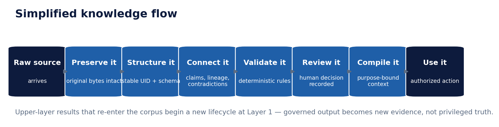
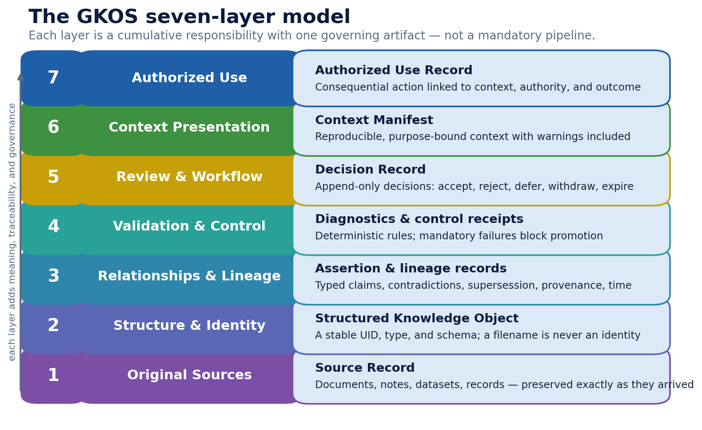
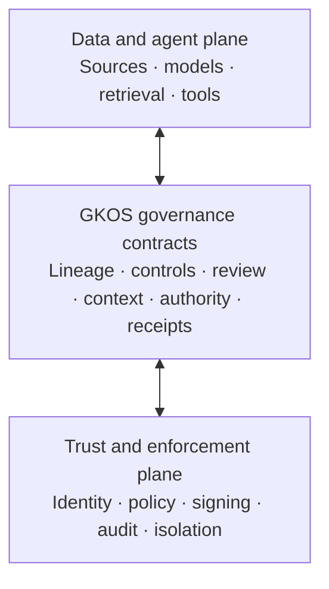

# Governed Knowledge Operations Standard (GKOS)

<!-- markdownlint-disable MD013 -->

> A developmental public pre-standard for making the path from evidence to
> consequential action inspectable, testable, and governable.

**Evidence is not truth. Confidence is not authority. Capability is not authority.**

When a person or AI system recommends, approves, or takes an action, GKOS is
designed to make six questions answerable:

1. What evidence actually entered the system?
2. What did a person, model, tool, or agent claim that evidence meant?
3. Which deterministic controls ran, and what failed or was refused?
4. Who or what had authority to decide—and within what limits?
5. What exact context was presented for that decision or action?
6. What happened next, and how can the result be corrected, challenged, or replayed?

GKOS does not replace your data stores, agent runtimes, workflow systems,
identity providers, policy engines, or professional judgment. It defines the
**governed contracts between them** so that retrieval, confidence, technical
access, and automation are not mistaken for approval or authority.

- **Current release:** GKOS-2026-08-20 v0.80
- **Development line:** v0.81 preparation; no v0.81 release or qualifying
  profile is claimed by this README
- **Maturity:** developmental public pre-standard; open for implementation,
  testing, criticism, and independent review
- **Machine exchange contract:** GKX 2.0
- **Canonical artifact profile:** GKX-CBOR-1 where required by the applicable
  artifact contract
- **Canonical repository:** `Odenknight/gkos-standard`

[Technical orientation](TECHNICAL_README.md) ·
[Master standard](standard/00_GKOS_Master_Standard.md) ·
[Requirements registry](requirements/REGISTRY.md) ·
[Conformance](conformance/README.md) ·
[Reference infrastructure](docs/implementation/GKOS_REFERENCE_INFRASTRUCTURE.md) ·
[Roadmap](ROADMAP.md)

> **GKOS defines the responsibilities and claim boundaries. GKX carries the
> machine-readable governed records. Implementations provide the runtime.**

## Why GKOS exists

Modern AI systems can retrieve records, combine evidence, create assertions,
call tools, delegate work, and change external systems faster than a person can
inspect every intermediate step. Conventional logs often show that a call
occurred, but not whether the source was current, which contradictions were
known, which policy version controlled the action, or whether the actor had the
right authority for that exact purpose.

GKOS separates records that are often collapsed together:

- preserved evidence;
- human, model, tool, and agent assertions;
- deterministic validation results;
- authorized decisions;
- purpose-bound context;
- grants and delegations;
- consequential actions, refusals, outcomes, and corrective routes.

It does not declare absolute truth. It makes the path from evidence to action
explicit enough to inspect, reproduce, challenge, correct, and test.

## Why standards communities may care

NIST's 2026 [AI Agent Standards Initiative](https://www.nist.gov/artificial-intelligence/ai-agent-standards-initiative)
prioritizes industry-led standards, community-led interoperable protocols,
agent authentication and identity infrastructure, and security evaluations.
The NCCoE concept work on
[software and AI agent identity and authorization](https://www.nccoe.nist.gov/projects/software-and-ai-agent-identity-and-authorization)
asks implementation-level questions about agent identification,
authentication, least privilege, delegation, human-agent binding, tamper-evident
logging, data-flow provenance, and prompt-injection containment.

GKOS is intended as a **candidate operationalization layer** for those kinds of
questions—not as a replacement for NIST guidance and not as a claim of NIST
alignment, approval, or endorsement.

| Implementation question | What GKOS contributes | What still comes from other systems |
| --- | --- | --- |
| How is an agent or service identified? | Stable governed actor and artifact references, versions, ownership, role boundaries, and recorded dependencies | Authentication, workload identity, credential lifecycle, and key custody through systems such as OIDC, SPIFFE/SPIRE, SCIM, and enterprise IAM |
| How is authority bounded and delegated? | Purpose-bound grants, monotonic delegation limits, deterministic control results, effect scope, and action-time verification | OAuth, NGAC, policy engines, PAM, organizational authority, and applicable law or policy |
| How are actions made inspectable? | Durable State-Change, Decision, Refusal, Context, and Authorized Use records with canonical hashes where required | Append-only storage, signatures, transparency services, monitoring, and independent assessment |
| How is data-flow provenance retained? | Source Records, typed lineage, exact evidence anchors, and a captured Selection Envelope before deterministic context assembly | Native records systems, OpenLineage or W3C PROV mappings, telemetry, retention, and lawful access controls |
| How is human or organizational responsibility preserved? | Role separation, authorized append-only disposition, exact reviewed-context binding, and explicit escalation boundaries | Workforce roles, qualifications, contracts, delegations, review procedures, and accountability mechanisms |
| How are prompt injection and confused-deputy risks contained? | Purpose, sensitivity, authority, effect-scope, and mandatory fail-closed gates around context and action | Runtime isolation, sandboxing, content defenses, credential separation, secure tool design, and adversarial testing |
| How can implementations be compared? | Stable requirement IDs, GKX artifacts, registered diagnostics, fixture-based tests, exact-bound claim manifests, and explicit limitations | Independent implementations, competent assessors, reproducible environments, and broader TEVV programs |

The [NIST AI Risk Management Framework](https://www.nist.gov/itl/ai-risk-management-framework)
remains a voluntary risk-management framework and is being revised in 2026.
GKOS should be treated as complementary implementation evidence: it may help an
organization demonstrate how selected governance decisions operated, but it
does not establish AI RMF conformity or legal compliance.

**GKOS is not a NIST publication and is not endorsed by NIST or NCCoE.** Product
and standards references are included for technical comparison only.

## The seven cumulative responsibilities

The layers are cumulative responsibilities—not seven products, not a required
synchronous pipeline, and not a claim that every deployment must implement all
seven.

| Layer | Responsibility | Required result |
| --- | --- | --- |
| **1. Original Sources** | Preserve what was received or observed, including revision, provenance, custody, sensitivity, retention, and acquisition evidence | Source Record |
| **2. Structure and Identity** | Assign stable identity, type, schema, version, and canonical representation without treating filename or path as identity | Structured Knowledge Object |
| **3. Relationships and Lineage** | Record typed, sourced, temporal, scoped, and attributable assertions, contradictions, dependencies, corrections, and supersession | Assertion and lineage records |
| **4. Validation and Control** | Apply deterministic requirements and restrictions; mandatory failures block, refuse, roll back, or freeze as specified | Diagnostics and Control Receipts |
| **5. Review and Workflow** | Bind an authorized, append-only disposition to the exact proposal and evidence reviewed | Decision Record |
| **6. Context Presentation** | Capture non-deterministic selection, then assemble reproducible, purpose-bound, restriction-aware context | Selection Envelope and Context Manifest |
| **7. Authorized Use** | Bind an exact action to context, valid authority, distinct actor roles, delegation, effect scope, outcome, and recovery | Authorized Use Record or Refusal Receipt |

Every committed governed state change must be durably receipted through the
applicable record role. Higher layers do not silently rewrite lower layers.
When an upper-layer result later becomes evidence, it re-enters as a new Layer-1
source without inherited standing.

## A plain-language example

Consider an AI assistant that proposes a customer refund:

1. The request, account record, and applicable policy versions are preserved as
   sources.
2. The agent's interpretation is recorded separately from those sources.
3. Deterministic rules check identity, amount, purpose, sensitivity, and the
   agent's delegated limit.
4. A valid standing policy may authorize a routine, reversible refund; an
   exception may require an independent review and Decision Record.
5. The exact evidence, warnings, restrictions, omissions, and policy versions
   used for the decision are bound in a Context Manifest.
6. The action is rechecked at execution time and recorded with its actor,
   authority, effect scope, outcome, and correction route.
7. The outcome returns as new evidence. It does not rewrite the original
   request or the history of how the decision was made.

GKOS does not decide whether the refund policy is fair or lawful. It makes the
operation and responsibility chain testable.

## A control plane—not another runtime or database

A deployment may implement GKOS in one service, several services, sidecars,
event handlers, workflow records, or adapters over existing platforms. GKOS
does not mandate one database, one agent framework, one cloud, or one vendor.

The governing distinction is:

- **Capabilities** retrieve, reason, route, sign, store, or execute.
- **GKOS contracts** state what evidence, authority, context, and receipts must
  survive when those capabilities are used.

## Use the tools you already have

Existing products and open standards can contribute mechanisms to one or more
layers. They do not become GKOS-conformant merely by being installed.

| GKOS responsibility | Representative mechanisms | What a GKOS adapter must still establish |
| --- | --- | --- |
| **L1 preservation** | Records repositories, WORM/object-lock storage, content-addressed stores; Docling, Apache Tika, or Unstructured for extraction | Exact received revision, fingerprint, provenance/custody, retention and sensitivity evidence; extraction must not overwrite the source |
| **L2 structure and identity** | JSON Schema, LinkML, schema registries, MDM, persistent identifier systems | Stable governed identity and version, type and schema identity, canonical representation, and explicit handling of unknown or lossy fields |
| **L3 relationships and lineage** | W3C PROV-O, OpenLineage, DataHub, Apache Atlas, Microsoft Purview lineage, Neo4j, Stardog, Graphiti | Typed direction, actor, evidence anchor, scope, epistemic state, validity time, contradiction, correction, and supersession semantics |
| **L4 validation and control** | GKOS Engine, OPA, Cedar, Great Expectations, Soda, pySHACL, policy and authorization services | Exact policy or check identity, deterministic outcome, stable diagnostic, mandatory blocking behavior, and durable receipt |
| **L5 review and workflow** | ServiceNow, Jira, GitHub/GitLab/Azure DevOps review, Temporal, Camunda/Flowable, ADR tools | Authorized append-only disposition, role separation, conditions, expiry, supersession, appeal/escalation, and binding to exact governed inputs |
| **L6 context presentation** | MCP transports and schemas, search/vector/graph systems, CUE, Pydantic, retrieval frameworks | Captured Selection Envelope plus deterministic assembly of evidence, contradictions, warnings, restrictions, omissions, recipient, purpose, versions, and expiry |
| **L7 authorized use** | OAuth/OIDC, SPIFFE/SPIRE, NGAC, OpenFGA, PAM, Sigstore/Rekor, in-toto | Exact actor/action/context/grant/effect-scope binding, action-time authorization, outcome, refusal or recovery route, and durable use evidence |

Important boundaries:

- Extraction software is not an immutable preservation system.
- A graph edge is not automatically a governed assertion.
- Authentication is not authorization, and authorization is not a Decision
  Record.
- A signature proves integrity or origin under its trust model; it does not
  prove truth, authority, or GKOS conformance.
- MCP can carry tools, resources, prompts, and authorization metadata; it does
  not by itself create a GKOS Context Manifest or Authorized Use Record.
- Non-deterministic model graders may provide evidence or monitoring signals,
  but they cannot silently replace a deterministic mandatory gate.

For a fuller mapping across commercial, enterprise, and open-source
infrastructure, including deployment patterns and NIST-oriented trust-plane
bindings, see the
[reference infrastructure architecture](docs/implementation/GKOS_REFERENCE_INFRASTRUCTURE.md).

All product references are illustrative. They are not endorsements,
procurement recommendations, interoperability results, or conformance claims.
Products and licenses change; an implementation must pin and reassess the exact
version and deployment mode it uses.

## Adoption profiles

GKOS can be adopted incrementally, but named claims have exact boundaries.

| Claim | Required depth | Meaning |
| --- | --- | --- |
| **GKOS Core** | All applicable GCP-1 through GCP-5 requirements on one exact release and fixture baseline | Preserved evidence through governed disposition |
| **GKOS Advanced** | All applicable GCP-1 through GCP-7 requirements on one exact release and fixture baseline | Core plus reproducible context and authorized use |
| **GCP-6 Context-Only Extension** | GKOS Core plus GCP-6; read-only for the claimed use | Purpose-bound context without authority to perform consequential action |
| **Viewer/Projection Profile** | Independently claimable read-only requirements | Faithful presentation without write, promotion, decision, or authorization authority |

A deployment may truthfully report lower-layer capability without calling it
GKOS Core. The active fixture catalog on the current development line declares
no qualifying profile, so these definitions are requirements and test targets—not
certifications of an implementation.

## Testability and exact-bound claims

A serious GKOS claim identifies at least:

- the exact dated GKOS release and GKX version;
- the profile and applicable requirement set;
- implementation version and immutable commit or artifact digest;
- schemas, policies, compiler, and canonicalization profile;
- fixture catalog and test-runner versions;
- environment and dependency evidence;
- executed, passed, failed, skipped, unsupported, and unevaluated results;
- exceptions and limitations;
- whether the assessment was self-attested or independently verified.

For GCP-6 and GCP-7, canonical governed artifacts use GKX-CBOR-1 where required.
Non-deterministic selection is captured in a hashed Selection Envelope;
deterministic assembly operates only on captured, digest-bound inputs. A
friendly JSON, YAML, Markdown, or dashboard rendering is a view—not a second
canonical authority.

## What GKOS can and cannot establish

GKOS can define and test whether an implementation preserves the required
records and boundaries. It cannot, by itself, establish that:

- a source is factually correct;
- a model output is accurate or unbiased;
- a policy is lawful, fair, ethical, or appropriate;
- an identity provider, ledger, signature system, or runtime is uncompromised;
- a human reviewer reached the right substantive conclusion;
- a deployment complies with NIST guidance, the EU AI Act, ISO/IEC 42001,
  sector regulation, or applicable law; or
- an implementation is certified, accredited, secure, or safe.

Those determinations require their own evidence, qualified authorities,
assessment scope, and—where applicable—recognized conformity or regulatory
processes.

## Where GKOS helps

| Audience | Practical value |
| --- | --- |
| **Individuals** | Keeps original sources, personal interpretations, AI suggestions, and final decisions distinguishable. |
| **Developers and operators** | Connects requirements, configurations, code, tests, incidents, approvals, deployments, and rollback evidence. |
| **Small businesses** | Makes responsibilities, policy exceptions, approvals, and AI-assisted work traceable without replacing the existing stack. |
| **Enterprises** | Provides a common contract across records, data, workflow, identity, policy, retrieval, and agent systems. |
| **Scientific organizations** | Links datasets, methods, executions, artifacts, interpretations, review, and reuse without treating reproducibility as proof of scientific validity. |
| **Legal and regulated organizations** | Separates source material, interpretation, matter- or purpose-specific context, authorized review, and resulting action while retaining deployment-supplied access and privilege controls. |
| **Government and public institutions** | Helps preserve the evidence, delegated authority, decision context, action, and appeal or correction trail behind public administration. |
| **AI and agentic systems** | Prevents model confidence, tool access, retrieval rank, or technical capability from being treated as permission to approve or act. |

## Implementations in the GKOS ecosystem

GKOS is implementation-neutral. Public projects may demonstrate selected
responsibilities without becoming the standard or acquiring a conformance
claim.

| Project | Role | Current claim boundary |
| --- | --- | --- |
| [GKOS Engine](https://github.com/Odenknight/GKOS-Engine) | Deterministic GKX parsing, validation, assessment, projection, read-only navigation, and adapter surfaces | Reference implementation; versioned separately from the standard; no qualifying GKOS profile is established merely by the package or tag |
| [Kosmos-Oden](https://github.com/Odenknight/Kosmos-Oden) | Human-facing visualization and read-only lineage/navigation over governed records | Product example with an exact-pinned Engine dependency; not the standard, an endorsement, an independent implementation, or a conformance result |

The implementation version matrix must keep the standard release, GKX
namespace, canonical profile, Engine tag, current development head, product
pin, and fixture baseline separate. Matching version numbers do not imply
compatibility.

## Current maturity and governance boundary

GKOS v0.80 is suitable for public review, research, controlled prototypes,
fixture development, interoperability experiments, and independent
implementation work.

It is **not**:

- an accredited national or international standard;
- an independent consensus publication;
- a certification or accreditation program;
- proof that a product is truthful, safe, secure, or legally compliant;
- a legal opinion or regulatory authorization;
- a replacement for professional judgment; or
- evidence that the v1.0 gates have been met.

The v0.x series is governed by Shaun “Oden” Marshall as Founder and Initial
Editor. Adopted changes are disclosed owner-authorized development decisions,
not independent consensus ratification. Multi-stakeholder governance, complete
conformance infrastructure, an independently demonstrated second
implementation, appeals and succession, signed archival publication, and
published pilot evidence remain v1.0 work.

## Start here

| You are… | Read this next |
| --- | --- |
| New to GKOS | This README, then the [illustrated edition](archive/illustrated/GKOS-v0.76-Illustrated-Edition.md) |
| Reviewing the concept professionally | [Legal and professional orientation](docs/GKOS_LEGAL_AND_PROFESSIONAL_ORIENTATION.md) and [known limitations](standard/annexes/Known_Limitations_and_Open_Issues.md) |
| Designing infrastructure | [Reference infrastructure](docs/implementation/GKOS_REFERENCE_INFRASTRUCTURE.md) and [technical orientation](TECHNICAL_README.md) |
| Implementing GKOS or GKX | [Master standard](standard/00_GKOS_Master_Standard.md), [layer contracts](standard/annexes/Layer_Interface_Contracts.md), [canonical serialization](standard/annexes/Canonical_Serialization.md), and [schemas](schemas/README.md) |
| Testing an implementation | [Conformance](conformance/README.md), [requirements registry](requirements/REGISTRY.md), and [fixtures](fixtures/README.md) |
| Comparing standards and tools | [Technical ecosystem mapping](TECHNICAL_README.md#open-source-and-product-ecosystem-mapping) and [provenance landscape crosswalk](docs/GKOS_PROVENANCE_LANDSCAPE_CROSSWALK.md) |
| Proposing a change | [Contributing](CONTRIBUTING.md) and [governance](GOVERNANCE.md) |
| Reviewing current limitations | [Known limitations](standard/annexes/Known_Limitations_and_Open_Issues.md) and [roadmap](ROADMAP.md) |

## Open contribution priorities

The highest-value contributions are evidence-bearing, not promotional:

- independent implementation reports that identify ambiguity and divergence;
- negative and boundary fixtures for mandatory gates;
- versioned mappings to identity, authorization, provenance, records, and
  workflow standards;
- public pilot reports with failures, burden, human-factor findings, and
  corrective actions;
- security, privacy, records-management, legal, scientific, and accessibility
  review;
- clearer public-facing examples that preserve the standard's claim boundaries;
- governance participation that reduces single-editor and single-implementation
  dependence.

Criticism, replacement text, fixtures, and reproducible evidence are welcome.
See [CONTRIBUTING.md](CONTRIBUTING.md).

## Repository map

- [Master standard](standard/00_GKOS_Master_Standard.md)
- [Normative and informative annexes](standard/annexes/)
- [Development decisions](decisions/GKOS_Decision_Register.md)
- [Requirements registry](requirements/REGISTRY.md)
- [Schemas](schemas/README.md)
- [Conformance](conformance/README.md)
- [Fixtures](fixtures/README.md)
- [Examples](examples/README.md)
- [Implementation references](docs/implementation/README.md)
- [Governance](GOVERNANCE.md)
- [Roadmap](ROADMAP.md)
- [Licensing](LICENSE.md)

The provisional Scientific Research Trace Profile is an informative draft for
testing research traceability. It is non-normative, establishes no qualifying
GKOS profile, and grants no certification, scientific-validity judgment, or
execution authority. See the [SRTP proposal](docs/proposals/SRTP_DRAFT_PROFILE.md).

## Publication, citation, and licensing

Tagged releases may be archived by Zenodo for version-specific and concept
DOIs. See [ZENODO.md](ZENODO.md) for release-gate and binding requirements.

Documentation and original graphics are licensed under CC BY 4.0. Schemas,
fixtures, workflows, scripts, and reference code are licensed under
Apache-2.0. Trademark, certification, endorsement, and accreditation rights
are separate. See [LICENSE.md](LICENSE.md), [NOTICE.md](NOTICE.md), and
[TRADEMARKS.md](TRADEMARKS.md).

Suggested citation:

> Shaun “Oden” Marshall. *Governed Knowledge Operations Standard (GKOS),
> GKOS-2026-08-20 v0.80.* CC BY 4.0. Changes, if any, should be identified by
> the modifier.
