# GKOS technical orientation

<!-- markdownlint-disable MD013 -->

This document is the technical entry point for implementers. It explains the
relationship among the standard, machine contract, profiles, schemas,
conformance evidence, and implementations. It is informative: the
[master standard](standard/00_GKOS_Master_Standard.md), adopted
[development decisions](decisions/GKOS_Decision_Register.md), and applicable
normative annexes control when an overview differs from them.

- **Standard:** GKOS-2026-09-03 v0.81
- **Machine exchange contract:** GKX 2.0
- **Reference implementation baseline:** see the
  [version compatibility matrix](docs/implementation/VERSION_COMPATIBILITY_MATRIX.md)
- **Maturity:** developmental public pre-standard

[Return to the public README](README.md) ·
[Read the master standard](standard/00_GKOS_Master_Standard.md) ·
[Inspect schemas](schemas/README.md) ·
[Run conformance tooling](conformance/README.md)

## Current development decisions

[R22](decisions/R22_Canonical_Informative_Architecture_Development_Decision_Record.md) is accepted informative documentation authority. [R23](decisions/R23_Layer3_Interoperability_Semantics_Proposal.md) is accepted prospective v0.82 development authority; its [implementation evidence work](docs/v082/V82-01_L3_INTEROPERABILITY_WORK_PACKET.md) remains open. Neither changes the immutable v0.81 release or establishes current profile qualification. The [NIST row-level crosswalk candidate](https://github.com/Odenknight/gkos-standard/pull/42) has its own exact-head review gate, separate from the published high-level NIST add-in.

## End-to-end integration

Start with the [illustrated data-to-action walkthrough](docs/implementation/GKOS_END_TO_END_WORKFLOW.md). It explains all seven responsibilities, the protected enforcement boundary, receipt recovery and separate framework review views. The [publication receipt](docs/releases/GKOS_2026-09-03_v0.81_PUBLICATION_RECORD.md) records the live edition.

Use **Selection Envelope** in prose. The existing schema filename `selection-set.schema.json` and serialized identifiers such as `selection_set_id` remain unchanged for compatibility; terminology is not a schema migration.

## Vocabulary and authority

| Category | Canonical name | Authority boundary |
| --- | --- | --- |
| Standard | **GKOS** | Defines responsibilities, lifecycle, authority, controls, and conformance |
| Exchange contract | **GKX 2.0** | Defines current machine-facing names and interoperable records governed by GKOS |
| Implementation | **GKOS Engine** | Implements deterministic machinery; does not define or amend the standard |
| Profile | **GCP-1 through GCP-7** and Viewer/Projection Profile | Defines the exact responsibilities a claimant must demonstrate |
| Domain draft | **Scientific Research Trace Profile (SRTP)** | Informative and provisional; currently establishes no qualifying profile |
| Record/artifact | Source Record, Decision Record, Context Manifest, receipts, projections | Carries governed evidence or state; it is not a product name |

Implementation and distribution names are not additional standards, layers, or
schema authorities. “Agent-Ready,” “Machine Dialect,” and “Navigation” have
specific historical, compatibility, fixture, or implementation contexts in
the repository; they are not substitutes for naming an exact current GKOS
profile or requirement. An implementation should state the record, profile,
version, and evidence it supports instead of relying on an ambiguous readiness
label.

## Standard, exchange contract, and implementations

GKOS and GKX deliberately have different jobs:

- **GKOS** defines what must remain distinguishable, governed, and auditable.
- **GKX** defines how implementations exchange the relevant machine-readable
  objects and diagnostics.
- **Implementations** choose storage engines, indexes, databases, programming
  languages, interfaces, and deployment topologies while preserving the
  applicable GKOS/GKX requirements.

R14 adopts the breaking GKX 2.0 namespace: `gkx_version`, `.gkx/`, `GKX-*`, and
`gkx`. Earlier release directories remain historical evidence; they are not
inputs to a current GKX 2.0 conformance claim. See
[R14](decisions/R14_GKX_2_0_Breaking_Machine_Namespace_Development_Decision_Record.md).

R15 adds governed state-change receipt roles, retention and disposition
controls, Layer-1 re-entry rules, explicit semantic supersession, and bounded
delegation. It does not create general agent write authority or change the GKX
2.0 serialized namespace. See
[R15](decisions/R15_Governed_State_Change_Reentry_and_Bounded_Delegation_Development_Decision_Record.md).

R16 defines Core and Advanced tiers, binds GCP-6 and GCP-7 for Advanced use,
adopts deterministic canonical serialization, and standardizes context,
authorized-use, refusal, diagnostic, and effect-scope obligations. See
[R16](decisions/R16_Required_Conformance_Profiles_and_GCP67_Enablement_Development_Decision_Record.md).

## Accepted informative architecture for v0.82 development

**GKOS canonical architecture (informative, r3, v0.82 development candidate).** The Standard defines GKX data contracts; implementations consume them and exchange governed records rather than internals. When retrieval is used, retrieval produces an exact candidate set, governance evaluates eligibility separately, and L6 captures selection and deterministically assembles context. Proposed or consequential operations cross the governed boundary, which preserves L4 controls, applicable L5 disposition, L6 context, and L7 authority/effect admission. External MCP/A2A/ACS bindings are informative and versioned: callable is not authorized. Receipts are cross-layer; the shaded founder overlay is an implementation example, not part of the Standard.

[Download PNG](graphics/diagrams/gkos-canonical-architecture.png) · [Editable Mermaid source](graphics/diagrams/gkos-canonical-architecture.mmd) · [Checked label register](graphics/diagrams/gkos-canonical-architecture.labels.txt) · [accepted R22 record](decisions/R22_Canonical_Informative_Architecture_Development_Decision_Record.md)

R22 is Proposed at this preparation head. The figure itself deliberately carries
no Proposed/Accepted adoption status so owner disposition can later be recorded
without changing the reviewed figure digests. Until R22 is accepted, the master
standard, permanent requirements, accepted decisions, and existing technical
orientation remain controlling.

## Layer contracts

The model is cumulative, but processing may be asynchronous, distributed, or
re-entrant. A product may implement a subset only when its claim names the
applicable profile and limitations precisely.

| Layer | Input responsibility | Required result | Boundary that must survive |
| --- | --- | --- | --- |
| **L1 Original Sources** | Receive or observe material | Source Record | Original revision, provenance, custody, sensitivity, retention, and receipt |
| **L2 Structure and Identity** | Structure a preserved source or governed object | Structured Knowledge Object | Stable identity and version; location is not identity |
| **L3 Relationships and Lineage** | Connect claims, sources, actors, and objects | Assertion and lineage records | Typed, sourced, temporal, scoped, attributable relationships |
| **L4 Validation and Control** | Evaluate deterministic rules and restrictions | Diagnostics and control receipts | Mandatory failures block promotion |
| **L5 Review and Workflow** | Apply authorized disposition | Decision Record | Append-only decision history; when context was used, manifest identity, version, and hash |
| **L6 Context Presentation** | Capture selection, then deterministically assemble context | Selection Envelope and Context Manifest | Digest-bound inputs, restrictions, warnings, contradictions, omissions, recipient, purpose, and expiry |
| **L7 Authorized Use** | Evaluate actor, action, exact context, grant, and effect scope | Authorized Use Record or Refusal Receipt | Distinct actor roles, authority, manifest hash, outcome, and recovery route |

Detailed requirements live in the
[layer interface contracts](standard/annexes/Layer_Interface_Contracts.md) and
[artifact mapping](standard/annexes/Layer_Artifact_Mapping.md).

## Control-plane placement

This control-plane graphic remains a narrower detail view. It does not
compete with the proposed r3 orientation merely because it focuses on
placement within an existing stack.

[Download PNG](graphics/diagrams/gkos-control-plane.png) · [Editable diagram source](graphics/diagrams/gkos-control-plane.mmd)

An implementation can bind GKOS responsibilities to existing infrastructure:

| Existing component | What it continues to own | What GKOS adds or requires |
| --- | --- | --- |
| Agent runtime | Reasoning, tool execution, scheduling | Governed inputs, explicit authority boundary, use evidence |
| Workflow engine | Orchestration, queues, approvals | Typed decision records, role constraints, state-change receipts |
| Identity/policy system | Authentication, grants, policy evaluation | Binding of identity and grants to governed context and action |
| Data/vector/graph store | Persistence, indexing, retrieval | Stable governed identity, lineage, version and restriction semantics |
| Signing/provenance system | Cryptographic identity, attestations, derivation | GKOS-specific epistemic, context, decision, and authority semantics |

GKOS specifies the governance invariants; it does not mandate one “governance
store.” A deployment may use multiple stores if the applicable identities,
history, restrictions, authority, and receipts remain reproducible.

## Open-source and product ecosystem mapping

**Status:** informative ecosystem analysis, reviewed 2026-08-29. This section
identifies reusable mechanisms and adapter targets. It is not an endorsement,
vendor certification, interoperability result, or GKOS conformance assessment.

The GKOS layers are implementation-neutral contracts. Existing projects often
provide useful machinery inside one or more layers, but product features and
GKOS artifacts are not interchangeable. Authentication is not an Authorized
Use Record; a workflow state is not necessarily a Decision Record; a prompt or
tool schema is not a Context Manifest; and a graph edge is not automatically a
typed, sourced, temporal GKOS assertion.

[Download PNG](graphics/diagrams/gkos-layer-responsibilities.png) · [Editable diagram source](graphics/diagrams/gkos-layer-responsibilities.mmd)

The arrows show cumulative responsibility; processing may be asynchronous,
distributed, or re-entrant, as described in the layer contracts above.

### Layer-by-layer component mapping

| Layer | Candidate open-source or open-standard components | What a GKOS adapter must still preserve |
| --- | --- | --- |
| **L1 Original Sources** | [Docling](https://github.com/docling-project/docling), [Apache Tika](https://tika.apache.org/), [Unstructured](https://github.com/Unstructured-IO/unstructured), [OpenLineage](https://openlineage.io/), [W3C PROV-O](https://www.w3.org/TR/prov-o/) | Exact source revision, fingerprint, provenance/custody, acquisition receipt, sensitivity and retention defaults; extraction output must not overwrite source evidence |
| **L2 Structure and Identity** | [Logseq](https://github.com/logseq/logseq), [LinkML](https://linkml.io/), [JSON Schema](https://json-schema.org/) | Stable governed UID and version independent of filename/path, canonical representation, type and schema identity; preserve unknown or lossy fields explicitly |
| **L3 Relationships and Lineage** | [Graphiti](https://github.com/getzep/graphiti), [XTDB](https://xtdb.com/), [Neo4j Community Edition](https://github.com/neo4j/neo4j), [Dolt](https://github.com/dolthub/dolt) | Typed direction, actor, provenance, evidence anchors, scope, epistemic state, validity time, version, contradiction and supersession semantics |
| **L4 Validation and Control** | [Great Expectations](https://greatexpectations.io/), [Soda Core](https://github.com/sodadata/soda-core), [Ragas](https://github.com/explodinggradients/ragas), [OpenTelemetry](https://opentelemetry.io/), [OPA](https://www.openpolicyagent.org/), [Cedar](https://www.cedarpolicy.com/) | Exact policy/check identity and version, evaluated inputs, deterministic outcome, stable diagnostic code, blocking behavior and durable receipt |
| **L5 Review and Workflow** | [adr-tools](https://github.com/npryce/adr-tools), workflow engines, review systems, and policy-backed approval services | Authorized append-only disposition, actor-role separation, conditions, expiry, supersession and exact binding to governed inputs; policy evaluation alone is not review |
| **L6 Context Presentation** | [MCP](https://modelcontextprotocol.io/) schemas and metadata, [SPDX](https://spdx.dev/), [CycloneDX](https://cyclonedx.org/), [CUE](https://cuelang.org/) | Captured Selection Envelope plus deterministic assembly of evidence, contradictions, warnings, restrictions, omissions, recipient, purpose, versions, expiry and reproduction data |
| **L7 Authorized Use** | [Sigstore/Rekor](https://www.sigstore.dev/), [in-toto](https://in-toto.io/), [SPIFFE/SPIRE](https://spiffe.io/), [OpenFGA](https://openfga.dev/) | Exact actor/action/context/grant/effect-scope binding, authorization-time evaluation, outcome, refusal or recovery route, and durable use evidence |

[Obsidian](https://obsidian.md/) is a widely used Markdown client and relevant
interoperability surface, but its core application is not open-source. It is
therefore not classified as an open-source component in the table. License,
edition, and deployment terms for every candidate must be verified before an
implementation adopts it.

### Historical ecosystem comparison

The [dated vendor snapshot](docs/ecosystem/HISTORICAL_VENDOR_COVERAGE_2026-08-29.md) is retained for background. Its broad overlap ratings are not current adoption evidence. For a candidate adapter, record the exact product/API version, primary source, supported boundary, failure behavior and executable evidence. Use the [integration contract](docs/implementation/GKOS_END_TO_END_WORKFLOW.md#a-contract-implementers-can-test) to evaluate it.

### Adapter priorities

| Adapter target | Recommended GKOS role | Mandatory boundary |
| --- | --- | --- |
| Google OKF v0.2 | Versioned L1/L2 intake and limited L3 projection | Preserve the raw bundle as source evidence; never treat a path as a GKX UID; translate trust fields as sourced signals, not authority; wrap run receipts as evidence before any governed promotion |
| MCP authorization | L6/L7 transport and authorization evidence | Bind principal, protected resource, grant/scope, request, Context Manifest hash, outcome and refusal; token possession never creates L5 promotion authority |
| Graphiti or another knowledge graph | Regenerable L3 projection/index | Pin source snapshot and ontology/index version; preserve loss markers; never allow inferred similarity or graph state to overwrite canonical assertions |
| OPA or Cedar | L4 deterministic policy evaluator | Record policy digest/version, complete evaluated input, decision, diagnostic code and blocking result; do not relabel policy evaluation as an authorized L5 disposition |
| OpenLineage or W3C PROV | L1/L3 import/export | Publish a field-level mapping, time semantics and explicit losses; provenance validity does not imply epistemic acceptance |
| Sigstore or in-toto | Signature/transparency envelope for selected receipts | Signature proves integrity/origin under its trust model, not truth, GKOS authority or conformance by itself |

### Data-science review path

For an analytics, ML or scientific workflow, the layers can be reviewed as a
single transaction without requiring one monolithic platform:

| Layer | Data-science example | Review question |
| --- | --- | --- |
| L1 | Dataset snapshot, source query, instrument output, paper, notebook input | Can the exact observed or acquired input be reproduced and its custody explained? |
| L2 | Dataset/model/evaluation object with stable ID and schema version | Does identity survive file moves, table renames and regenerated views? |
| L3 | Feature, dataset, model, run, citation, contradiction and supersession lineage | Are relationships sourced, directional, scoped and valid for the stated time? |
| L4 | Schema checks, drift tests, leakage tests, metric/eval results, policy checks | Which exact checks ran, and do mandatory failures actually stop promotion? |
| L5 | Accepted, rejected, limited or deferred model/data decision | Who had authority, who was independent, and what evidence and conditions bound the disposition? |
| L6 | Reproducible evaluation, analysis or inference context | Can another reviewer reconstruct the exact selected inputs, warnings, omissions, policies and versions? |
| L7 | Deployment, publication, external release, automated decision or tool effect | Was the action permitted for this actor and purpose against this exact context, and is the outcome/refusal durable? |

GKOS-2026-09-03 v0.81 is published at its signed tag and immutable release
package. Current `main` is post-v0.81 development; later informative or
provisional work does not rewrite the published coordinate. R21 does not make
any vendor, retrieval algorithm, graph store, model, client, or adapter
normative, and RRET-01 remains provisional, non-normative, and non-qualifying.
No profile is currently qualified.

## Governed retrieval and context

Similarity search is a candidate-discovery mechanism, not an authorization
mechanism. A GKOS-aligned retrieval path should be able to establish:

1. the actor, purpose, scope, and applicable restrictions;
2. access eligibility before restricted material is exposed;
3. current identity, version, lineage, and supersession state;
4. relevant contradictions, warnings, and omissions;
5. the exact material compiled into the Context Manifest; and
6. the decision or action record produced from that context.

A Context Manifest is therefore more than a prompt dump or retrieval log. It is
a purpose-bound record of the context presented for a governed use.

Selection may be non-deterministic, but its complete operative output must be
captured as a canonical Selection Envelope. Assembly is deterministic: identical
selection, resolved content, schema, policy, compiler, and canonical-profile
inputs must produce identical Context Manifest bytes and hash.

## Canonical serialization

Canonical artifact identity binds to deterministic CBOR under the
`GKX-CBOR-1` profile, not to JSON, YAML, Markdown, a database row, or a
human-readable rendering. SHA-256 is calculated over the canonical payload,
which includes artifact type, schema version, canonical profile, and every
applicable digest-bound policy, compiler, and selection reference.

The canonical profile requires definite lengths, shortest exact encodings,
bytewise lexicographic ordering of canonical encoded map keys, duplicate-key
refusal, NFC text, fixed-microsecond UTC timestamps, and preservation of
schema-declared numeric types. A GCP-6 or GCP-7 claimant must also provide a
human-auditable rendering and parser/verifier whose round trip reproduces the
canonical hash. See the
[canonical serialization annex](standard/annexes/Canonical_Serialization.md).

## Core records and receipts

The exact schema program is still developmental. Conceptually, implementations
must preserve these distinct roles:

| Record role | Answers |
| --- | --- |
| Source Record | What was received or observed? |
| Structured Knowledge Object | What governed object and version is this? |
| Assertion/Lineage Record | Who claims what, based on which evidence, and how is it related? |
| Diagnostic/Control Receipt | Which deterministic check ran and what did it find? |
| Decision Record | Who authorized which disposition, with what scope and conditions? |
| Context Manifest | What was presented, to whom, for what purpose, under which restrictions? |
| Authorized Use Record | What action occurred, under which authority, with what outcome? |

“Receipt” is a general evidence role, not a single universal schema. A receipt
must identify the governed operation and its relevant inputs, actor or system,
time, result, and binding identifiers as required by its layer contract.

A projection is a derived representation. It must not silently become a
parallel authority, erase loss, or imply that rendered or indexed content is
the canonical governed record.

## Profiles and conformance

GKOS defines cumulative GCP-1 through GCP-7 responsibilities plus an
independent Viewer/Projection Profile. R16 names these tiers:

| Tier | Required responsibilities |
| --- | --- |
| GKOS Core | GCP-1 through GCP-5 |
| GKOS Advanced | GCP-1 through GCP-7 |
| GCP-6 Context-Only Extension | Core plus read-only GCP-6; no consequential action authority |
| Viewer/Projection Profile | Independent projection responsibilities |

A conforming claim must name:

- the exact GKOS release and GKX version;
- the exact profile or requirement set evaluated;
- the test suite and evidence used;
- all limitations, exclusions, and approved exceptions;
- whether the result is self-attested or independently verified; and
- the implementation version or immutable commit evaluated.

Green tests alone are not evidence that every normative requirement was
evaluated. Unevaluated or blocked requirements must not be converted into a
pass. Review the
[requirements registry](requirements/REGISTRY.md),
[profile applicability map](requirements/PROFILE_APPLICABILITY.md),
[conformance runner](conformance/README.md), and
[fixture catalog](fixtures/README.md).

The active executable suite remains incomplete and declares no qualifying
profile. No current implementation satisfies the future v1.0
second-independent-implementation gate.

## Provisional domain work

The Scientific Research Trace Profile is an informative test bed for binding
research inputs, execution events, artifacts, reviews, reruns, receipts, and
re-entry proposals. Its schemas and fixtures are explicitly provisional.

Passing the SRTP draft catalog:

- is not a GCP conformance claim;
- does not certify scientific validity;
- does not authorize execution or publication;
- does not establish regulatory compliance; and
- does not make SRTP normative.

See the [profile proposal](docs/proposals/SRTP_DRAFT_PROFILE.md),
[traceability proposal](docs/proposals/SRTP_DRAFT_TRACEABILITY.md), and
[provisional fixtures](fixtures/provisional/science/README.md).

## Implementation boundaries

### GKOS Engine

GKOS Engine is the reference implementation of deterministic machinery used to
validate, assess, project, and test GKOS/GKX artifacts. It is downstream of the
standard. Engine behavior cannot silently amend GKOS, and implementation
experience enters the standard only through the governed proposal and decision
process.

Do not hard-code an Engine version from this orientation page. Use the
[version compatibility matrix](docs/implementation/VERSION_COMPATIBILITY_MATRIX.md)
and immutable evidence cited by the relevant claim.

### Lite distributions

A “Lite” product name denotes a distribution or deployment choice, not a
relaxed GKOS schema or second conformance authority. Any Lite implementation
must state which operations it omits and what compatibility it preserves. It
must not accept invalid material merely by redefining the standard.

### Kosmos-Oden and other viewers

A viewer or navigation surface may project governed records without gaining
promotion, decision, or activation authority. Kosmos-Oden v0.8.0 is an
implementation example of this boundary: its public package and lockfile pin
GKOS Engine 2.1.1 at commit
`f4dfda16eac746c667cf042f908a918d9acc6713`, and its product update is bound to
Kosmos-Oden commit `a7113c0ca3be8dd230a9549940e2f387d4cb2a96`.

Those exact bindings make the example reproducible; they do not make product
tests a GKOS conformance result. Kosmos-Oden's visualization is source-content
read-only and changes no source content. A Viewer/Projection claim must still
identify loss, provenance, version, the canonical governed source, and its
immutable evidence.

## Interoperability

GKOS should reuse established mechanisms where their responsibilities overlap:

| Specification | Candidate relationship |
| --- | --- |
| W3C PROV | Export or interchange for entity, activity, agent, and derivation data, with explicit GKOS extensions or loss markers |
| in-toto | Envelope for signed validation, test, and release attestations |
| SLSA | Complementary source/build assurance and adoption pattern |
| Sigstore | Candidate public identity-bound signing and transparency mechanism |
| C2PA | Source evidence for asset credentials and media provenance |
| MCP authorization | Transport/tool grants that may carry or enforce authority; not a substitute for governed knowledge state |

See the claim-limited
[provenance landscape crosswalk](docs/GKOS_PROVENANCE_LANDSCAPE_CROSSWALK.md).

## Implementer path

1. Select the exact GKOS release and GKX version.
2. Select the smallest applicable profile or requirement set.
3. Map each applicable requirement to an implementation component and evidence
   source.
4. Preserve stable identities, versions, lineage, restrictions, and authority
   boundaries across storage and transport choices.
5. Run deterministic schemas, fixtures, and conformance tooling.
6. Record unevaluated requirements, blockers, divergences, and exceptions
   honestly.
7. Publish a claim only when its exact scope and immutable evidence are bound.

## Technical map

- [Master standard](standard/00_GKOS_Master_Standard.md)
- [Layer interface contracts](standard/annexes/Layer_Interface_Contracts.md)
- [Conformance profiles](standard/annexes/Conformance_Profiles.md)
- [Canonical serialization](standard/annexes/Canonical_Serialization.md)
- [Authority and refusal receipt fields](standard/annexes/Authority_and_Refusal_Receipt_Fields.md)
- [Diagnostic-code registry](standard/annexes/Diagnostic_Code_Registry.md)
- [Governed state change and re-entry](standard/annexes/Governed_State_Change_Reentry_and_Bounded_Delegation.md)
- [Requirements registry](requirements/REGISTRY.md)
- [Schemas](schemas/README.md)
- [Conformance runner](conformance/README.md)
- [Fixtures](fixtures/README.md)
- [Implementation documentation](docs/implementation/README.md)
- [Compatibility matrix](docs/implementation/VERSION_COMPATIBILITY_MATRIX.md)
- [Development decisions](decisions/GKOS_Decision_Register.md)
- [Known limitations](standard/annexes/Known_Limitations_and_Open_Issues.md)

## Claim boundary

GKOS-2026-09-03 v0.81 is a developmental public pre-standard. It is published,
owner-authorized, non-consensus, and non-qualifying. Nothing in this document
establishes accreditation, certification, legal compliance, regulatory
authorization, scientific validity, product safety, implementation conformance,
or the future GKOS v1.0 gates.
