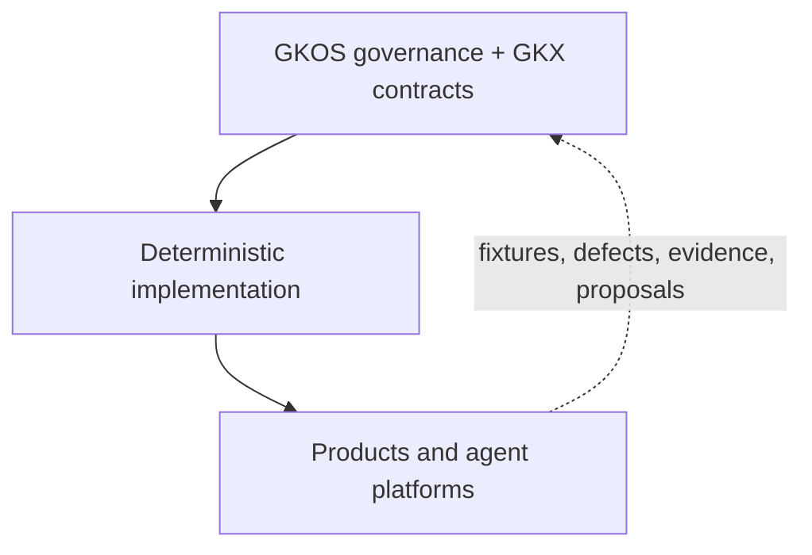
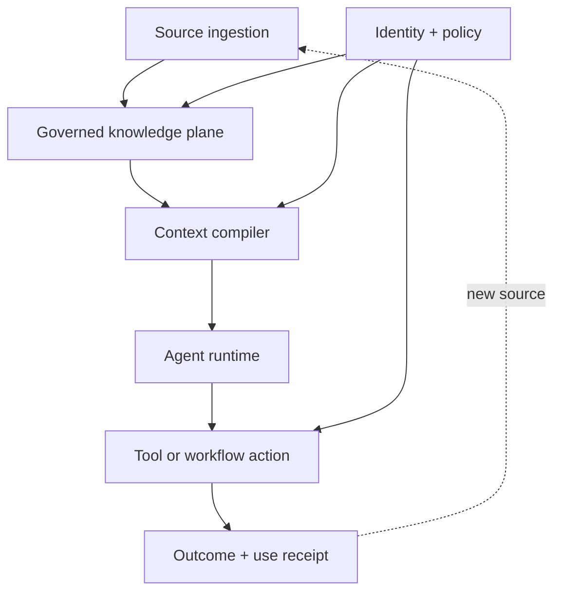

# GKOS Technical Orientation

<!-- markdownlint-disable MD013 -->

**Applies to:** GKOS-2026-08-05 v0.78 and adopted development decisions
**Audience:** implementers, platform architects, security engineers, reviewers,
standards evaluators, and AgenticOS designers
**Status:** informative orientation; the normative standard and adopted decision
records control

## R14 GKX 2.0 breaking boundary

R14 makes GKX 2.0 the only current machine namespace: `gkx_version`, `.gkx/`,
`GKX-*`, and `gkx`. It supersedes earlier machine-identifier preservation
policy. Prior release packages remain immutable historical evidence; the change
is owner-authorized, developmental, and non-consensus.

## R13 development-decision boundary

R13 makes catalog 0.1.1 explicitly non-qualifying, requires `UNEVALUATED` and
an empty profile claim for incomplete required expectations, and reserves
`GKOS-<AREA>-<NNN>` for clause-stable requirements. Fixtures must eventually
cite those requirements while adapters map implementation diagnostics and
observations. New identities use lowercase UUIDv7; existing lowercase UUIDv4
identities remain permanent, and any migration preserves every lineage branch.
These are adopted v0.x development decisions, not an independently verified
conformance result or consensus ratification. v0.77 is authorized for
developmental publication under signed tag `v0.77`; its release mechanics are
separate from this worktree.

## 1. System boundary

GKOS is a governance standard, not a storage engine or agent runtime. It defines
responsibilities, artifacts, invariants, authority boundaries, failure
behavior, and conformance disclosures for moving knowledge from preserved
evidence to authorized use.

GKX is the technical exchange model used to express governed objects and
records. GKOS Engine is the canonical deterministic reference implementation.
Implementations can provide different user experiences, storage, orchestration,
and model integrations, but they do not redefine the upstream standard.

Implementation experience may propose an upstream change. Shipped behavior is
not normative until accepted through the GKOS decision process.

## 2. Controlling principles

A conforming design preserves these invariants:

1. **Sources remain evidence.** Ingestion does not convert a source into truth.
2. **Assertions remain attributable.** Human and agent claims retain actor,
   evidence, scope, time, and version.
3. **Agent output is proposal-only by default.** A model cannot set accepted
   state or grant itself authority.
4. **Authority is receipt-based.** Prompts, role names, model identity,
   confidence, retrieval rank, similarity, graph position, and tool access are
   non-authoritative.
5. **Restrictions are monotonic unless an authorized operation changes them.**
   A lower-precedence source cannot widen a higher-precedence boundary.
6. **Mandatory control failure blocks promotion.** Diagnostics are not merely
   advisory when the applicable profile marks them mandatory.
7. **Contradictions remain visible.** Resolution adds a governed disposition;
   it does not erase the conflicting record.
8. **Re-entry creates new evidence.** An upper-layer output returning to the
   corpus starts a new lifecycle at Layer 1.
9. **Consequential use is purpose-bound and receipted.** The exact context and
   authority remain linked to the action and outcome.
10. **Unevaluated is not passing.** Tooling gaps, missing fixtures, and
    inaccessible evidence are disclosed, not inferred away.

## 3. Layer contracts

| Layer | Accepted responsibility | Minimum governed output | Invariant |
| --- | --- | --- | --- |
| L1 Original Sources | Acquire and preserve evidence | Source Record and ingestion receipt | Revision identity, fingerprint, provenance, custody, sensitivity, retention, and locators preserved |
| L2 Structure and Identity | Assign stable structure and identity | Structured Knowledge Object | Filename/path is not identity; schema and canonical form are declared |
| L3 Relationships and Lineage | Record typed claims and derivation | Assertion and lineage records | Direction, actor, provenance, evidence anchor, scope, epistemic state, temporal validity, and version retained |
| L4 Validation and Control | Execute deterministic rules | Diagnostics and control receipts | Mandatory failures block promotion; no silent defaulting |
| L5 Review and Workflow | Bind an authorized disposition | Append-only Decision Record | Proposal author cannot claim independent approval of its own work |
| L6 Context Presentation | Compile reproducible, purpose-bound context | Context Manifest | Evidence, accepted assertions, contradictions, restrictions, omissions, versions, recipient, purpose, and expiry declared |
| L7 Authorized Use | Permit and record consequential action | Authorized Use Record | Actor, action, context, authority, dependencies, outcome, and compensation route linked |

The standard defines cumulative responsibilities. Deployments may realize them
as services, modules, event handlers, database records, content-addressed files,
or another architecture if the contract and evidence remain demonstrable.

## 4. Object and state separation

GKOS prohibits collapsing four axes into a single status:

| Axis | Question | Representative values |
| --- | --- | --- |
| Object class | What kind of governed artifact is this? | source, assertion, proposal, diagnostic, decision, context manifest, use record |
| Epistemic state | What evidentiary standing is asserted? | unknown, observation, reported, inferred, hypothesis, modeled, supported, contested, refuted, retracted, accepted, superseded |
| Review disposition | What did an authorized workflow decide? | pending, accepted, rejected, deferred, withdrawn, expired |
| Temporal validity | When does the assertion or decision apply? | valid-from, valid-until, superseded-at, event time, processing time |

The twelve epistemic terms form a controlled vocabulary, not an automatic state
machine. `accepted` requires a corroborating Decision Record. A confidence
score can be evidence used during review but cannot perform the promotion.

## 5. Authority and precedence

Current authority precedence is:

1. constitution;
2. safety and applicable law;
3. security restrictions;
4. authenticated authority receipts;
5. accepted governance;
6. deterministic policy;
7. human assertions;
8. agent proposals; and
9. similarity and retrieval.

The current release defines provisional authority-receipt fields but does not
yet provide the complete normative receipt schema, verification procedure,
actor-identity model, delegation/attenuation mechanics, collusion-adjacent
self-approval model, or upward cross-layer attestation chain. An implementation
must disclose any local mechanism and cannot present it as GKOS-wide v1.0
conformance.

Read and action authority are distinct. A component permitted to retrieve a
record does not therefore have permission to mutate, promote, export, delete,
or act from it.

## 6. Consequential-use minimum

GKOS v0.76 classifies at least these operations as consequential:

- external disclosure outside the governed deployment boundary;
- a sensitivity-level change;
- promotion to the `accepted` epistemic state; and
- deletion, tombstoning, or governed erasure.

A deployment may extend but not narrow that list. Consequential use requires a
valid Context Manifest, applicable authority, and Authorized Use Record.

## 7. Determinism and canonical semantics

Deterministic claims must pin all behaviorally relevant inputs:

- GKOS release and adopted decisions;
- GKX dialect/schema version;
- Engine implementation version and resolved commit;
- policy identity and hash;
- command and arguments;
- input bytes or canonical content hash;
- defaulting and normalization rules; and
- fixture suite version and commit.

Canonical byte equality must define treatment of volatile data such as
timestamps, host paths, locale, object-key order, and platform line endings.
If volatile fields are masked, the mask is part of the test contract and the
claim must not describe unmasked output as byte-identical.

### Engine-Lite contract

Under [R12](decisions/R12_Ecosystem_Compatibility_Development_Decision_Record.md),
Engine-Lite is the full deterministic semantics of its pinned Engine behind a
smaller interface. For identical input, configuration, arguments, Engine, and
policy, the four deterministic commands—`validate`, `assess`, `graph`, and
`export`—must preserve validation decisions, diagnostic identifiers/severity,
assessments, graph semantics, and projections.

Lite is not a reduced validator and not a second schema authority. The normal
target is same-day Engine-verbatim adoption; one Engine minor version is the
maximum permitted current-release drift, never a major version. Security,
data-integrity, fail-closed, and schema-authority fixes override that allowance.

## 8. GKX identity, dialects, and migration

GKX 2.3 continues the OKF+ 2.2/2.3 line under the current name; it does not
restart at 1.0. Historical inputs and machine identifiers remain supported
during the declared compatibility window.

| Surface | Purpose | Authority/write posture |
| --- | --- | --- |
| Historical OKF+ 2.2 note profile | Compact, human-oriented notes | Compatibility input; governed authoring may continue within a declared profile |
| Agent-ready 2.3 surface | Flat scalars/lists suitable for people and agents | Writes occur only through governed workflows |
| GKX 2.3 machine dialect | Nested, origin-separated projection and governance structures | Read-only unless a later specification authorizes a writer |
| Google Cloud OKF 0.2 projection | Optional interchange with a declared external subset | Version-pinned compatibility; never an authority source by format alone |

A migration must inventory externally observable identifiers, classify each as
display-only/alias/deprecated/breaking, publish schemas and fixtures before
changing machine identifiers, define reader obligations and deprecation
periods, and preserve conversion provenance.

## 9. Google Cloud OKF interoperability boundary

[Google Cloud OKF 0.2](https://github.com/GoogleCloudPlatform/knowledge-catalog/blob/main/okf/SPEC.md)
is an external format and is not the GKX schema authority.
Any interoperability claim must identify:

- source and target versions;
- supported fields and constructs;
- lossless and lossy mappings;
- synthesized/defaulted values;
- unsupported constructs;
- conflict behavior during import;
- round-trip expectations;
- conversion provenance; and
- fixture and test versions.

Support for a later Google OKF release requires a new decision, profile, and
fixture set. “Superset,” “fully compatible,” or equivalent unqualified claims
are prohibited.

## 10. Security, privacy, and failure behavior

The standard's baseline is fail-closed:

- missing or ambiguous sensitivity resolves to a restricted deployment default;
- provenance and audit records inherit or exceed referenced sensitivity;
- external dispatch requires an authorized route and purpose;
- lowering sensitivity requires authenticated authority;
- legal hold overrides routine deletion;
- governed erasure may remove payload while retaining a safe tombstone and
  decision/integrity evidence;
- queue capacity, proposal TTL, backlog aging, reviewer load, sampling, and
  emergency quarantine are governed; and
- a projection missing decision-material information must visibly badge the
  defect or refuse the affected rendering.

Minimum defect badges are `missing-provenance`, `unresolved-contradiction`,
`stale-context`, `unverified-sensitivity`, and `incomplete-lineage`.

Security controls cannot simply be “more metadata.” A conforming implementation
must demonstrate that mandatory failures block promotion/action and that a
consumer cannot bypass diagnostics by reading an “effective” value in isolation.

## 11. AgenticOS integration pattern

GKOS fits below orchestration and above/beside storage, policy, identity, and
audit services.

Recommended separation of responsibility:

- storage preserves bytes, revisions, hashes, and retention state;
- identity authenticates actors and resolves principals;
- policy evaluates deterministic grants and restrictions;
- GKOS/GKX records the knowledge lifecycle, decisions, context, and use;
- the context compiler produces a hash-bound, purpose-specific manifest;
- orchestration selects models, agents, and tools without acquiring governance
  authority from that selection; and
- the audit plane retains immutable or externally anchored receipts appropriate
  to the deployment's sensitivity.

Private deployments should not be forced into a public transparency log.
Signing and anchoring therefore need governed profiles: for example, a public
Sigstore profile, an enterprise PKI/KMS profile, and an offline verification
profile with equivalent disclosure of trust assumptions.

## 12. Conformance model and current executable coverage

Profiles GCP-1 through GCP-7 are cumulative; Viewer/Projection is an orthogonal
read-only profile. A claim includes:

- exact GKOS release and adopted-decision baseline;
- claimed profile;
- fixture and runner version/commit;
- executed cases and raw outcomes;
- evidence and artifact hashes;
- exceptions and known divergences;
- unevaluated requirements; and
- assessment type: self-attested or independently verified.

Current catalog 0.1.1 is incomplete and declares no qualifying profile. It
covers an early GCP-1/GCP-3 slice, and
the starter runner does not evaluate declared graph expectations. Graph checks
must become executable before a credible GCP-3 claim can support broader public
adoption. Minimum required graph cases include:

- supersession inverse consistency and preservation of history;
- cycle handling for relations declared antisymmetric;
- direction/actor/provenance/evidence/scope/state/time/version preservation;
- similarity or retrieval never creating an accepted relationship; and
- rename/path changes not changing stable identity.

An output table should use PASS, FAIL, PARTIAL, and UNEVALUATED distinctly.
PARTIAL is a disclosure state, not a profile claim. “GCP-3 except lineage” is
not GCP-3 conformance.

### Classification defaults and read ceilings

An effective sensitivity default and a consumer read ceiling are different
controls. The former classifies an unlabeled object during projection; the
latter limits which already-classified objects a consumer may receive. They
compose by applying both controls: an object projected as `secret` is excluded
by an `internal` read ceiling. A consumer ceiling never reclassifies the object
and never weakens the projection default. This explains how an Engine that
ships with a `secret` unlabeled-object default can coherently serve an API whose
ordinary read ceiling is `internal`, without treating either value as the
other's replacement.

## 13. Independent implementation rule

Engine-Lite cannot satisfy the second-implementation gate because sharing the
Engine's deterministic path is its design contract.

A candidate second implementation must demonstrate:

- a separate implementation and execution/validation path;
- dependency locks without Engine implementation packages or vendored copies;
- auditable provenance and source history;
- use of published standard artifacts rather than private Engine behavior as
  the oracle; and
- a pass against the same frozen, clause-traceable required profile.

An inaccessible or indeterminate criterion prevents qualification. Independent
governance origin, similar terminology, a self-authored conformance statement,
or analogous features do not establish GKX conformance.

## 14. Interoperability with adjacent standards

The [crosswalk](docs/GKOS_PROVENANCE_LANDSCAPE_CROSSWALK.md) is informative and
claim-limited. The intended direction is reuse:

- export Layers 1–3 to W3C PROV with explicit loss markers for GKOS semantics;
- express selected validation/test/release evidence using in-toto statements;
- use SLSA for software source/build assurance around implementations;
- preserve C2PA manifests as evidence for applicable media assets;
- use a governed signing profile rather than inventing an undeclared trust root;
  and
- use MCP/OAuth authorization for protocol access while retaining GKOS's
  separate knowledge-promotion and purpose-bound-use rules.

No mapping itself proves conformance to either side. Each projection needs a
versioned schema, fixtures, loss analysis, and round-trip policy.

## 15. Normative and informative authority

Use this precedence when sources conflict:

1. dated normative release and later adopted development decisions;
2. normative master standard and normative annexes;
3. adopted schemas, requirements, and fixtures within their declared maturity;
4. governance and ecosystem policy;
5. informative technical/orientation material; and
6. implementation guides, illustrated material, roadmaps, studies, and
   historical drafts.

Historical release text is preserved. A later decision can supersede its
current-facing terminology or policy without rewriting the archived release.

## 16. Implementation checklist

- [ ] Pin the exact GKOS/GKX, implementation, policy, and fixture versions.
- [ ] Preserve original evidence and acquisition metadata.
- [ ] Use stable identity independent of filename/path.
- [ ] Keep object class, epistemic state, review disposition, and temporal
      validity separate.
- [ ] Preserve relationship direction, provenance, scope, actor, and time.
- [ ] Make mandatory diagnostics block promotion and action.
- [ ] Prevent agents and reviewers from manufacturing authority.
- [ ] Record decisions append-only with supersession/retraction semantics.
- [ ] Compile hash-bound, purpose-specific Context Manifests.
- [ ] Require valid authority for consequential use.
- [ ] Emit Authorized Use Records and outcome evidence.
- [ ] Re-enter outputs as new sources.
- [ ] Publish failures, divergences, exceptions, and unevaluated requirements.
- [ ] Run the version-pinned fixture set and retain raw results.

## 17. Open gates before v1.0

- complete normative authority receipt and actor identity models;
- complete upward/cross-layer attestation and Decision Record integrity;
- complete schemas, stable namespaces, clause identifiers, and fixtures;
- execute graph-level and GCP-4 through GCP-7 conformance;
- demonstrate diagnostic and exchange interoperability;
- obtain a qualifying independent implementation and external runs;
- establish amendment authority, balanced technical steering, voting, quorum,
  recusal, dominance safeguards, appeals, interpretations, succession, and
  continuity;
- publish governed signing and archival profiles; and
- obtain independent legal, security, privacy, and records-management review.

## 18. Primary repository references

- [Master standard](standard/00_GKOS_Master_Standard.md)
- [Layer interface contracts](standard/annexes/Layer_Interface_Contracts.md)
- [Conformance profiles](standard/annexes/Conformance_Profiles.md)
- [Security, privacy, and retention](standard/annexes/Security_Privacy_Retention.md)
- [Known limitations](standard/annexes/Known_Limitations_and_Open_Issues.md)
- [Development decisions](decisions/GKOS_Decision_Register.md)
- [Schemas](schemas/README.md)
- [Fixtures](fixtures/README.md)
- [Conformance runner](conformance/README.md)
- [Compatibility matrix](COMPAT.md)
- [Governance](GOVERNANCE.md)
- [Roadmap](ROADMAP.md)
