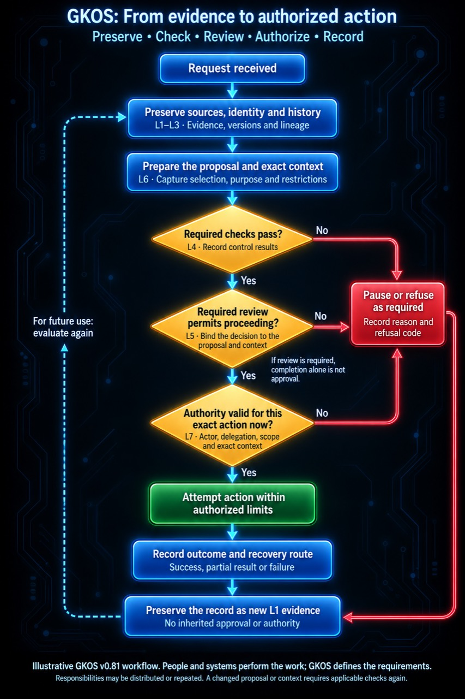
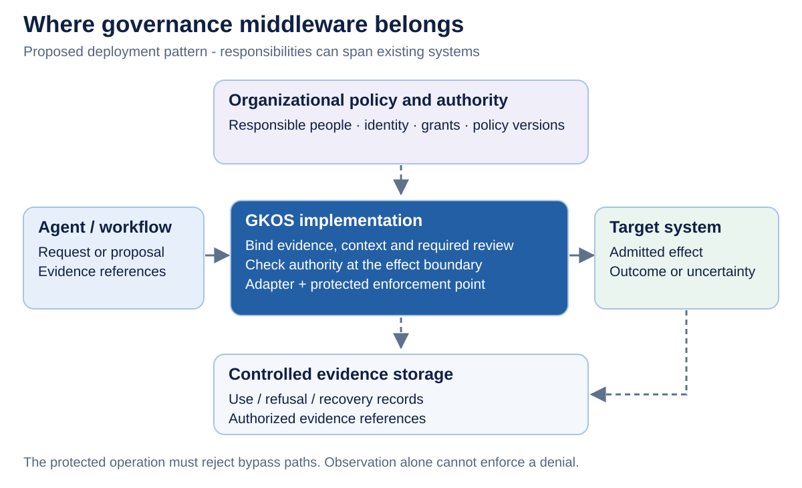
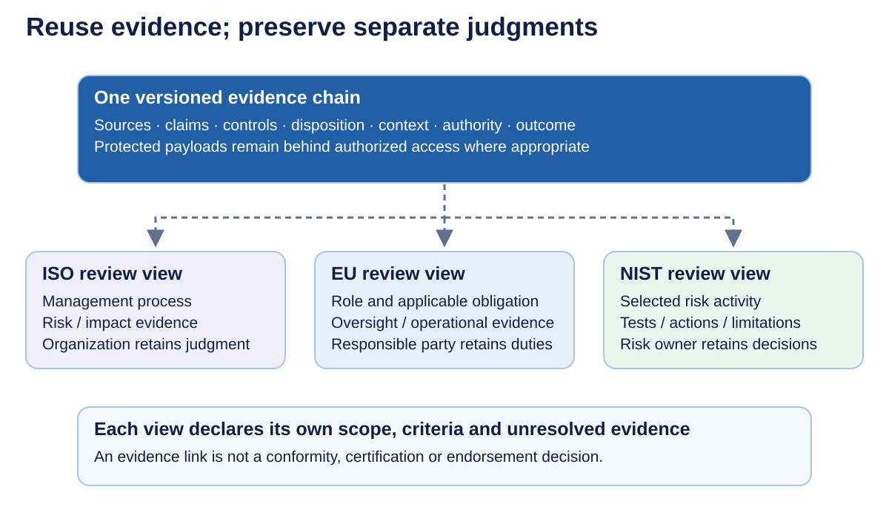

# From data to authorized action

**Status:** informative implementation explanation for GKOS-2026-09-03 v0.81; updated 2026-09-06.

This user-supplied illustration follows one request from incoming evidence to an authorized attempt or a recorded refusal. Blue boxes preserve and prepare records; yellow decisions test whether proceeding is permitted; red paths pause or refuse; green permits an attempt. The return loop preserves the outcome for future evaluation without carrying approval forward.

## How data moves through the whole stack

GKOS defines contracts; connectors, storage, retrieval systems, reviewers, policy services and execution tools perform the work. Layer numbers describe cumulative responsibilities, not a mandatory order of service calls. The picture prepares L6 context before final L4/L5 decisions because those decisions must bind the material actually considered. Applicable access and disclosure restrictions also run before restricted data is exposed.

1. **Receive and preserve — L1.** A connector receives a request, document, observation, database revision or tool result. Preserve its exact source revision and provenance, with acquisition time, custody, sensitivity and retention information. Treat source content as evidence, not as instructions granting authority.
2. **Structure and identify — L2.** Assign stable identity, type, schema and version to a governed object. Keep a link to the preserved source and record transformations. A file path or regenerated display is not the object's identity.
3. **Connect meaning and history — L3.** Record human, model and tool assertions separately from their sources. Bind typed relationships, dependencies, contradictions, corrections and supersession to the responsible actor and applicable scope and time.
4. **Select and present context — L6.** Capture what retrieval selected in a Selection Envelope, then assemble the Context Manifest with exact evidence references, purpose, warnings, restrictions and policy versions. Captured selection supports replay of deterministic assembly; it does not make model output or retrieval repeatable or correct.
5. **Check and review — L4 and L5.** Apply the applicable deterministic controls and preserve diagnostics and Control Receipts. A mandatory failure follows its specified block, refusal or recovery path. Where review is required, an authorized reviewer records a disposition bound to the exact proposal and context. Completion alone is not approval; changes can require checks and review again.
6. **Admit and attempt the effect — L7.** At the protected action boundary, verify the actor, grant/delegation chain, role separation, exact context, effect scope and current authority, including expiry and revocation. Only the permitted attempt reaches the target system. Record the Authorized Use Record or Refusal Receipt and reason; technical access alone is insufficient.
7. **Record, reconcile and learn — L7 back to L1.** Preserve success, partial result, failure or uncertainty with target evidence and a recovery route. Reconcile an uncertain external effect before retrying. Append corrections and recovery evidence. Future use starts a new evaluation; an earlier approval never becomes automatic authority for a new action.

## Where middleware belongs

An adapter, gateway, library or service can implement these contracts across existing systems. An enforcement point must control access to the protected operation and reject bypass paths. Observation-only integration can report an event but cannot promise to block it. State the credential, clock, revocation, policy-change and evidence-storage trust assumptions explicitly.

## A contract implementers can test

| Boundary | Bind and preserve | Failure to test |
| --- | --- | --- |
| Intake and proposal | Request/proposal identity, actor, tenant, purpose, source references and intended effect | Untrusted source text is mistaken for authority |
| Context and disposition | Selection Envelope, exact Context Manifest, warnings, restrictions, policy and required review | The proposal or displayed context changes after approval |
| Authority and admission | Grant chain, role separation, action-time validity, revocation and effect scope | A stale, revoked or cross-tenant grant still executes |
| Effect and receipt | Attempt identity, target result or uncertainty, durable receipt and recovery route | Effect succeeds but receipt delivery fails, or retry duplicates the effect |
| Evidence export | Versioned inventory, authorized references, access/retention limits and missing evidence | A valid digest is mistaken for complete evidence or external approval |

Across external systems, use a durable intent, target-supported idempotency, recoverable receipt delivery and reconciliation. An outbox alone does not make an external effect atomic. Record compensation failures and manual intervention as well as successful recovery.

An operational audit export indexes runtime evidence for a review. The proposed [Conformance Evidence Package](../ecosystem/GKOS_CONFORMANCE_EVIDENCE_PACKAGE_0.1_DRAFT.md) instead requires its assessment/conformance manifest and inventory; a generic log bundle is not automatically such a package. Canonical identity follows the applicable GKX-CBOR-1 artifact contract, not an arbitrary JSON rendering.

## Reuse evidence across distinct reviews

The separate [ISO](../ecosystem/GKOS_ISO_AI_MANAGEMENT_ADDIN_0.1_DRAFT.md), [EU](../ecosystem/GKOS_EU_AI_ACT_ADDIN_0.1_DRAFT.md) and [NIST](../ecosystem/GKOS_NIST_AI_GOVERNANCE_ADDIN_0.1_DRAFT.md) proposals explain candidate uses and remaining obligations. Protected payloads stay behind authorized access; an evidence reference does not transfer legal responsibility or establish conformity.

## Controlling references

- [Layer interface contracts](../../standard/annexes/Layer_Interface_Contracts.md)
- [Authority and refusal receipt fields](../../standard/annexes/Authority_and_Refusal_Receipt_Fields.md)
- [Practitioner blueprint](GKOS_INFRASTRUCTURE_PRACTITIONER_BLUEPRINT.md)
- [Publication and archive receipt](../releases/GKOS_2026-09-03_v0.81_PUBLICATION_RECORD.md)
