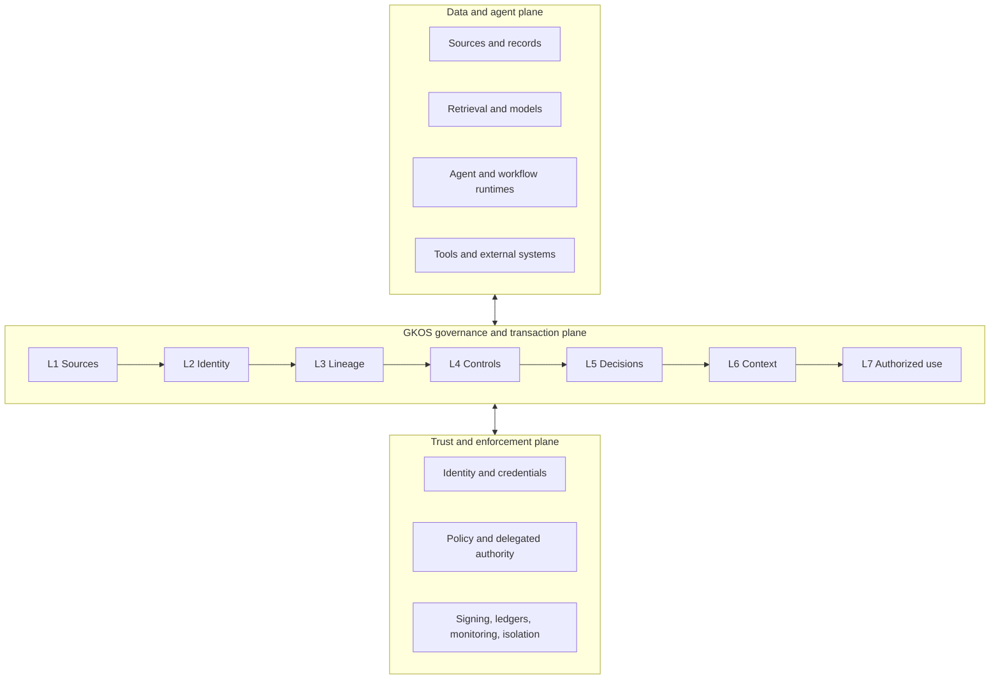

# GKOS Reference Infrastructure Architecture

<!-- markdownlint-disable MD013 -->

- **Document ID:** GKOS-INFRA-001
- **Revision:** r3 validated public draft
- **Date:** 2026-09-02
- **Status:** informative implementation guidance; not normative, not a
  Development Decision Record, not a conformance claim, and not a procurement
  recommendation
- **Standard baseline:** `Odenknight/gkos-standard` main at
  `1f5768fe6b8f847c17030127a3a00e78edf5cd80`
- **Published standard:** GKOS-2026-08-20 v0.80
- **Machine exchange contract:** GKX 2.0
- **Canonical artifact profile:** GKX-CBOR-1 where required by the applicable
  artifact contract
- **Reference implementation coordinate:** GKOS Engine tag `v2.1.2` at
  `7bf14b481e78c5ae9d1e14661602be4f24559d0e`; later Engine development must be
  identified by its own exact commit and must not be treated as the tagged
  release

This guide explains how existing commercial services, enterprise platforms,
open-source projects, and open standards can contribute to a GKOS deployment.
A product name identifies a candidate mechanism only. It does not imply
endorsement, interoperability, suitability, or GKOS conformance.

## 1. Governing determinations

1. **The standard defines the seams; implementations fill them.** A vendor,
   reference implementation, model, database, or orchestration framework does
   not define or amend a GKOS requirement.
2. **Adapters target requirement IDs, schemas, layer contracts, and fixtures—not
   undocumented Engine behavior.** Engine diagnostics are implementation
   observations, not substitute requirements.
3. **A read adapter may observe and propose. A governed writer must be separately
   authorized.** No adapter may silently mutate retained source revisions or
   accepted governed state. Approved changes use the applicable Decision,
   State-Change Receipt, authorization, and re-entry contracts.
4. **Mandatory control failure fails closed.** Optional or unsupported behavior
   is declared as unsupported; it is not silently treated as satisfied.
5. **Every committed governed state change is durably receipted.** The record
   identifies the actor class and the applicable deterministic decision where
   one was consulted.
6. **External trust systems contribute assertions and enforcement.** An IAM
   login, signature, graph edge, workflow state, or transparency-log entry does
   not by itself create epistemic authority, a GKOS Decision Record, or a GKOS
   Authorized Use Record.
7. **Non-determinism stays explicit.** Retrieval, ranking, model filtering, and
   model-based evaluation may contribute captured evidence. They do not replace
   deterministic mandatory controls.
8. **MCP is an integration mechanism, not a governance result.** MCP adapters
   may be built before v1.0 when their transport, identity, authorization,
   purpose, sensitivity, tool, and failure boundaries are explicitly defined
   and tested. MCP presence does not create GKOS conformance.
9. **Product categories overlap.** “Managed/commercial,” “enterprise or
   self-managed,” and “open-source/open-standard” describe common acquisition
   modes, not exclusive procurement tiers. Verify the exact edition, license,
   hosting model, support terms, and version before adoption.

## 2. Three-plane architecture



The planes are logical responsibilities, not required network tiers. A single
application may implement several responsibilities; a large enterprise may
federate them across many services. Every claimed boundary must remain
reproducible across the chosen topology.

## 3. Profiles as adoption seams

| Adoption seam | Current claim boundary | Typical participants |
| --- | --- | --- |
| **Governance core** | GKOS Core: all applicable GCP-1 through GCP-5 requirements on one exact release and fixture baseline | records systems, repositories, catalog and lineage services, validators, workflow systems |
| **Context without action** | GCP-6 Context-Only Extension: GKOS Core plus GCP-6; read-only for the claimed use | search, RAG, decision-support, reporting, context gateways |
| **Governed consequential use** | GKOS Advanced: all applicable GCP-1 through GCP-7 requirements | agents, automation, transaction systems, PAM/IAM, effect gateways, operational ledgers |
| **Faithful display** | Independent Viewer/Projection Profile | dashboards, editors, public viewers, audit and oversight surfaces |

An organization may implement and report lower-layer capability precisely, but
GCP-1 through GCP-4 alone are not a GKOS Core claim. The current active fixture
catalog declares no qualifying profile.

## 4. Layer-by-layer component mapping

The tables identify candidate mechanisms. Each deployment must publish an
adapter mapping and evidence showing how the chosen mechanism satisfies the
applicable GKOS contract.

### L1 — Original Sources

**Required result:** Source Record preserving the received revision,
provenance, custody, sensitivity, retention, fingerprint, and acquisition
receipt.

| Common acquisition mode | Candidate mechanisms | Legitimate contribution |
| --- | --- | --- |
| Managed/commercial | AWS S3 Object Lock, Azure Immutable Blob Storage, Preservica, Microsoft Purview Records Management, commercial DMS or records platforms | retention controls, legal holds, version preservation, custody and audit evidence |
| Enterprise/self-managed | WORM-capable object storage, records repositories, source-system exports, enterprise backup and archive platforms | preserve authoritative revisions in the deployment's existing records boundary |
| Open-source/open-standard | MinIO object locking, content-addressed stores, Git for suitable text/code evidence, BagIt; Docling, Apache Tika, and Unstructured for extraction only | source preservation and/or extraction pipelines, provided original bytes remain separately retained |

**Boundary:** extraction output is a derived object. An extraction tool does not
prove that original bytes were preserved, and a content digest does not by
itself record custody, sensitivity, or retention authority.

### L2 — Structure and Identity

**Required result:** Structured Knowledge Object with stable governed identity,
type, schema version, representation, and version history. Filename, path,
database row ID, and content hash are not automatically the governed object
identity.

| Common acquisition mode | Candidate mechanisms | Legitimate contribution |
| --- | --- | --- |
| Managed/commercial | Informatica MDM, Reltio, Collibra, Alation, Palantir Foundry object models | enterprise identifiers, business types, ownership, classifications, schema and catalog metadata |
| Enterprise/self-managed | Confluent Schema Registry, Apicurio Registry, internal ID registries and metadata services | versioned schemas, compatibility policy, identifier resolution |
| Open-source/open-standard | JSON Schema, LinkML, RO-Crate, ARK or other persistent identifier schemes, Frictionless Data | portable type definitions, package identity, persistent references, declared metadata |

**Boundary:** GKOS does not mandate one identifier syntax. A deployment must
state its identity, versioning, collision, migration, and resolution rules and
must preserve explicit lineage when representations change.

### L3 — Relationships and Lineage

**Required result:** typed, sourced, temporal, scoped, and attributable
assertion and lineage records, including contradiction, dependency, correction,
withdrawal, and supersession as distinct operations.

| Common acquisition mode | Candidate mechanisms | Legitimate contribution |
| --- | --- | --- |
| Managed/commercial | Neo4j Enterprise, Stardog, Ontotext GraphDB, TigerGraph, Amazon Neptune | graph storage, temporal or named-graph modeling, traversal and relationship queries |
| Enterprise/self-managed | DataHub, Apache Atlas, Microsoft Purview lineage, Databricks Unity Catalog lineage | technical and business lineage, ownership, transformation and dependency evidence |
| Open-source/open-standard | W3C PROV-O, OpenLineage, Graphiti, Neo4j Community Edition, Apache Jena/Fuseki, Oxigraph | provenance interchange, graph projection, lineage event capture, temporal knowledge representation |

**Boundary:** a graph edge is a record or projection, not an acceptance or
supersession authority. Model-extracted relationships remain attributable
assertions until the applicable controls and review lifecycle are satisfied.

### L4 — Validation and Control

**Required result:** deterministic diagnostics and Control Receipts. Every
mandatory failure blocks, refuses, rolls back, or freezes as specified and
carries the registered diagnostic or gate code.

| Common acquisition mode | Candidate mechanisms | Legitimate contribution |
| --- | --- | --- |
| Managed/commercial | Immuta, Privacera, Great Expectations Cloud, managed policy and data-quality services | policy administration, data access restrictions, quality checks, audit evidence |
| Enterprise/self-managed | OPA, Cedar, dbt tests, AWS Deequ, Cerbos, internal policy decision points | deterministic policy evaluation, authorization input, repeatable pipeline checks |
| Open-source/open-standard | GKOS Engine, pySHACL, Pandera, JSON Schema validators, OpenTelemetry evidence feeds | GKX and shape validation, registered diagnostics, deterministic checks, observed evidence |

**Boundary:** the current GKOS Engine is a reference implementation and is
versioned separately from the standard. A package, tag, or successful local
check does not establish a qualifying profile. Model graders, RAG evaluators,
and LLM judges may produce evidence or monitoring signals; a non-deterministic
result cannot silently satisfy a deterministic mandatory gate.

### L5 — Review and Workflow

**Required result:** authorized, append-only Decision Record bound to the exact
proposal and evidence reviewed. Where a Context Manifest supported the review,
its stable identity, version, and canonical artifact hash are bound as well.

| Common acquisition mode | Candidate mechanisms | Legitimate contribution |
| --- | --- | --- |
| Managed/commercial | ServiceNow, Appian, Pega, Nintex, DocuSign or Adobe Acrobat Sign | routing, identity attribution, approval evidence, delegation and workflow state |
| Enterprise/self-managed | GitHub/GitLab merge requests, Azure DevOps, Jira approval workflows, Gerrit | review assignment, protected changes, votes, comments, branch gates |
| Open-source/open-standard | Temporal, Camunda, Flowable, Forgejo, adr-tools and structured ADR formats | durable orchestration, human tasks, retry/expiry handling, decision documentation |

**Boundary:** a ticket state or electronic signature is input to the GKOS
Decision Record unless it fully satisfies the exact record contract. The
published v0.80 baseline requires authorized disposition and role separation.
The v0.81 development line is separately evaluating bounded independent-agent
review; unpublished development work must not be reported as v0.80 behavior.

### L6 — Context Presentation

**Required result:** a captured Selection Envelope and a Context Manifest whose
assembly is deterministic, purpose-bound, restriction-aware, explicit about
omissions and contradictions, and replayable from digest-bound inputs.

| Common acquisition mode | Candidate mechanisms | Legitimate contribution |
| --- | --- | --- |
| Managed/commercial | Azure AI Search, Amazon Bedrock Knowledge Bases, Google Vertex AI Search, Cohere Rerank, managed MCP gateways | retrieval, ranking, connectors, context delivery, model-independent search services |
| Enterprise/self-managed | Elastic, Vespa, enterprise search, internal model gateways, managed vector or graph services | hybrid retrieval, tenancy, access filtering, model routing and context transport |
| Open-source/open-standard | Haystack, LlamaIndex, LangChain, txtai, Qdrant, pgvector, Weaviate, CUE, Pydantic, MCP SDKs and servers | retrieval and ranking, pointer stores, schema-bound context assembly, transport and tool metadata |

**Boundary:** retrieval may be non-deterministic, but its complete operative
output is captured before deterministic assembly. MCP, an SBOM format, a prompt,
or a vector search result is not by itself a GKOS Context Manifest.

### L7 — Authorized Use

**Required result:** Authorized Use Record or Refusal Receipt binding the exact
context, valid authority at action time, distinct actor roles, delegation,
typed effect scope, outcome, and correction, rollback, or compensation route.

| Common acquisition mode | Candidate mechanisms | Legitimate contribution |
| --- | --- | --- |
| Managed/commercial | CyberArk, BeyondTrust, Delinea, Teleport, StrongDM, enterprise identity and privileged-access services | privileged-session control, credential brokering, session evidence, action enforcement |
| Enterprise/self-managed | Microsoft Entra, Okta, Keycloak, OAuth/OIDC services, SPIFFE/SPIRE, NGAC implementations, OpenFGA | actor and workload identity, grants, relationship or attribute policy, delegated access, credential lifecycle |
| Open-source/open-standard | Sigstore/Rekor, in-toto, OpenFGA, Casbin, immudb, Trillian | artifact signing, attestations, policy decisions, append-only or transparency evidence |

**Boundary:** authentication establishes an identity claim; policy systems may
authorize access; signatures or transparency logs may establish integrity and
origin under their trust models. None alone proves that an action was
substantively authorized under the exact GKOS context, purpose, grant, and
effect scope.

### Viewer/Projection Profile

**Required result:** faithful read-only display of provenance, epistemic state,
incompleteness, contradictions, warnings, restrictions, and conformance
limitations, with no write, promotion, decision, or authorization authority.

| Common acquisition mode | Candidate mechanisms | Legitimate contribution |
| --- | --- | --- |
| Managed/commercial | Power BI, Tableau, Retool and commercial governance dashboards | oversight, portfolio reporting, audit and management views |
| Enterprise/self-managed | Apache Superset, Metabase, internal portals and observability platforms | controlled projections and drill-down into receipts and lineage |
| Open-source/open-standard | Quarto, Streamlit, Markdown or graph viewers, compatible editor plugins | accessible public or specialist views over governed records |

**Boundary:** display is never a second canonical authority. A viewer must show
required defects and limitations or refuse the view when it cannot do so
faithfully.

## 5. NIST-oriented interoperability map

NIST's 2026 AI Agent Standards Initiative emphasizes industry-led standards,
open interoperable protocols, agent identity infrastructure, and security
evaluations. The NCCoE software and AI agent identity concept work focuses on
identification, authorization, delegation, logging and transparency, data-flow
provenance, and prompt-injection risk.

| NIST/NCCoE concern | GKOS artifact or control contribution | Complementary mechanisms |
| --- | --- | --- |
| Identification of agents and software systems | stable actor references, ownership, role and version dependencies in L2 records and receipts | OIDC, SPIFFE/SPIRE, SCIM, PKI, enterprise IAM |
| Authorization and least privilege | deterministic L4 evaluation; purpose, effect scope, grant, expiry, and action-time verification in L7 | OAuth 2.x, NGAC, OPA, Cedar, OpenFGA, PAM |
| Access delegation and human-agent binding | monotonic delegation chains, separate proposer/reviewer/authorizer/executor roles, bounded authority receipts | identity federation, organizational delegation, workflow and credential systems |
| Logging, transparency, and non-repudiation | State-Change, Decision, Refusal, Context, and Authorized Use records; deterministic canonical hashes where applicable | signed logs, KMS/HSM, transparency logs, append-only databases, monitoring |
| Tracking prompts and data flows | Source Records, typed lineage, exact evidence anchors, Selection Envelopes, re-entry rules | OpenLineage, W3C PROV, telemetry, records and data-governance systems |
| Prompt injection containment | purpose and sensitivity boundaries, deterministic mandatory gates, effect-scope enforcement, refusal receipts | runtime isolation, sandboxing, credential separation, secure tool interfaces, input and output defenses |
| Interoperability and evaluation | GKX 2.0, stable requirements, schemas, fixtures, registered diagnostics, exact-bound claim manifests | independent implementations, reproducible environments, TEVV and qualified assessment |

This is an informative crosswalk, not a NIST mapping. GKOS is not endorsed by
NIST or NCCoE and does not establish conformity to the AI RMF, Zero Trust
Architecture, Digital Identity Guidelines, or any law or regulation.

Primary references:

- [NIST AI Agent Standards Initiative](https://www.nist.gov/artificial-intelligence/ai-agent-standards-initiative)
- [NCCoE Software and AI Agent Identity and Authorization](https://www.nccoe.nist.gov/projects/software-and-ai-agent-identity-and-authorization)
- [NIST AI Risk Management Framework](https://www.nist.gov/itl/ai-risk-management-framework)
- [NIST AI Standards Zero Drafts](https://www.nist.gov/artificial-intelligence/nists-ai-standards-zero-drafts-pilot-project-accelerate-standardization)

## 6. Deployment patterns

### Pattern A — Sidecar or gateway

Use a narrow GKOS adapter beside an existing agent, RAG, or automation runtime.
It captures source and selection records, invokes deterministic gates, and
requires the applicable Decision, Context, and Authorized Use records before
consequential effects.

```text
request → existing runtime → GKOS adapter/gateway → tool or target system
                             ├─ records and receipts
                             ├─ deterministic controls
                             └─ refusal or authorized-use binding
```

Use this pattern when the existing runtime is difficult to replace. Do not
assume one sidecar can observe hidden in-process behavior; the assessed scope
must identify every path that can bypass the adapter.

### Pattern B — Federated enterprise hub

Keep authoritative data and workflow systems in place and connect them through
GKOS adapters:

```text
records and archives → identity and schema → lineage/catalog
        → deterministic control plane → review workflow
        → context gateway → identity/PAM/effect gateway → receipts and oversight
```

Use this pattern for heterogeneous enterprises and regulated organizations.
Treat native permissions as inputs and enforcement mechanisms, not as complete
GKOS decisions or authorized-use evidence.

### Pattern C — Open-first implementation

Assemble open-source components behind the same contracts:

```text
object/content-addressed preservation
  → JSON Schema/LinkML/persistent IDs
  → PROV/OpenLineage/graph projection
  → GKOS Engine + OPA/Cedar/shape validation
  → Temporal/Flowable/Forgejo review
  → Haystack/LlamaIndex + deterministic context compiler
  → Keycloak/SPIFFE/OpenFGA + signed or append-only receipt store
```

Use this pattern for research, independent implementation, transparent pilots,
and cost-sensitive deployments. Open source does not remove the need for secure
configuration, support, records policy, key custody, or competent review.

### Pattern D — Viewer-first on-ramp

Build a faithful Viewer/Projection Profile over existing receipts, decisions,
lineage, and context records without adding a write path. This is often the
lowest-risk way to test public communication, reviewer usability, and defect
visibility before introducing governed mutation or action.

## 7. Evidence and conformance package

Every implementation or pilot should preserve a machine-readable and
human-readable evidence package containing:

- exact GKOS release and GKX version;
- claimed profile or lower-layer capability boundary;
- implementation repository, commit, built artifact digest, and deployment
  configuration;
- schema, policy, compiler, canonicalization, and adapter versions;
- fixture catalog, test-runner, and expected-result versions;
- execution environment, dependency lock or SBOM, and relevant capability
  preflights;
- executed, passed, failed, skipped, unsupported, and unevaluated requirements;
- raw result and evidence digests;
- exceptions, limitations, and non-conformities;
- assessment type: self-attested, second-party, or independently verified.

No named profile should be claimed until every applicable mandatory requirement
on the same exact baseline has passing evidence. A signature over incomplete
evidence does not make the evidence complete.

## 8. Ninety-day implementation sequence

| Weeks | Objective | Primary GKOS responsibilities |
| --- | --- | --- |
| 1–2 | Inventory agents, human authorities, source systems, tools, action paths, bypass paths, retention, sensitivity, and current evidence | L1–L2 scope |
| 3–4 | Preserve exact source revisions; establish stable identities, actor ownership, schema versions, and source-to-object mappings | L1–L2 |
| 5–6 | Add typed lineage and contradiction handling; implement deterministic policy and refusal gates with stable diagnostics | L3–L4 |
| 7–8 | Implement governed proposal and review workflows; durably receipt every committed state change | L5 and cross-layer receipts |
| 9–10 | Capture Selection Envelopes; build deterministic Context Manifest assembly and replay tests | L6 |
| 11–12 | Bind selected consequential actions to exact context, valid authority, effect scope, outcome, and rollback or correction; run adversarial and bypass testing | L7 |
| Continuous | Human-factors testing, security review, environment qualification, limitation disclosure, and independent implementation comparison | all claimed responsibilities |

Begin with bounded, reversible, low-consequence use. A timeline is not evidence
of conformance; the exit criteria are passing contracts, fixtures, bypass
analysis, and review evidence.

## 9. Current limitations and claim boundary

- GKOS v0.80 is an owner-authorized developmental public pre-standard, not an
  accredited or consensus standard.
- The current active fixture catalog declares no qualifying profile.
- GKOS Engine is a reference implementation and is not an independent second
  implementation.
- Product features and product certifications do not automatically map to GKOS
  artifacts or requirements.
- The v0.81 review and disclosure work remains a development line until a dated
  release is published.
- Domain legality, safety, scientific validity, clinical validity, and business
  correctness remain outside what a generic GKOS implementation can prove.
- A future conformance or certification ecosystem requires independent
  governance, test infrastructure, implementation evidence, competent
  assessment, appeals, and surveillance.

## 10. Licensing and reuse

The GKOS normative standard, explanatory documentation, and original graphics
are licensed under CC BY 4.0. Schemas, fixtures, workflows, scripts, and
reference code are licensed under Apache-2.0. Trademark, certification,
endorsement, and accreditation rights are separate.

This guide may be adapted under the repository's documentation license with
appropriate attribution and identification of changes.
