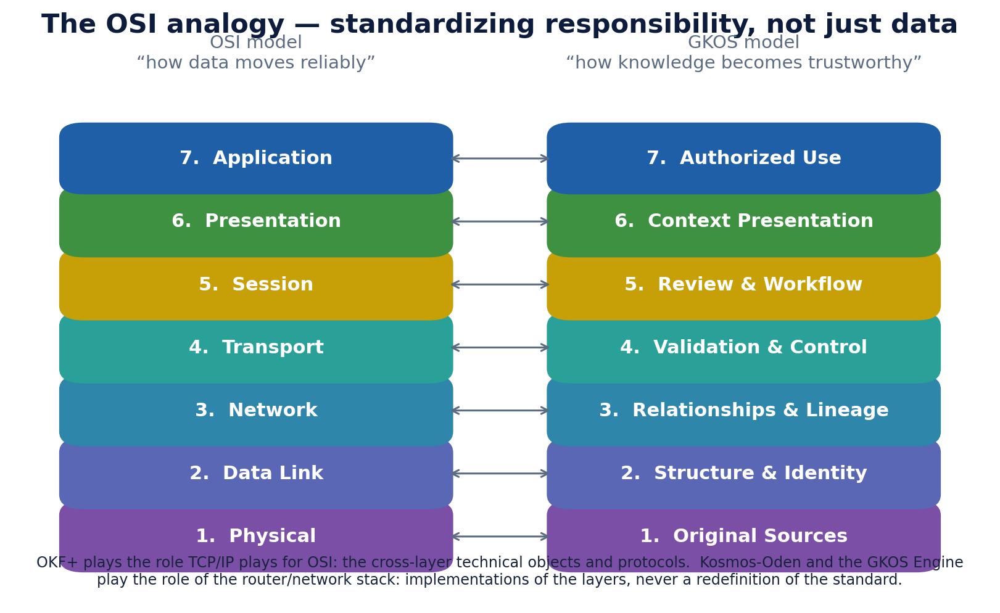

# 1. What GKOS is

> **Informative.** This beginner's guide page explains GKOS in plain language. It creates no requirement and changes no rule. Where it differs from the [authoritative sources](README.md#authoritative-sources), those sources control. Edition described: GKOS-2026-09-24 v0.82.1.

## The short version

GKOS stands for **Governed Knowledge Operations Specification**. It is a written set of rules about records.

The rules cover one path: from the evidence an AI system uses, to the action that system or a person takes. GKOS says which records must exist along that path, and what each record must contain. With those records, someone else can later check what happened, why, and who allowed it.

GKOS does not run anything. People and deployed systems do the work. GKOS defines the contracts they keep. See the [README](../README.md#a-governance-architecture-not-another-runtime).

## Three sentences to remember

The [README](../README.md) opens with three short rules:

1. **Evidence is not truth.** A document you received is something you can point to. It is not proof that its content is correct.
2. **Confidence is not authority.** A model that is 99% sure has not been given permission to act.
3. **Capability is not authority.** A tool that *can* send a refund is not thereby *allowed* to send one.

Most of GKOS follows from keeping these things apart.

## A small example

An AI assistant reads a customer email and suggests a refund. Without GKOS, a log might say "refund issued at 14:07". With GKOS, the records can also show:

- the exact email and account record the assistant read;
- what the assistant concluded, kept separate from the email itself;
- which checks ran, and whether any failed;
- who had authority to approve the refund, and within what limit;
- the exact information shown to that person; and
- what happened, and how to reverse it if needed.

[Chapter 5](05-a-first-walkthrough.md) follows this example step by step.

## What GKOS is made of

GKOS is more than one document. This repository holds several parts that work together.

| Part | What it is | Where it lives |
| --- | --- | --- |
| Master standard and annexes | The controlling text | [`standard/`](../standard/00_GKOS_Master_Standard.md) |
| Requirement registry | Every permanent rule, each with a stable ID such as `GKOS-REVIEW-002` | [`requirements/REGISTRY.md`](../requirements/REGISTRY.md) |
| GKX 2.0 | The machine exchange contract: field names and record shapes that software uses | [`schemas/`](../schemas/README.md) |
| Fixtures | Small test files with an expected result | [`fixtures/`](../fixtures/README.md) |
| Conformance runner | A tool that runs fixtures against an implementation | [`conformance/`](../conformance/README.md) |
| Decision records | The written reasons for each development change | [`decisions/`](../decisions/GKOS_Decision_Register.md) |

**GKOS** says what must stay distinct and auditable. **GKX** says how software exchanges those records. **Implementations** choose their own databases, languages and products. See the [technical orientation](../TECHNICAL_README.md#standard-exchange-contract-and-implementations).

## An analogy: the OSI model

Networking has the OSI model. It does not move a single packet. It assigns responsibilities to layers so that products from different makers can work together. GKOS borrows that idea for evidence and authority.

This figure comes from the archived v0.76 edition. Its footnote names OKF+, which is now historical terminology; the current exchange contract is GKX 2.0. The analogy is explanatory only. It is not a one-to-one mapping and not an ISO endorsement. See [From curation to governed evidence and action](../docs/EVOLUTION-AND-OSI.md#osi-analogy-and-limits).

## Current status

GKOS is a developmental specification (public working draft). It began as a single-author pre-standard concept; the goal is to advance it to a pre-standard through an open, multi-stakeholder committee process.

The facts behind that status, from the [README](../README.md#current-standing):

- **Current published edition:** GKOS-2026-09-24 v0.82.1. It is a documentation patch. Its technical baseline is v0.82.
- **Normative population:** unchanged from v0.81: 62 permanent requirements and 28 gate codes.
- **Machine exchange contract:** GKX 2.0.
- **Governance:** owner-authorized v0.x development by the Founder and Initial Editor. It is not consensus ratification.
- **Profile qualification:** no implementation profile currently qualifies.
- **Second implementation:** awaiting a public second implementation.

The repository title changed from "Standard" to "Specification" in [PR #63](https://github.com/Odenknight/gkos-standard/pull/63). Published editions, including v0.82.1, keep their recorded title, **Governed Knowledge Operations Standard**. Cite each edition by its published title. Neither title claims consensus, accreditation or certification. See the [README](../README.md#specification-status-and-published-titles).

---

[Guide index](README.md) · Next: [2. Why it exists](02-why-it-exists.md)
