# 2. Why GKOS exists

> **Informative.** This beginner's guide page explains GKOS in plain language. It creates no requirement and changes no rule. Where it differs from the [authoritative sources](README.md#authoritative-sources), those sources control. Edition described: GKOS-2026-09-24 v0.82.1.

## The problem

Modern AI systems can retrieve records, combine evidence, make claims, call tools, hand work to other agents, and change outside systems. They do this faster than a person can inspect each step. See the [README](../README.md#why-gkos-exists).

Ordinary logs record that something happened. They usually do not record:

- whether the source was current when it was used;
- which contradictions were already known;
- which version of a policy applied;
- whether the authority to act was still valid at the moment of action; or
- what route existed to correct the result afterwards.

## An example of the gap

Suppose an assistant changed a customer's credit limit last month. Today, the customer disputes it.

The log says: `credit_limit updated 2026-09-02 10:14 by agent-7`.

Now try to answer these questions from that line alone:

- Which account statement did the agent read? Was it the latest one?
- Did the agent know about an open fraud flag?
- Was agent-7 allowed to raise limits, and by how much?
- Did a person review the change? What exactly did that person see?
- Can the change be reversed, and who must do it?

The log cannot answer any of them. GKOS defines the records that can.

## The six questions

GKOS is designed to make six questions answerable whenever a person or AI system recommends, decides or acts. They come from the [README](../README.md):

1. What evidence actually entered the system?
2. What did a person, model, tool or agent claim that evidence meant?
3. Which deterministic controls ran, and what failed or was refused?
4. Who or what had authority to decide, and within what limits?
5. What exact context was presented for that decision or action?
6. What happened next, and how can the result be corrected, challenged or replayed?

A **deterministic** control is one that gives the same answer every time for the same input. A spelling rule is deterministic. A model's judgment usually is not.

## Things GKOS keeps apart

Many systems blur the following into one field or one log line. GKOS keeps each one separate. See the [README](../README.md#why-gkos-exists).

| Kept separate | Plain meaning | Why it matters |
| --- | --- | --- |
| Preserved evidence | What actually arrived | You can always go back to the original |
| Assertions | What someone or something claimed it meant | A claim can be wrong without the evidence being wrong |
| Control results | What the automatic checks found | A failed check is visible, not hidden |
| Decisions | Who chose, and what they chose | An agent proposal is never mistaken for a decision |
| Context | Exactly what was shown, for what purpose | A reviewer cannot later be said to have seen something they did not |
| Grants and their limits | Who may act, on what, until when | An expired or revoked permission is caught |
| Actions and outcomes | What was attempted, and what happened | A result can be checked, corrected or undone |

## What GKOS does not claim

GKOS does not declare what is true. It makes the path from evidence to action clear enough to inspect, reproduce, challenge, correct and test. [Chapter 6](06-what-gkos-is-not.md) covers its limits in detail.

## Where GKOS fits

GKOS does not replace databases, records systems, agent runtimes, workflow engines, identity providers, policy engines, professional judgment or law. It defines responsibilities and records that let those components take part in one governed chain. See the [README](../README.md).

The figure shows GKOS as a layer of contracts between existing systems. Each system keeps its own job. GKOS adds the records that tie those jobs together. See [control-plane placement](../TECHNICAL_README.md#control-plane-placement).

---

[Guide index](README.md) · Previous: [1. What GKOS is](01-what-gkos-is.md) · Next: [3. Core ideas](03-core-ideas.md)
