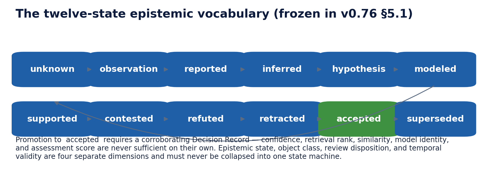

# 3. Core ideas

> **Informative.** This beginner's guide page explains GKOS in plain language. It creates no requirement and changes no rule. Where it differs from the [authoritative sources](README.md#authoritative-sources), those sources control. Edition described: GKOS-2026-09-24 v0.82.1.

This chapter explains seven ideas. You will meet them on every later page. Each section ends with the files that control the idea.

1. [Evidence](#evidence)
2. [Records](#records)
3. [Provenance](#provenance)
4. [Authorship origin](#authorship-origin)
5. [Epistemic state](#epistemic-state)
6. [Sensitivity](#sensitivity)
7. [Supersession](#supersession)

A short note on [authority](#a-note-on-authority) closes the chapter.

## Evidence

**Evidence** is what actually arrived or was observed: a document, an email, a database row, an instrument reading, a tool result. GKOS preserves it as received.

Two rules follow:

- **Evidence is not truth.** A preserved invoice proves that you received that invoice. It does not prove that the amount on it is correct.
- **Evidence is not instructions.** If an incoming document says "approve this refund", that text is evidence about the document. It grants no authority. See the [workflow walkthrough](../docs/implementation/GKOS_END_TO_END_WORKFLOW.md#how-data-moves-through-the-whole-stack), step 1.

Preserving evidence does not mean keeping it forever. Retention, legal holds and governed erasure still apply. See the [security, privacy and retention annex](../standard/annexes/Security_Privacy_Retention.md).

**Controlled by:** [layer interface contracts](../standard/annexes/Layer_Interface_Contracts.md) (Layer 1).

## Records

A **record** is a durable, structured entry that answers one specific question. GKOS defines several kinds. Each one answers a different question. This table comes from the [technical orientation](../TECHNICAL_README.md#core-records-and-receipts).

| Record | The question it answers |
| --- | --- |
| Source Record | What was received or observed? |
| Structured Knowledge Object | What governed object and version is this? |
| Assertion and lineage records | Who claims what, based on which evidence, and how is it related? |
| Diagnostic and Control Receipt | Which deterministic check ran, and what did it find? |
| Decision Record | Who authorized which outcome, with what scope and conditions? |
| Context Manifest | What was presented, to whom, for what purpose, under which restrictions? |
| Authorized Use Record | What action occurred, under which authority, with what outcome? |

<!-- GRAPHIC-NEEDED: GN-021 Three separate linked records about one refund: evidence, assertion and Decision Record -->

A **receipt** is a role, not one fixed format. Any record that carries the required fields can play the receipt role. For example, a record that a check refused an action plays the **Refusal Receipt** role. See the [authority and refusal receipt fields annex](../standard/annexes/Authority_and_Refusal_Receipt_Fields.md).

Records are append-only where GKOS says so. A Decision Record, for example, is never edited in place. A later decision is added as a new record. See `GKOS-REVIEW-004` in the [requirement registry](../requirements/REGISTRY.md).

**Controlled by:** [layer-to-artifact mapping](../standard/annexes/Layer_Artifact_Mapping.md), [schemas](../schemas/README.md).

## Provenance

**Provenance** is the history of where something came from. For a source, GKOS asks you to keep:

- the exact revision you received;
- where it came from and how it was acquired;
- who has held it since (its **custody**);
- its sensitivity; and
- its retention rules.

A file name or folder path is not identity. If someone renames `policy-final.pdf` to `policy-v2.pdf`, the governed object keeps its stable ID and its history. See the [layer interface contracts](../standard/annexes/Layer_Interface_Contracts.md) (Layers 1 and 2).

A digital signature can show who signed a statement and that it has not changed. It does not prove the statement is true, or that the signer had authority. See [important boundaries](../README.md#important-boundaries).

**Controlled by:** [layer interface contracts](../standard/annexes/Layer_Interface_Contracts.md). Background: [provenance landscape crosswalk](../docs/GKOS_PROVENANCE_LANDSCAPE_CROSSWALK.md).

## Authorship origin

**Authorship origin** records where a piece of content came from in terms of who or what produced it. In GKX 2.0 it is the optional field `authorship_origin`. The [shared schema definitions](../schemas/gkx-common.defs.json) allow four values:

| Value | Plain reading |
| --- | --- |
| `authored` | Written directly by its author |
| `derived` | Produced from other material |
| `proposed` | Offered for review, not yet decided |
| `approved` | Labelled as approved by its producer |

The current repository lists these values but does not yet define each one in prose. The plain readings above are this guide's informal glosses, not definitions.

One rule matters more than the labels. **A label is not a decision.** Writing `approved` in a field does not make anything approved. Governed acceptance needs an authorized, append-only Decision Record bound to the exact proposal and evidence. See `GKOS-REVIEW-001` and `GKOS-REVIEW-002` in the [requirement registry](../requirements/REGISTRY.md).

**Controlled by:** [shared schema definitions](../schemas/gkx-common.defs.json) (`origin`), [GKX 2.0 frontmatter schema](../schemas/gkx-frontmatter-2.0.schema.json).

<!-- GRAPHIC-NEEDED: GN-022 A label versus a decision: authorship_origin approved beside an actual Decision Record -->

## Epistemic state

**Epistemic** means "about knowledge": how well something is known. A record's **epistemic state** says how much standing a claim has. For example, is it an observation, a guess, a disputed claim, or accepted knowledge?

GKX 2.0 requires every record to carry the field `epistemic_state`. The [shared schema definitions](../schemas/gkx-common.defs.json) allow twelve values:

`unknown`, `observation`, `reported`, `inferred`, `hypothesis`, `modeled`, `supported`, `contested`, `refuted`, `retracted`, `accepted`, `superseded`.

This figure was drawn for the archived v0.76 edition, where the twelve values were frozen. The current GKX 2.0 schema uses the same twelve values. The arrows show the reading order of the list, not required transitions.

Three rules to remember:

1. **Promotion to `accepted` needs a Decision Record.** Confidence, rank or similarity scores are not enough. The fixture catalog tests this: a record marked `accepted` with no Decision Record must draw a diagnostic. See fixture `GCP3-L02` in the [fixture catalog](../fixtures/fixtures.manifest.json).
2. **Contradictions stay visible.** A Context Manifest must include every required contradiction. A viewer must show epistemic state and contradictions. See `GKOS-CONTEXT-004` and `GKOS-PROFILE-007` in the [requirement registry](../requirements/REGISTRY.md).
3. **Standing is not inherited.** When material comes back into the system, it does not carry its old epistemic state with it. See `GKOS-REENTRY-002`.

The current repository lists the twelve values but does not define each one in prose. Most read as their everyday English meaning.

**Controlled by:** [shared schema definitions](../schemas/gkx-common.defs.json) (`epistemicState`), [requirement registry](../requirements/REGISTRY.md).

## Sensitivity

**Sensitivity** says how carefully something must be protected. GKX 2.0 defines seven labels in the [shared schema definitions](../schemas/gkx-common.defs.json):

`public`, `internal`, `restricted`, `confidential`, `regulated`, `phi`, `secret`.

GKOS owns the labels. Each deployment defines its own criteria for applying them and its own handling policy. See the [governed state change annex](../standard/annexes/Governed_State_Change_Reentry_and_Bounded_Delegation.md).

Four rules from the [security, privacy and retention annex](../standard/annexes/Security_Privacy_Retention.md):

- **Missing sensitivity fails closed.** If a record has no label, treat it as restricted or stricter, never as public. **Fail closed** means "when unsure, block". Fixture `GCP1-B01` tests this case.
- **Restrictions may go up at once.** Lowering a restriction needs authenticated authority.
- **Audit data is protected at least as much as its subject.** Audit and provenance records inherit or exceed the sensitivity of what they refer to.
- **Authorization comes before disclosure.** Protected information must not leak into logs, errors, counts or outputs that the recipient is not allowed to see. See `GKOS-DISCLOSURE-001`.

<!-- GRAPHIC-NEEDED: GN-023 Sensitivity labels: the seven labels, the fail-closed path for a missing label, and one-way elevation -->

**Controlled by:** [security, privacy and retention annex](../standard/annexes/Security_Privacy_Retention.md), [requirement registry](../requirements/REGISTRY.md).

## Supersession

**Supersession** means one record formally replaces another. The old record is not deleted or rewritten. It stays, marked as superseded, and points to its successor. The successor points back.

Example from the fixture catalog: record `GCP3-L01` has `epistemic_state: superseded` and lists its successor's ID in `superseded_by`. The successor, `GCP3-L02`, lists the original in `supersedes`. Both use stable IDs, not file names, so a rename cannot break the chain. See [`fixtures/corpus/`](../fixtures/corpus/gcp3-l01-superseded.md).

Two rules:

- **Software must not guess supersession.** Similarity, confidence, timestamps or ID order cannot decide that one record replaces another. An authorized person or a valid, bounded delegation must declare it. See section 5 of the [governed state change annex](../standard/annexes/Governed_State_Change_Reentry_and_Bounded_Delegation.md).
- **Supersession is its own outcome.** It is not the same as rejection, withdrawal or expiry. Each is recorded separately and traceably. See `GKOS-REVIEW-004`.

<!-- GRAPHIC-NEEDED: GN-006 Layer-1 re-entry and explicit supersession: predecessor preserved, new L1 source with no inherited standing, supersession declared by an authorized human, never inferred -->

**Controlled by:** `GKOS-REENTRY-004`, `GKOS-LINEAGE-001` to `GKOS-LINEAGE-003` in the [requirement registry](../requirements/REGISTRY.md).

## A note on authority

**Authority** is permission to decide or act, within limits. GKOS treats it as something granted and recorded, never assumed.

- Being able to call a tool does not grant authority.
- Being logged in does not grant authority. Authentication is not authorization.
- A permission can expire or be revoked. GKOS checks it again at the moment of action.
- A delegated permission can only narrow. It can never be wider or last longer than the permission it came from.

<!-- GRAPHIC-NEEDED: GN-024 Delegation narrowing: a grant and a delegated grant drawn as nested scopes with expiry -->

See [important boundaries](../README.md#important-boundaries) and the [authority and refusal receipt fields annex](../standard/annexes/Authority_and_Refusal_Receipt_Fields.md).

---

[Guide index](README.md) · Previous: [2. Why it exists](02-why-it-exists.md) · Next: [4. The seven responsibilities](04-the-seven-responsibilities.md)
