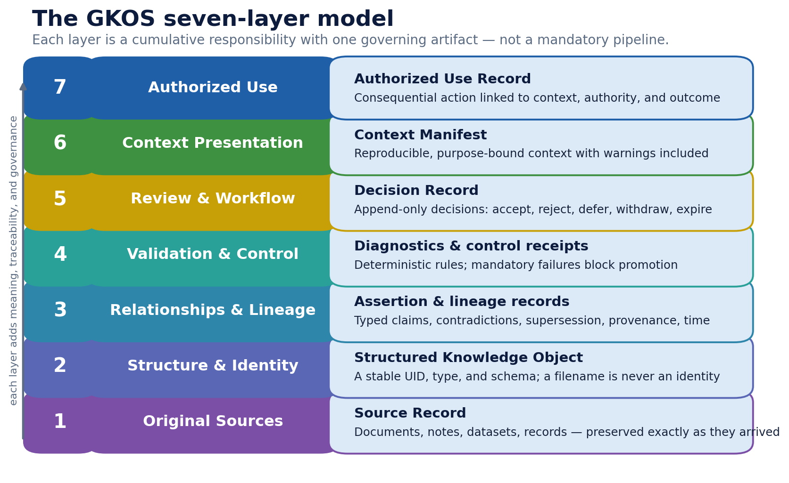
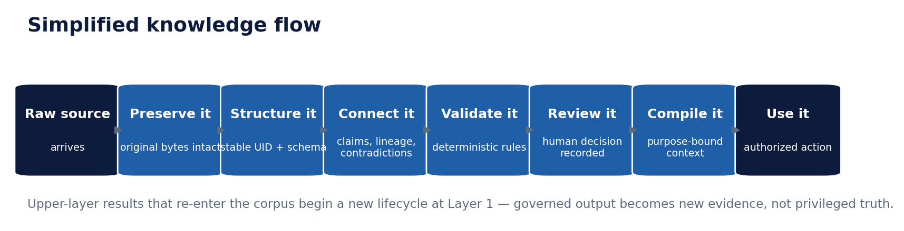

# 4. The seven responsibilities

> **Informative.** This beginner's guide page explains GKOS in plain language. It creates no requirement and changes no rule. Where it differs from the [authoritative sources](README.md#authoritative-sources), those sources control. Edition described: GKOS-2026-09-24 v0.82.1.

GKOS divides its work into seven **layers**. Each layer is a responsibility. Each one produces a named record.

## Three things to know first

1. **Layers are responsibilities, not products.** One service can carry several layers. One layer can be spread across several systems. See the [README](../README.md#the-seven-cumulative-responsibilities).
2. **Layers are not a fixed pipeline.** Work can run out of order, in parallel, or more than once. For example, context (Layer 6) is often prepared before the final checks and review (Layers 4 and 5), because those must bind the material actually considered. See the [workflow walkthrough](../docs/implementation/GKOS_END_TO_END_WORKFLOW.md#how-data-moves-through-the-whole-stack).
3. **Higher layers never rewrite lower layers.** When a result later becomes evidence, it comes back in as a new Layer 1 source. It does not inherit the standing of the action that produced it.

The short names L1 to L7 mean Layer 1 to Layer 7.

## The seven layers at a glance

| Layer | Responsibility in plain words | Record produced |
| --- | --- | --- |
| L1 Original Sources | Keep exactly what arrived, and where it came from | Source Record |
| L2 Structure and Identity | Give it a stable ID, type and version | Structured Knowledge Object |
| L3 Relationships and Lineage | Record who claims what, and how things relate | Assertion and lineage records |
| L4 Validation and Control | Run the automatic checks; block on mandatory failure | Diagnostics and Control Receipts |
| L5 Review and Workflow | Record an authorized decision about the exact proposal | Decision Record |
| L6 Context Presentation | Capture what was selected, then assemble exactly what is shown | Selection Envelope and Context Manifest |
| L7 Authorized Use | Check authority at the moment of action; record the outcome | Authorized Use Record or Refusal Receipt |

The authoritative version of this table is in the [layer interface contracts](../standard/annexes/Layer_Interface_Contracts.md).

## Each layer, with an example

The examples below use one running case: a company knowledge base that answers staff questions about travel policy.

### L1 Original Sources

**Job:** preserve what was received or observed, unchanged, with its revision, provenance, custody, sensitivity and retention information.

**Example:** the travel policy PDF arrives from HR. The system keeps that exact revision, records that HR sent it on a given date, and labels it `internal`.

**Watch out:** a text-extraction tool is not by itself a preservation system. Its output must not overwrite the original. See [important boundaries](../README.md#important-boundaries).

### L2 Structure and Identity

**Job:** give each governed object a stable identity, type, schema and version.

**Example:** the policy becomes an object with a permanent ID. When HR renames the file, the ID does not change.

**Watch out:** a file path is not identity. A content hash fingerprints one version; it is not the stable identity of the object across versions.

### L3 Relationships and Lineage

**Job:** record claims and links as typed, sourced, time-bound and attributable statements. This includes contradictions, corrections and supersession.

**Example:** an agent records "the meal allowance is 60 per day", pointing to page 4 of the policy. Separately, an older memo says 50. The system records a typed `contradicts` link between the two claims.

**Watch out:** a link in a graph database is not automatically a governed assertion.

### L4 Validation and Control

**Job:** apply deterministic checks and restrictions. A mandatory failure must block, refuse, roll back or freeze as specified, and leave a receipt.

**Example:** a check confirms the policy carries a sensitivity label and a valid version. If the label were missing, the check would fail closed.

**Watch out:** a model grader can add evidence, but it cannot silently replace a mandatory deterministic check.

### L5 Review and Workflow

**Job:** bind an authorized, append-only decision to the exact proposal and evidence reviewed.

**Example:** an HR reviewer accepts the 60-per-day claim and marks the memo superseded. Both outcomes go into Decision Records that point to the exact material the reviewer saw.

**Watch out:** finishing a workflow step is not approval. Authentication is not authorization, and authorization is not a Decision Record. See `GKOS-REVIEW-002` in the [requirement registry](../requirements/REGISTRY.md).

### L6 Context Presentation

**Job:** capture what retrieval selected in a **Selection Envelope**, then assemble a **Context Manifest**. The manifest records the exact evidence, warnings, contradictions, restrictions, purpose and recipient.

**Example:** a staff member asks about meal allowances. Search finds five passages. The Selection Envelope records which five, and why. The Context Manifest records exactly what the assistant was given, including a warning that the old memo was superseded.

**Watch out:** search results can vary from run to run. GKOS does not require repeatable search. It requires that the actual selection be captured, so the assembly step can be replayed exactly. See `GKOS-CONTEXT-001` to `GKOS-CONTEXT-003`.

### L7 Authorized Use

**Job:** before a consequential action, check the actor, the grant and any delegation, the exact context, the scope of the effect, and that authority is valid now. Then record the outcome and a recovery route, or record a refusal.

**Example:** the assistant only answers a question. That is not a consequential action. If it instead filed an expense claim, Layer 7 would check that it may file claims, for this person, up to this amount, today.

**Watch out:** a successful call through a protocol does not by itself create authority. See [agent and protocol interoperability](../README.md#agent-and-protocol-interoperability).

## The loop back to Layer 1

Every outcome, success or failure, becomes new evidence. It re-enters at Layer 1 as a new source. It does not carry forward the approval that produced it. A future action starts a fresh evaluation. See `GKOS-REENTRY-001` and `GKOS-REENTRY-002` in the [requirement registry](../requirements/REGISTRY.md).

## Three groups

The repository's layer diagram groups the seven layers in three bands:

- **Knowledge substrate:** L1 to L3. What exists, and how it relates.
- **Decision and control:** L4 and L5. What was checked, and what was decided.
- **Governance envelope:** L6 and L7. What was shown, and what was done.

See the [technical orientation](../TECHNICAL_README.md#open-source-and-product-ecosystem-mapping) for how existing tools can help with each layer, and what a GKOS adapter must still add.

---

[Guide index](README.md) · Previous: [3. Core ideas](03-core-ideas.md) · Next: [5. A first walkthrough](05-a-first-walkthrough.md)
