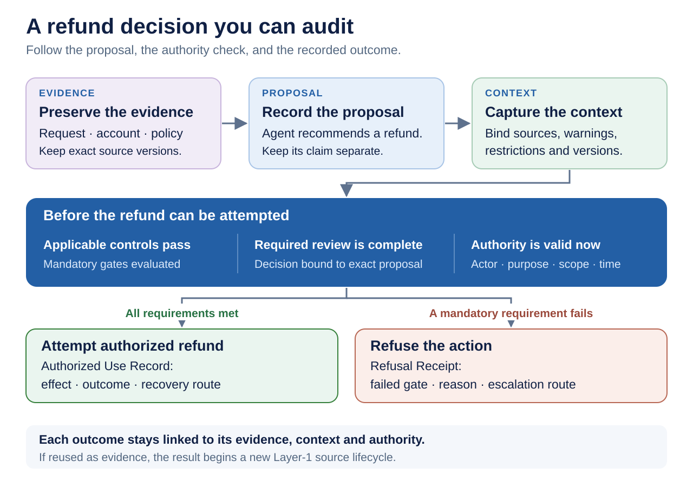
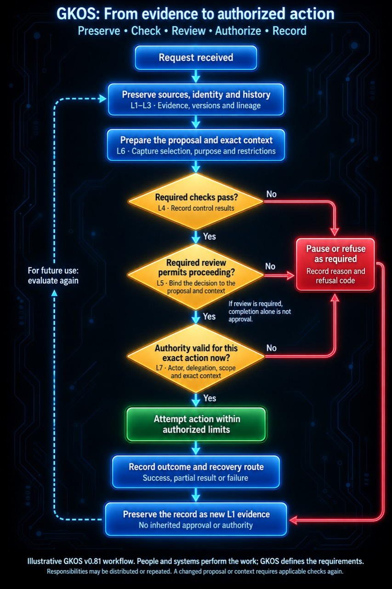

# 5. A first walkthrough: one refund

> **Informative.** This beginner's guide page explains GKOS in plain language. It creates no requirement and changes no rule. Where it differs from the [authoritative sources](README.md#authoritative-sources), those sources control. Edition described: GKOS-2026-09-24 v0.82.1.

This chapter follows one request from start to finish. It uses the refund example from the [README](../README.md#a-simple-example) and the seven steps of the [end-to-end workflow](../docs/implementation/GKOS_END_TO_END_WORKFLOW.md). Names, amounts and IDs below are invented for illustration.

## The situation

- A customer, Dana, emails: "My order 4471 arrived broken. Please refund the 80 I paid."
- An AI support agent reads the email and the order record.
- Company policy, version 7, says: support agents may refund damaged items up to 100 under standing authority. Larger refunds need a supervisor's review.
- The agent holds a grant that lets it issue refunds up to 100. The grant is valid until the end of the month.

The figure shows the path we will follow.



## Step 1. Receive and preserve (L1)

The system keeps three sources exactly as received:

- Dana's email;
- the order record for 4471, at its current revision; and
- policy version 7.

Each gets a Source Record: when it arrived, from where, who holds it, and its sensitivity. The email contains personal data, so it is labelled `confidential`.

The email says "please refund". That text is evidence of what Dana asked. It is not an instruction that grants any authority.

## Step 2. Structure and identify (L2)

Each source becomes a governed object with a stable ID and version. If someone later moves the email to another folder, its ID does not change.

## Step 3. Record what the agent concluded (L3)

The agent concludes: "Order 4471 is damaged; a refund of 80 fits policy 7." This is an **assertion**. It is recorded separately from the sources, and it points to them.

In GKX 2.0, a record like this starts with a short header called frontmatter. An illustrative header that matches the [frontmatter schema](../schemas/gkx-frontmatter-2.0.schema.json):

```yaml
---
gkx_version: "2.0"
uid: 01a0f7c8-62e0-7d41-9f2e-5b8c0a1d2e3f
title: Agent assessment of refund request for order 4471
type: semantic
created_at: 2026-10-01T14:05:00.000Z
epistemic_state: inferred
sensitivity: confidential
authorship_origin: proposed
---
```

What each line means:

- `uid` is the stable ID. New IDs use the UUIDv7 format (`GKOS-IDENTITY-001` in the [requirement registry](../requirements/REGISTRY.md)).
- `epistemic_state: inferred` says this is a conclusion the agent drew, not an observation and not accepted fact.
- `sensitivity: confidential` follows the email it relies on.
- `authorship_origin: proposed` marks it as offered, not decided. See [chapter 3](03-core-ideas.md#authorship-origin).

## Step 4. Select and present context (L6)

The system gathers what a decision-maker needs. It captures the selection in a Selection Envelope. It then assembles a Context Manifest with:

- the exact versions of the email, order record and policy;
- the agent's assertion;
- any warnings, such as "customer had one earlier refund this year";
- restrictions, such as "do not show full card number"; and
- the purpose: "decide refund for order 4471".

The manifest gets a fingerprint (a hash). Later steps refer to this exact manifest.

## Step 5. Check and review (L4 and L5)

Deterministic checks run against policy 7:

- Is the item marked damaged? Yes.
- Is the amount within the agent's limit of 100? Yes, 80.
- Is the sensitivity label present? Yes.

Each check leaves a Control Receipt. All pass.

Because 80 is within standing authority, policy 7 requires no separate review here. A routine, reversible case may proceed under valid standing authority. An exception may require review and a Decision Record. See the [README](../README.md#a-simple-example).

## Step 6. Check authority and act (L7)

At the moment of action, the system checks again:

- Is the agent's grant still valid now? Yes, it runs to the end of the month.
- Does the grant cover refunds of 80 for this customer? Yes.
- Is the Context Manifest the same one that was checked? Yes, the hash matches.

The refund is attempted. The payment system confirms it. An **Authorized Use Record** captures the action, the manifest hash, the proposing actor, the authorizing basis, the executing service, the outcome `completed`, and the recovery route: "reverse through payment refund reversal". The field list is in the [authority and refusal receipt fields annex](../standard/annexes/Authority_and_Refusal_Receipt_Fields.md).

## Step 7. Record and re-enter (L7 back to L1)

The payment confirmation becomes a new Layer 1 source. It does not inherit approval. If Dana asks for another refund next week, that request starts a fresh evaluation.



## Variation A: the amount needs review

Suppose Dana's order cost 250. The agent's limit is 100, so policy 7 requires a supervisor.

1. The proposal enters a review lifecycle (`GKOS-REVIEW-001`).
2. A supervisor, Lee, sees the Context Manifest and accepts the refund.
3. A **Decision Record** stores the outcome. It is append-only and bound to the exact proposal and the manifest Lee saw (`GKOS-REVIEW-002`, `GKOS-CONTEXT-005`).
4. The agent that proposed the refund cannot also approve it. Roles stay distinct (`GKOS-REVIEW-003`).

Key fields of that Decision Record, from the [decision record schema](../schemas/decision-record.schema.json):

| Field | Plain meaning | In this example |
| --- | --- | --- |
| `decision_id` | The decision's ID | A new ID |
| `disposition` | The outcome | `accepted` |
| `decided_at` | When | The time Lee decided |
| `actor` | Who decided | Lee, a human |
| `proposal_hash` | Fingerprint of the exact proposal | The agent's refund proposal |
| `context_used` and `context_manifest_ref` | Whether context was used, and which manifest | `true`, and the manifest Lee saw |

Then step 6 runs as before, with Lee's decision as part of the authority basis.

## Variation B: the action is refused

Suppose the order cost 250, but the agent tries to issue the refund itself, without review.

At Layer 7, the check finds that the requested effect (250) is not contained in the agent's grant (up to 100). The action must not go ahead. The system records a refusal instead:

- **Gate code:** `GKOS-GATE-L7-002`, "actor or delegation scope does not contain the requested effect". See the [diagnostic-code registry](../standard/annexes/Diagnostic_Code_Registry.md).
- **Requirement:** `GKOS-EFFECT-002`.
- **Record:** a **Refusal Receipt** with the gate code, the rule checked, the inputs, the time, the actor and the policy. See the [refusal receipt schema](../schemas/refusal-receipt.schema.json).

If the grant had expired yesterday, the refusal would carry `GKOS-GATE-L7-001` instead: authority absent, expired, not yet valid, revoked or indeterminate.

A refusal is not a silent failure. It is a durable record that someone can review, and it re-enters as evidence like any other outcome.

<!-- GRAPHIC-NEEDED: GN-025 Refusal path for the refund example: L7 check, gate code GKOS-GATE-L7-002, Refusal Receipt fields, re-entry -->

## What the records let you answer

Months later, Dana disputes the refund. Here is where each of the six questions from [chapter 2](02-why-it-exists.md#the-six-questions) finds its answer.

| Question | Record that answers it |
| --- | --- |
| What evidence entered? | Source Records for the email, order and policy 7 |
| What did the agent claim it meant? | The assertion record, kept apart from the sources |
| Which controls ran, and what failed? | Control Receipts, and any Refusal Receipt |
| Who had authority, within what limits? | The grant, and the Decision Record if review was needed |
| What exact context was presented? | The Context Manifest and its hash |
| What happened next, and how can it be corrected? | The Authorized Use Record, its outcome and recovery route |

## What GKOS did not decide

GKOS did not decide whether policy 7 is fair or lawful. It did not decide whether the item was really broken. It made the chain of evidence, authority and action inspectable and testable. See the [README](../README.md#a-simple-example).

---

[Guide index](README.md) · Previous: [4. The seven responsibilities](04-the-seven-responsibilities.md) · Next: [6. What GKOS is not](06-what-gkos-is-not.md)
