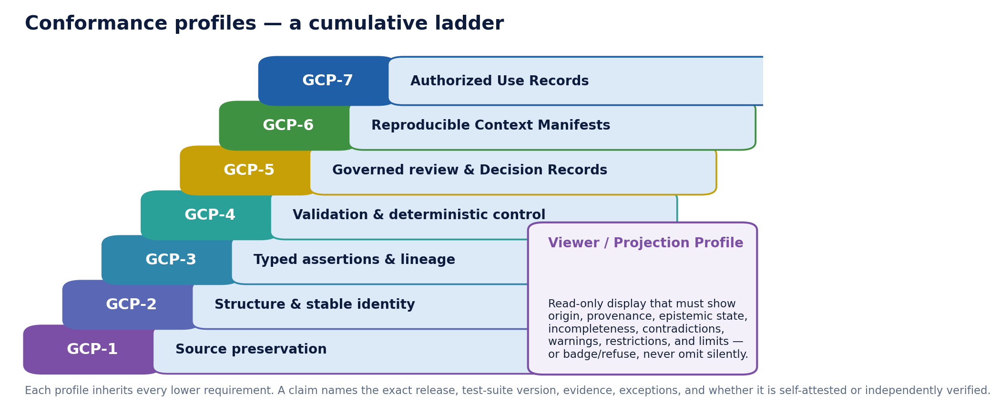
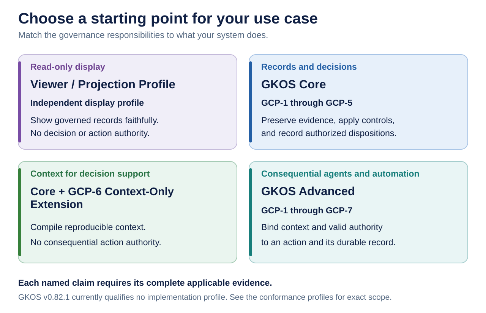

# 6. What GKOS is not

> **Informative.** This beginner's guide page explains GKOS in plain language. It creates no requirement and changes no rule. Where it differs from the [authoritative sources](README.md#authoritative-sources), those sources control. Edition described: GKOS-2026-09-24 v0.82.1.

Read this chapter before you describe GKOS in public, in a contract, or in a security plan. The controlling text is the [conformance-claims policy](../conformance/CLAIMS_POLICY.md).

## Current maturity

GKOS is a developmental specification (public working draft). It began as a single-author pre-standard concept; the goal is to advance it to a pre-standard through an open, multi-stakeholder committee process.

In practice, that means:

- **Who decides today:** the Founder and Initial Editor adopts v0.x changes as disclosed development decisions. These are not consensus ratifications. See [GOVERNANCE.md](../GOVERNANCE.md#development-phase-authority).
- **What is published:** GKOS-2026-09-24 v0.82.1, a documentation patch. Its technical baseline is v0.82. Its normative population is unchanged from v0.81: 62 permanent requirements and 28 gate codes. See the [README](../README.md#current-standing).
- **What is qualified:** nothing. The active fixture catalog declares no qualifying profile.
- **What is still missing:** a public second implementation, and the governance gates required before v1.0. See [chapter 8](08-getting-involved.md#the-committee-goal).

## GKOS is not these things

| GKOS is not | Why | Source |
| --- | --- | --- |
| A product, database or runtime | It defines contracts. Products carry them out. | [README](../README.md#a-governance-architecture-not-another-runtime) |
| An accredited or consensus standard | It is a developmental specification under owner-authorized v0.x governance | [README](../README.md#maturity-and-governance-boundary) |
| A certification program | "GKOS certified" is reserved until a governed certification scheme and a competent independent process exist | [Claims policy](../conformance/CLAIMS_POLICY.md#permitted-scope-of-claims) |
| A legal opinion or regulator approval | No GKOS claim alone establishes legal compliance, procurement acceptance or security accreditation | [Claims policy](../conformance/CLAIMS_POLICY.md#permitted-scope-of-claims) |
| A NIST, ISO or other body's publication | Crosswalks and add-ins are informative proposals with no endorsement | [README](../README.md#why-standards-communities-may-care) |
| A judge of truth | It records evidence and claims; it does not decide which are correct | [README](../README.md#what-gkos-cannot-establish-by-itself) |

## What GKOS cannot establish by itself

From the [README](../README.md#what-gkos-cannot-establish-by-itself), GKOS alone cannot show that:

- a source is factually correct;
- a model output is accurate, unbiased, safe or appropriate;
- a policy is lawful, fair, ethical or complete;
- an identity provider, credential, signature system, policy engine or runtime is uncompromised;
- a reviewer reached the right conclusion;
- a deployment complies with a law, regulation, framework or sector rule; or
- an implementation is certified or accredited.

Those need their own evidence, competent authorities and, where they apply, formal assessment processes.

## Profiles: what a claim can name

A **profile** is a named set of responsibilities that an implementation can be tested against. GKOS has seven cumulative profiles, GCP-1 to GCP-7, plus a separate Viewer/Projection Profile.

This figure was drawn for the archived v0.76 edition. The ladder is still current. Since then, R16 named two tiers on top of it:

| Tier | Required profiles | Source |
| --- | --- | --- |
| GKOS Core | GCP-1 to GCP-5 | `GKOS-PROFILE-001` |
| GKOS Advanced | GCP-1 to GCP-7 | `GKOS-PROFILE-002` |
| GCP-6 Context-Only Extension | Core plus read-only GCP-6; no consequential action | `GKOS-PROFILE-003` |
| Viewer/Projection Profile | Independent of the tiers; read-only display that must show provenance, epistemic state, contradictions, warnings and limits | `GKOS-PROFILE-007` |

The requirement IDs are in the [requirement registry](../requirements/REGISTRY.md). The [conformance profiles annex](../standard/annexes/Conformance_Profiles.md) controls.

**Today no profile qualifies.** Passing some tests shows only that those mechanisms work. It is not a profile pass. See the [claims policy](../conformance/CLAIMS_POLICY.md#permitted-scope-of-claims).

The figure helps you pick a starting target. It does not mean any target is currently met. See [adoption paths](../README.md#adoption-paths).

## Words to use and words to avoid

| Avoid | Why | Say instead |
| --- | --- | --- |
| "GKOS-compliant" or "GKOS-conformant", without qualification | Too broad; hides what was actually tested | An exact, bounded assessment statement (see below) |
| "GKOS certified" | Reserved; no certification scheme exists | Describe the mechanisms you implemented and the evidence |
| "the GKOS standard", as a claim of standing | Implies accredited or consensus status | "GKOS, a developmental specification (public working draft)" |
| "consensus specification" | Not the current classification | "developmental specification" |
| "Core-qualified" or "Advanced-qualified" | No profile qualifies today | Name the requirements tested and the results |

## How to describe a real implementation

A serious claim names, at least ([claims policy](../conformance/CLAIMS_POLICY.md#permitted-scope-of-claims), `GKOS-PROFILE-004`):

- the exact dated GKOS edition and GKX version;
- the claimed profile and the requirements that apply;
- the implementation version and an immutable commit or artifact fingerprint;
- schemas, policies and canonicalization profile;
- fixture catalog and runner versions;
- environment and dependencies;
- results split into executed, passed, failed, skipped, unsupported and unevaluated;
- exceptions and limitations; and
- whether the assessment is self-attested or independently verified.

The claims policy gives an [example structure](../conformance/CLAIMS_POLICY.md#ssp-procurement-and-contract-use) for a system security plan or contract. It ends by stating that no complete profile qualification or certification is claimed. Contract wording still needs its own review.

## Old claims stay old

A result is bound to the edition and deployment it tested. Do not relabel an older assessment as a v0.82.1 result. See [change and historical evidence](../conformance/CLAIMS_POLICY.md#change-and-historical-evidence).

---

[Guide index](README.md) · Previous: [5. A first walkthrough](05-a-first-walkthrough.md) · Next: [7. How the repository is organized](07-how-it-is-organized.md)
