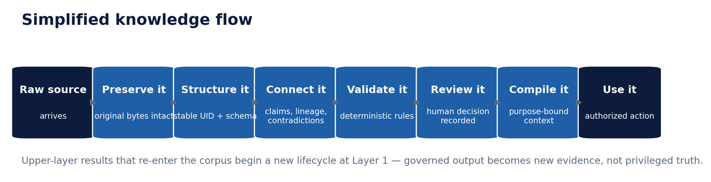
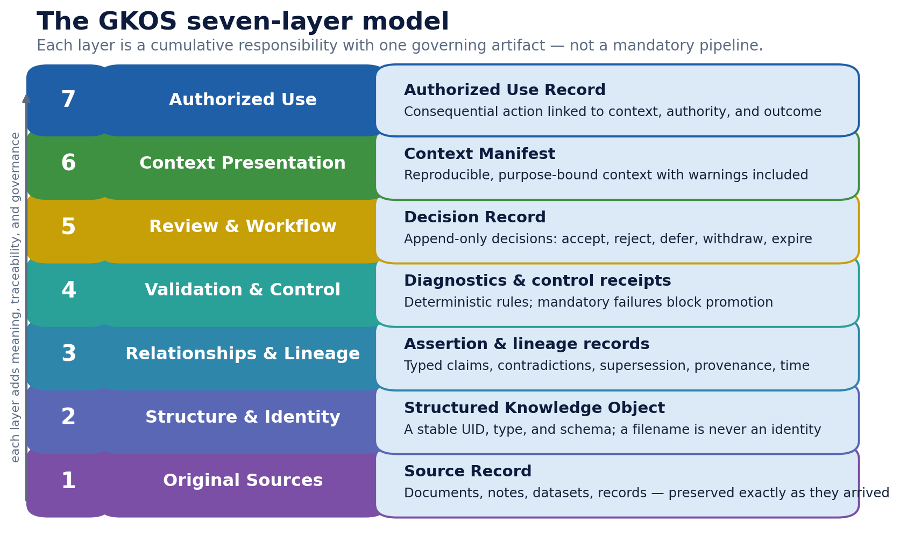
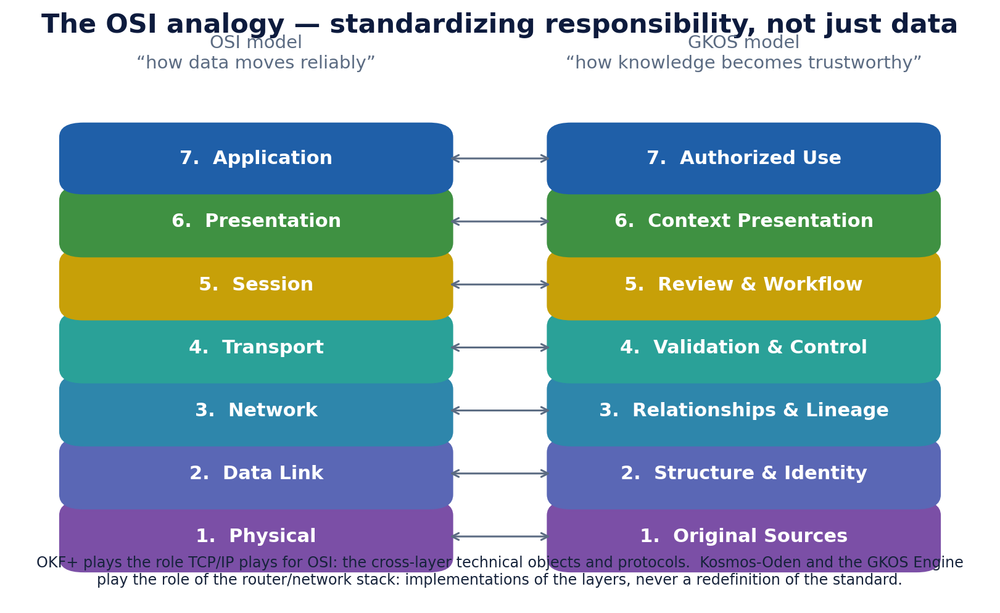
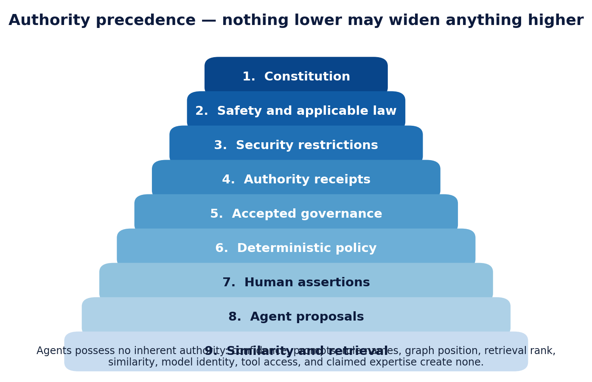
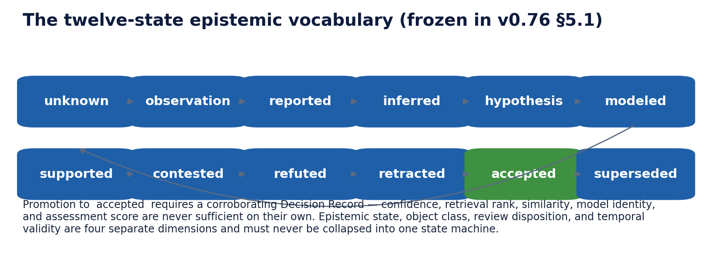
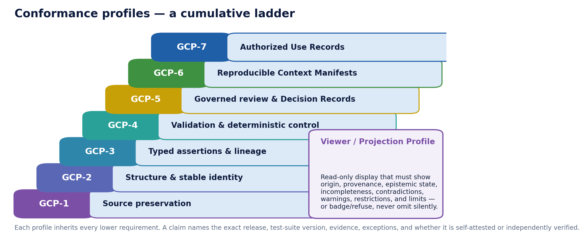

<!-- markdownlint-disable MD025 MD001 MD036 -->
<!-- This edition intentionally uses multiple H1s as part dividers,
     non-incrementing heading levels, and an emphasized tagline;
     source structure preserved verbatim. -->
# Governed Knowledge Operations Standard (GKOS)

## GKOS-2026-07-20 v0.76 — Complete Illustrated Edition

*“How knowledge becomes trustworthy”*

> **Status.** Public pre-standard and concept-refinement release. Changes in the v0.x series are developmental adoptions by the Founder and Initial Editor after documented technical review — not consensus ratifications, certifications, or accredited standards decisions. GKOS v0.76 is suitable for public review, implementation experiments, fixture development, and independent critique. It is not a certification regime, legal opinion, regulatory assurance, or guarantee of truth or safety. Normative terms: MUST, MUST NOT, SHOULD, SHOULD NOT, MAY. License: documentation CC BY 4.0; software-oriented materials Apache-2.0. Canonical repository: github.com/Odenknight/gkos-standard.

# How to read this document

This edition serves two audiences at once. If you are new to knowledge governance, read Part I and the figures — every concept in the standard appears there in plain language. If you are an implementer, Part II carries the complete normative text of GKOS v0.76, section by section, and each section ends with a “What this means for you” sidebar translating the requirements into build decisions. Part III condenses the annexes. Nothing normative has been altered; the authoritative text remains standard/00_GKOS_Master_Standard.md in the canonical repository.

# Part I — The idea in plain language

### The problem GKOS solves

Organizations and individuals now produce knowledge with AI in the loop: notes, claims, analyses, and decisions flow between people and software agents. The hard question is no longer “can we generate an answer?” but “why should anyone trust this answer next year — or in front of an auditor?”

GKOS answers by refusing to treat trust as a feeling or a score. Knowledge becomes trustworthy through accumulated, governed operations: the original evidence is preserved untouched, every claim is connected to what supports or contradicts it, validation is deterministic, human decisions are recorded permanently, and any consequential use is explicitly authorized and traceable. GKOS never declares absolute truth — it makes the path to every conclusion inspectable, reproducible, and challengeable.

*From raw source to authorized use: every arrow is a recorded, governed operation.*

### The seven layers, without jargon

Think of a courtroom rather than a database. Layer 1 keeps the original exhibits exactly as they arrived. Layer 2 gives every item a permanent identity so renaming a file can never orphan its history. Layer 3 records who claims what, based on which evidence, contradicted by whom, and during which period the claim held. Layer 4 is procedure: deterministic rules that either pass or block. Layer 5 is the judgment: a human (or explicitly authorized policy) records a decision that can never be silently edited. Layer 6 assembles the case file for a specific purpose — including the warnings and contradictions, not just the favorable parts. Layer 7 records what was actually done with the knowledge, under whose authority.

The layers are cumulative responsibilities, not a conveyor belt: a small deployment can honestly implement only the first two or three and say so.

*The seven-layer model. Each layer has exactly one governing artifact.*

### Why the OSI comparison is more than a slogan

The OSI model never moved a single packet — it standardized who is responsible for what, so that any vendor's layer 3 could interoperate with any other vendor's layer 4. GKOS makes the same move for knowledge: it separates responsibilities for preserving, structuring, validating, reviewing, presenting, and authorizing. OKF+ plays the role TCP/IP plays in networking — the concrete technical objects and interoperability specifications used across the layers. Kosmos-Oden and the GKOS Engine play the role of a router or a network stack: implementations of the model, never a redefinition of it.

*The architectural analogy, layer by layer.*

### Humans, agents, and systems each keep their lane

AI agents extract, link, classify, detect conflicts, and draft proposals — they generate capability, never authority. Humans review consequential changes and retain final authority. The system preserves originals, records every decision, enforces permissions, and prevents silent edits. An agent's confidence, an impressive prompt, or a high similarity score authorizes exactly nothing; only an explicit, recorded grant does.

# Part II — The standard (complete normative text, annotated)

## §0. Development status

GKOS v0.76 remains in the pre-v1.0 testing and refinement phase. Changes recorded during the v0.x series are developmental adoptions by the Founder and Initial Editor after documented technical review. They are not consensus ratifications, independent certifications, accredited standards decisions, or claims that the complete future governance body has been seated.

External reviewers are being assembled. Formal multi-stakeholder amendment authority, voting, quorum, appeal, and consensus procedures are v1.0 gates. Until then, development records MUST identify their review basis, authorizing editor, limitations, and non-consensus status.

> **🔧 What this means for you**
> Cite the exact release string (“GKOS-2026-07-20 v0.76”) in anything you build or claim. Treat every v0.x requirement as stable enough to implement against but subject to recorded, traceable change — the decision register in the repository is the change log that matters.

## §1–§2. Purpose and core thesis

GKOS defines a domain-neutral governance model for preserving evidence, structuring identity, recording semantic assertions and lineage, enforcing deterministic controls, governing review, compiling reproducible context, and authorizing consequential use.

Knowledge becomes trustworthy through accumulated, governed operations over preserved evidence, explicit assertions, recorded decisions, and reproducible context. GKOS does not declare absolute truth. It distinguishes evidence, assertions, proposals, validation results, decisions, accepted knowledge, projections, and authorized uses.

> **🔧 What this means for you**
> Model these eight things as distinct types from day one. The most common implementation failure is collapsing “an agent proposed X”, “a human decided X”, and “X is accepted” into one field — GKOS treats that collapse as the root defect it exists to prevent.

## §3. Architecture and version relationships

GKOS defines governance. OKF+ defines technical objects and protocols. Kosmos-Oden and the GKOS Engine are implementations and cannot redefine the standard by themselves.

An implementation's version number, including an internal “Engine v1.0,” does not imply that GKOS has reached v1.0. The GKOS v1.0 gates are satisfied only by a recorded future governance decision under the v1.0 governance model.

A conformance claim citing a draft technical specification MUST disclose that status and identify the last ratified baseline. OKF+ 2.3 is presently a draft technical specification; OKF+ 2.2 remains the last ratified baseline. GKOS v0.76 freezes the epistemic vocabulary directly, so conformance does not depend on the continuing contents of the OKF+ 2.3 draft.

> **🔧 What this means for you**
> Version your product, your engine, and your cited specifications independently, and say which is which in every claim. If you build on flat OKF+ 2.3 today, your conformance manifest must carry technical_spec_status: draft and name OKF+ 2.2 as the ratified baseline — the v0.76 schema slice enforces exactly this.

## §4. Authority

Authority comes only from authenticated authority receipts and explicit governance grants. Agents possess no inherent authority. Confidence, prompts, role names, graph position, retrieval rank, similarity, model identity, tool access, and claimed expertise do not create authority.

Deterministic policy MAY automatically approve an operation only when explicitly authorized, bounded, reproducible, and recorded. No actor may approve, review, validate the authority of, authorize, or certify its own work under a profile that claims separation of duties.

*The nine-level precedence chain. A lower-precedence item MUST NOT widen a higher-precedence restriction.*

> **🔧 What this means for you**
> Until the v0.8 receipt mechanism ships, the only honest single-owner posture is the disclosed waiver: record disposition: self-accepted with authority_receipt: “none (single-actor profile)” and list the waiver in your conformance claim. Never let an agent identity reach an accept surface — procedural enforcement is what you have while cryptographic receipts are pending.

## §5. Epistemic model

Retained source revisions are immutable except through governed deletion, redaction, tombstoning, or crypto-shredding required by law, policy, retention, privacy, or legal hold. Sources are evidence, not guaranteed truth.

Human assertions carry provenance and only their author's authority unless separately governed. Agent outputs remain proposals or projections until governed promotion. Contradictions remain visible. Supersession, contradiction, correction, withdrawal, rejection, deletion, and governed erasure are distinct operations. Confidence alone cannot promote epistemic state.

### §5.1 Epistemic state vocabulary

GKOS v0.76 defines a twelve-state vocabulary, informed by the OKF+ 2.3 draft but frozen as self-contained GKOS normative text. A conforming Layer 3 implementation MUST record epistemic state as one of these values or provide a documented, deterministic mapping from an equivalent enumeration. Promotion to accepted requires a corroborating Decision Record. Epistemic state, object class, review disposition, and temporal validity are four separate dimensions and MUST NOT be collapsed into one field or one state machine.

*The frozen twelve-state vocabulary. Green marks the one transition that demands a Decision Record.*

> **🔧 What this means for you**
> Use the twelve strings verbatim (the machine-readable enum ships in schemas/okf-common.defs.json). Wire a hard gate on accepted: in the reference implementation, an accepted state without an approval record draws diagnostic OKF-EPISTEMIC-004, and authoring the word “approved” in frontmatter is projected back down with a diagnostic rather than trusted.

## §6. Seven layer contracts

- L1 Original Sources → Source Record: revision identity, fingerprint, provenance, media type, custody, retention and sensitivity defaults, locators, ingestion receipt.
- L2 Structure and Identity → Structured Knowledge Object: stable UID, type, schema version, canonical representation, metadata, locators. Filenames are not identity.
- L3 Relationships and Lineage → typed assertion and lineage records: direction, provenance, evidence anchors, temporal validity, epistemic state, actor, scope, version. Similarity is non-authoritative unless governed.
- L4 Validation and Control → deterministic diagnostics and control receipts. Failed mandatory controls block promotion.
- L5 Review and Workflow → an append-only Decision Record.
- L6 Context Presentation → a reproducible, purpose-bound Context Manifest containing accepted assertions, evidence anchors, contradictions, warnings, restrictions, omissions, versions, recipient, and expiry.
- L7 Authorized Use → an Authorized Use Record linking action, context, authority, actor, dependencies, outcome, and compensation route.

Layers are cumulative responsibilities, not a mandatory synchronous pipeline. Upper-layer results re-entering the corpus begin a new lifecycle at Layer 1. Incomplete objects MUST declare missing contracts and MUST NOT claim unsupported conformance.

### §6.1 Mechanical definitions (normative)

- Consequential use — any of: external disclosure outside the governed deployment boundary; a sensitivity-level change; promotion to accepted; deletion, tombstoning, or governed erasure. A deployment MAY extend this list but MUST NOT narrow it.
- Blast radius — the set of governed objects reachable from the operation's target through the typed relationship and lineage graph, computed at proposal time within a declared hop bound; limits are a reachable-object count, a corpus fraction, or stricter.
- Materially equivalent — a resubmission equals a rejected proposal only when the evidence-set hash AND the proposed state transition (target identity, patch shape, input-hash lineage) are both identical; it then inherits the rejection's traceability and is not novel without new evidence.
- Defect-badge-or-refuse — a viewer lacking required information MUST render a visible badge from a published taxonomy (minimum: missing-provenance, unresolved-contradiction, stale-context, unverified-sensitivity, incomplete-lineage) or refuse and disclose. Silent omission is non-conforming.

> **🔧 What this means for you**
> All four definitions are naming exercises over capabilities you likely already have: blast radius is a graph reachability query, material equivalence is two hash comparisons, consequential use is a four-item operation allowlist, and the badge taxonomy is a UI contract. Publish your badge taxonomy next to your conformance claim — that publication is itself a requirement.

## §7. Specialized Agents

A Specialized Agent is a governed computational actor with declared competency, accountable owner, layer scope, permitted inputs and writes, prohibited operations, evidence duties, model/prompt/tool/policy versions, risk limits, delegation, evaluation, suspension, and revocation terms. Specialization grants capability, not authority.

A Governance Coordinator consolidates proposals, verifies receipts, enforces deterministic policy, detects conflicts, routes review, and requests governed commits. It is not sovereign authority. Security specialists MAY impose temporary fail-closed restrictions but MUST NOT lower sensitivity or widen access. Operational agents MAY act only from an authorized purpose-bound Context Manifest and valid authority receipt.

> **🔧 What this means for you**
> This maps directly onto an agent-fleet contract file: identity, owner, layer scope, write scope, prohibited ops, versioned dependencies, risk limits (max_files / max_fraction against blast radius), expiry. Your orchestrator may schedule, retry, throttle, and quarantine — it may never bypass a control or acquire semantic authority by orchestrating.

## §8. Conformance

Profiles are GCP-1 through GCP-7 and are cumulative. A Viewer/Projection Profile provides read-only display with visible origin, provenance, epistemic state, incompleteness, contradictions, warnings, restrictions, and conformance limitations.

A conformance claim requires a machine-readable manifest, human-readable report, exact GKOS release, test-suite version, evidence, limitations, exceptions, and assessment type. Self-attestation and independent verification MUST be distinguished. Executable GKOS-TS and complete OKP-CH semantic-invariant suites remain incomplete in v0.76; claims remain provisional and MUST disclose coverage.

*GCP-1 through GCP-7 plus the read-only Viewer/Projection Profile.*

### §8.1 Progressive disclosure

A human-authoring surface MUST NOT expose machine-oriented governance structures in a form likely to be silently corrupted by ordinary editing. A view MAY hide technical metadata behind one discoverable, lossless reveal affordance; hiding is presentation only and MUST NOT alter bytes. Warnings, contradictions, restrictions, defects, incompleteness, and epistemic-state information are decision-material and MUST remain visible in the default view. Review, audit, governance-action, and agent-console surfaces MUST show full governance detail.

> **🔧 What this means for you**
> The first executable GKOS-TS slice now exists: an adapter-neutral runner plus fixture catalog 0.1.0 in the repository's conformance/ and fixtures/ directories, emitting claims that validate against the conformance-manifest schema. Run it, publish the claim with your known divergences listed, and you are ahead of the disclosure bar most software never reaches. For disclosure: flat YAML is one valid answer, not the mandated one — the invariant is “ordinary editing cannot silently corrupt governance structure.”

## §9. Security, privacy, and retention

Missing or ambiguous sensitivity fails closed to a restricted deployment default. Audit and provenance data inherit or exceed referenced sensitivity. Agent interfaces are local-only by default and require authenticated identity, scoped authorization, purpose declaration, sensitivity filtering, resource limits, audit receipts, and separately authorized writes.

Governed erasure MAY remove payload bytes while preserving a minimal non-sensitive tombstone, decision record, and integrity evidence. Legal holds override routine deletion. Deployments MUST govern queue capacity, proposal TTL, backlog alerts, per-agent limits, reviewer workload, retrospective sampling, and emergency quarantine.

> **🔧 What this means for you**
> “Fails closed to a restricted default” has teeth: pick the default deliberately, write it in your machine-readable invariants, and test it — fixture GCP1-B01 exists precisely because a reference implementation was found defaulting to internal while its own invariants file declared secret. Separate read tokens from write authorization at the API layer, and make above-ceiling targets indistinguishable from nonexistent ones.

## §10–§11. Publication, maturity, and deferred mechanisms

The canonical v0.76 repository is Odenknight/gkos-standard. Documentation and original graphics use CC BY 4.0; software-oriented materials use Apache-2.0. Trademark and certification rights are separate. The standalone GKOS Engine v1.0 Build Instructions are informative implementation guidance outside the normative release scope.

Deferred to future engineering and governance work: the normative authority-receipt schema and verification procedure; the actor-identity and collusion-adjacent self-approval model; the upward receipt and cross-layer attestation chain; decision-record integrity and external anchoring; a formal single-actor waiver conformance profile; complete schemas, namespaces, fixtures, and executable conformance suite; and v1.0 multi-stakeholder governance.

> **🔧 What this means for you**
> The deferral list is your risk register. Anything you build against a deferred mechanism (receipts, actor identity, attestation chains) is interim by definition — build it behind an interface, disclose it as a limitation, and expect a v0.8-class change. The “complete schemas and fixtures” line item is now partially discharged: the first normative-candidate slice ships in the repository.

# Part III — Annexes (condensed)

## Conformance profiles

GCP-1 source preservation; GCP-2 structure and stable identity; GCP-3 typed assertions and lineage; GCP-4 validation and deterministic control; GCP-5 governed review and Decision Records; GCP-6 reproducible Context Manifests; GCP-7 Authorized Use Records. Cumulative. Claims MUST identify the exact standard release, profile, assessment type, evidence, exceptions, and test-suite status.

## Layer interface contracts

Each layer contract defines purpose, accepted inputs, required operations, outputs, preserved invariants, authority boundary, prohibited behavior, failure behavior, receipts, and re-entry rules. Blocking invariants: L1 revision and provenance preserved; L2 stable identity (filename is not identity); L3 typed, sourced, temporal, scoped relationships; L4 mandatory failures block promotion; L5 authorized append-only disposition; L6 reproducible purpose-bound presentation; L7 action linked to context and authority. Upper-layer results returning to the corpus MUST enter as new Layer-1 sources.

## Provisional authority-receipt field list (informative, not normative)

A future authority receipt is expected, at minimum, to carry: receipt_id, issuer, subject, actor_identity, authority_source, permitted_actions, resource_scope, purpose_scope, tenant_scope, sensitivity_ceiling, delegation_allowed, issued_at, not_before, expires_at, policy_version, revocation_locator, nonce_or_replay_binding, signature_or_attestation. The future mechanism must define attenuation, non-transferability, delegation-chain integrity, revocation, proof of possession, single use, hash binding, audience/tenant binding, and a verification procedure — built on established security mechanisms (attenuated capability tokens, grant protocols) rather than an unreviewed invented format. No implementation may claim conformance to this annex.

## Security, privacy, and retention annex

Missing sensitivity fails closed. Restrictions may be elevated immediately; reductions require authenticated authority. Audit and provenance inherit or exceed referenced sensitivity. External dispatch requires explicit route authorization and purpose. Agent writes require separate authorization from reads. Legal hold overrides routine deletion. Governed erasure may remove payload while preserving a minimal safe tombstone and decision evidence. Security specialists may quarantine, deny export, or suspend execution temporarily but may not widen access. Review queues require capacity, TTL, aging, workload, sampling, and emergency procedures.

## Specialized Agent framework annex

A governed Specialized Agent requires stable identity, accountable owner, competency declaration, primary and secondary GKOS layers, input permissions, proposal and write scope, prohibited operations, evidence requirements, versioned model/prompt/tool/policy dependencies, risk and blast-radius limits, delegation and expiry, evaluation criteria, and suspension/revocation procedure. Orchestrators may schedule, pause, retry, throttle, quarantine, route, and record work but may not bypass controls or acquire semantic authority. Subdelegation must be expressly permitted, narrower than the originating grant, provenance-preserving, and no longer-lived than the original grant.

## Known limitations

GKOS v0.76 does not yet provide a complete executable GKOS-TS suite, finalized OKP-CH schemas, independent certification, a second interoperable implementation, a signed release manifest, a DOI, formal federated governance, or an accredited standards-body process. Conformance profiles are provisional; implementers MUST disclose unsupported requirements, exceptions, incomplete fixtures, and self-attestation status.

# Document provenance

Prepared 2026-07-22 from the canonical repository text of GKOS-2026-07-20 v0.76 (standard/00_GKOS_Master_Standard.md and standard/annexes/). Normative sections are reproduced faithfully with typographic adaptation only; plain-language passages, sidebars, and figures are explanatory additions and carry no normative weight. Figures 1–6 were generated for this edition and are consistent with the v0.76 layer names, epistemic vocabulary, GCP profile names, and authority precedence chain. Per the repository attribution requirement: Governed Knowledge Operations Standard (GKOS), GKOS-2026-07-20 v0.76, by Shaun “Oden” Marshall, licensed under CC BY 4.0; changes in this edition are the explanatory apparatus identified above.
